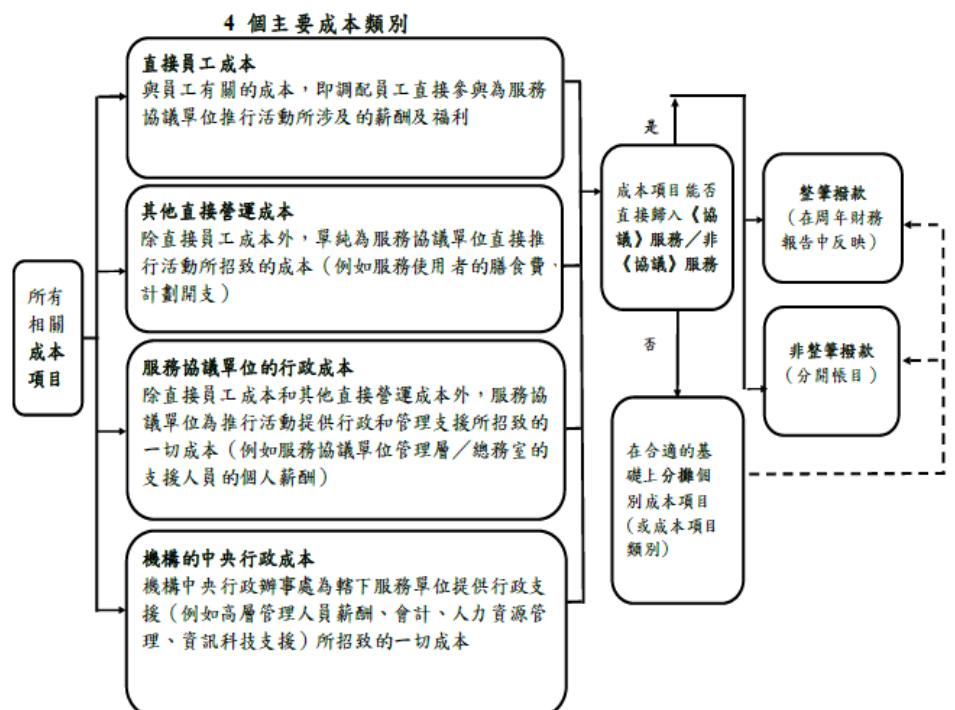
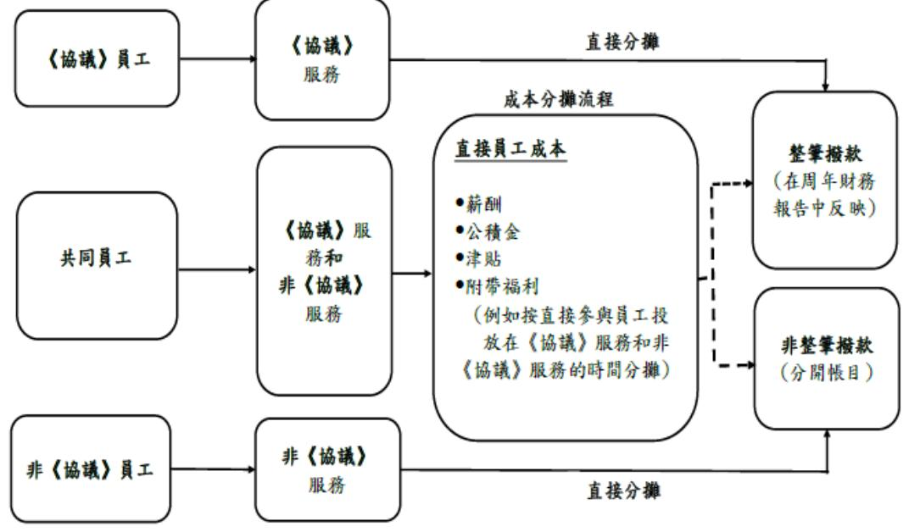
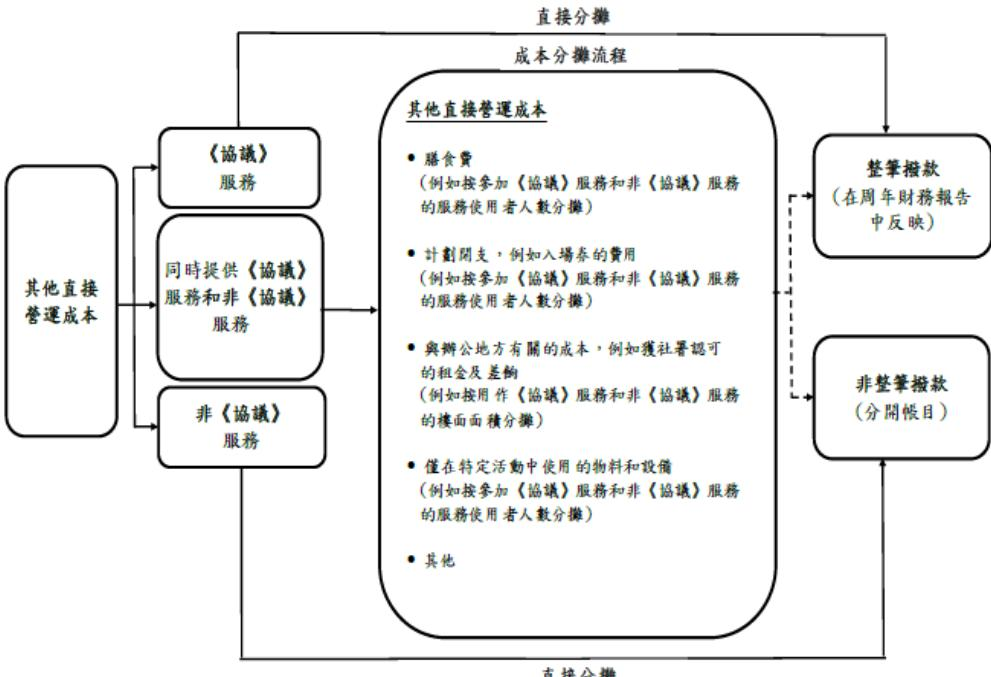
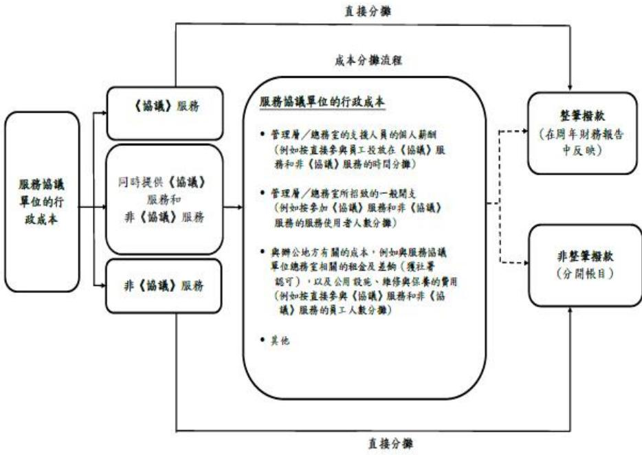
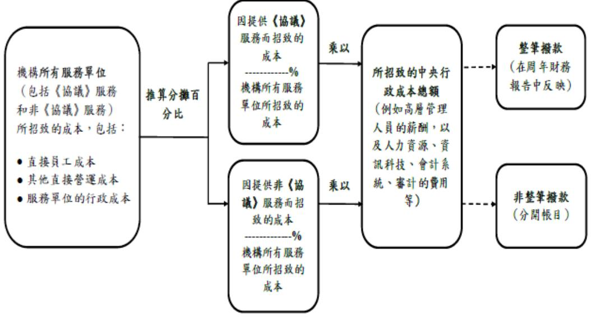

# 社會福利服務 整筆撥款津助手冊

香港特別行政區政府 社會福利署

## **2024** 年 **10** 月

(**2025** 年 **5** 月更新)

| 目錄 |
|----|
|    |

| 章   |      |                       | 頁數            |
|-----|------|-----------------------|---------------|
| (一) | 引言   |                       | - 2 3   |
|     | 1.1  | 目的                    |               |
|     | 1.2  | 涵蓋範圍                  |               |
|     | 1.3  | 合規                    |               |
|     | 1.4  | 條文                    |               |
|     | 1.5  | 出版形式                  |               |
|     | 1.6  | 圖示及超連結                |               |
|     | 1.7  | 查詢                    |               |
| (二) |      | 整筆撥款津助制度              | - 5 8   |
|     | 2.1  | 簡介                    |               |
|     | 2.2  | 整筆撥款                  |               |
|     | 2.3  | 指導原則                  |               |
|     | 2.4  | 不得越界補貼                |               |
|     | 2.5  | 在整筆撥款津助制度下營辦津助福利服務的資格 |               |
|     | 2.6  | 退出                    |               |
| (三) |      | 津貼及服務協議               | - 10 22 |
|     | 3.1  | 簡介                    |               |
|     | 3.2  | 《協議》內容                |               |
|     | 3.3  | 服務協議單位                |               |
|     | 3.4  | 《協議》服務                |               |
|     | 3.5  | 《協議》相關活動              |               |
|     | 3.6  | 跨機構及/或服務協議單位的津助/資助服務或 |               |
|     |      | 政府政策局/部門基金            |               |
|     | 3.7  | 捐贈                    |               |
|     | 3.8  | 調解條款                  |               |
| (四) |      | 津助撥款及運用               | - 24 30 |
|     | 4.1  | 津助撥款                  |               |
|     | 4.2  | 津助撥付                  |               |
|     | 4.3  | 調整津助撥款金額              |               |
|     | 4.4  | 不包括在整筆撥款的其他撥付項目       |               |
|     | 4.5  | 整筆撥款儲備和公積金儲備          |               |
|     | 4.6  | 使用整筆撥款和整筆撥款儲備         |               |
|     | 4.7  | 使用公積金儲備               |               |
|     | 4.8  | 使用儲備投資                |               |
|     | 4.9  | 保險                    |               |
|     | 4.10 | 存放由社署發放不同資助撥款的開戶規定    |               |

| 五 ( ) | 財務管理       |                        | - 32 45 |
|-------------|------------|------------------------|---------------|
|             | 5.1        | 簡介                     |               |
|             | 5.2        | 財務會計                   |               |
|             | 5.3        | 帳簿及會計記錄                |               |
|             | 5.4        | 財務規劃及推算                |               |
|             | 5.5        | 財務申報規定                 |               |
|             | 5.6        | 財務審計                   |               |
|             | 5.7        | 披露要求                   |               |
|             | 5.8        | 內部管控                   |               |
|             | 5.9        | 津助審查                   |               |
| 六 ( ) |            | 非津助服務及成本分攤             | - 47 59 |
|             | 6.1        | 非津助服務                  |               |
|             | 6.2        | 不得越界補貼                 |               |
|             | 6.3        | 指導原則                   |               |
|             | 6.4        | 成本分攤                   |               |
|             | 6.5        | 個案例子 ( 只供參考 )    |               |
| 七 ( ) |            | 服務表現監察制度               | - 61 65 |
|             | 7.1        | 簡介                     |               |
|             | 7.2        | 服務表現標準                 |               |
|             | 7.3        | 服務表現評估                 |               |
|             | 7.4        | 機構自我評估                 |               |
|             | 7.5        | 服務表現檢視                 |               |
| 八 ( ) |            | 公眾問責和處理投訴              | - 67 77 |
|             | 8.1        | 非政府機構的公眾問責性            |               |
|             | 8.2        | 社署的監管角色                |               |
|             | 8.3        | 維護國家安全                 |               |
|             | 8.4        | 展示「社會福利署資助服務」標誌        |               |
|             | 8.5        | 監察高級行政人員的薪酬            |               |
|             | 8.6        | 特別事故報告                 |               |
|             | 8.7        | 重要事故報告                 |               |
|             | 8.8        | 外部審計                   |               |
|             | 8.9        | 機構在處理投訴上的角色及責任         |               |
|             | 8.10       | 整筆撥款獨立處理投訴委員會          |               |
| 九 ( ) | 機構管治       |                        | - 79 84 |
|             | 9.1        | 簡介                     |               |
|             | 9.2        | 管治委員會及機構管理層            |               |
|             | 9.3        | 界定管治委員會的職能及責任          |               |
|             | 9.4 9.5 | 管治委員會任期 與員工和服務使用者溝通 |               |
|             | 9.6        | 人力資源管理                 |               |
|             | 9.7        | 防貪及誠信規定                |               |
|             |            |                        |               |

第一章 引言

#### 目的

本「整筆撥款津助手冊」(手冊)由社會福利署(社署) 發出,列出有關運用社署津助撥款以營辦福利服務的原則、 程序、標準和規定,並就管理和監控在整筆撥款津助制度 下接受政府津助的非政府機構(機構)提供行政指引1。

#### 涵蓋範圍

就本手冊而言,「機構」指獲社署提供經常津助的非政府 機構,而該等機構會以津助支付向公眾提供福利服務的運 作開支。只接受社署提供非經常資助2或服務合約款項的 非政府機構,並不視作營辦津助福利服務的機構。

#### 合規

接受社署津助的機構須遵從發放撥款的原則,以及本手冊 列明的津助條件和其他要求。如機構未能遵從本手冊的條 款和條件,政府或會撤銷津助。

#### 條文

作為監督社署撥款的管制人員,社署署長制訂本手冊的條 文,並可對該等條文作出修訂、補充、引申、詮釋及豁免。 機構亦須遵守社署不時發出的管理信函、指引及通告中訂 明的規定。

1 按合適的情況,本手冊同時適用於以傳統模式獲得津助的機構。

2 舉例而言,有些以自資方式營辦福利服務的機構或會接受社署以非經常性質提供的租 金和差餉資助。

#### 出版形式

本手冊只以電子形式出版。社署會定期檢視和更新手冊內 容。使用本手冊的人士應瀏[覽社署網頁,](https://www.swd.gov.hk/tc/ngo/subventions/)以查閱手冊、管 理信函、指引及通告的最新版本。

#### 圖示及超連結

本手冊設有以下兩款圖示,方便使用者掌握及注 意提交的要求 -

此圖示提醒機構須如期向社署提交的文件/統 計資料

- 此圖示提醒機構須按實際情況而向社署提交的 報告/文件/其他資料
- 本手冊亦設有以藍色顯示的超連結,方便使用者 直接連接到手冊的各章、附件和其他相關資料。

#### 查詢

如對本手冊有任何查詢,請聯絡社署津貼組(電話:2832 4308;電郵:[suenq@swd.gov.hk](mailto:suenq@swd.gov.hk))。

第二章

# 整筆撥款津助制度

社會福利服務整筆撥款津助手冊 | **4**

### 第二章

## 整筆撥款津助制度

#### 簡介

社會福利署(社署)自 2001 年起推行整筆撥款津助制度, 藉此提高機構運用津助撥款的問責性、效率及成本效益。

#### 整筆撥款

在整筆撥款津助制度下,社署以每間機構為單位,以整筆 付款的方式發放經常津助撥款(故稱為「整筆撥款」),以 在相關《津貼及服務協議》(《協議》)規定下營辦津助福 利服務。在遵從本手冊及相關津助規則的前提下,機構可 在不同成本項目及獲社署津助的服務協議單位之間調配 整筆撥款資源(公積金除外),從而按《協議》規定的預 定目的及目標提供服務。

#### 指導原則

在調配整筆撥款資源方面,政府有需要確保有合適的成本 控制及監察制度,以監督機構運用公帑的情況,特別是在 提供福利服務及運用公帑時是否符合經濟原則及講求效 率和效益。在此前提下,社署按以下指導原則推行整筆撥 款津助制度:

#### 靈活性、效率及成本效益

社署鼓 勵機構以有效率 及符合成本效益 的方式 靈活運用整筆撥款資源,從而提供更物有所值的 福利服務,並積極回應社會不斷轉變的需要。

運用公帑的問責性

機構管治委員會1及管理層須妥善地管控整筆撥 款,並確保撥款只用於符合《協議》規定及社署 署長訂明的預定目的;以就運用公帑向公眾問責。

#### 機構管治

機構管 治委員會及管理 層負責監督服務 營辦及 管控資源運用,包括財務及人力資源管理工作。 有效的管治框架包含清晰的管理架構、嚴格的操 守標準、周全的程序,以及獨立的制衡措施。機 構亦應備有適當的誠信要求及防貪措施,以防止 貪污舞 弊和避免出現任 何利益衝突及處 理相關 利益衝突。

#### 服務質素及表現

機構須符合相關標準及要求,以確保津助服務按 社署同意的方式提供。機構須設有有效的內部監 察機制,以監督及監察服務單位在遵從《協議》 要求及 16 項服務質素標準的表現。機構應第一 時間按 既定政策及程序 處理服務使用者 提出的 投訴及意見,從而提升服務質素。

#### 透明度

保持資 訊透明及披露資 訊有助機構爭取 持份者 的支持,同時促進與員工及服務使用者的有效溝 通。機構管治委員會及管理層應透過合適渠道讓 員工及服務使用者參與重要決策過程。

1 機構的管治組織可稱作「董事局」、「董事會」、「執行委員會」、「管理委員會」或「委 員會」等。本手冊統稱機構的管治組織為「管治委員會」。

#### 不得越界補貼

- 除了提供由整筆撥款津助的《協議》服務外,部 分機構亦會以自資方式,或以其他政府部門或資 助團體所提供的補助或津貼舉辦其他活動,以為 公眾提供服務,而這些活動或服務並非由社署津 助或資助。
- 社署向機構提供經常津助撥款支付營運開支,以 獲取機構按《協議》規定為公眾提供服務。有關 撥款可能是機構的主要收入,也可能只佔機構總 收入的一小部分。
- 接受社 署津助的機構應 確保津助服務沒 有在金 錢上或實物方面為非《協議》服務提供補貼。如 機構把整筆撥款資源用於非《協議》服務,則須 作成本分攤。詳情請參閱第六章。有關無須進行 成本分攤的情況,請參閱第三章。

#### 在整筆撥款津助制度下營辦津助福利服務的資格

機構必須是根據《稅務條例》(第 112 章)第 88 條獲豁免 繳稅的慈善機構的真正非牟利機構,方合資格在整筆撥款 津助制度下營辦津助福利服務。申請營辦津助福利服務的 機構必須提供下列資料,以評估其接受津助的資格:

- 由稅務局根據《稅務條例》第 88 條發出的證 明書;
- 機構的章程大綱及章程細則/章程細則/規 章(如適用);
- 機構的管治和管理架構,以及負責營運機構 的管理人員名單;
- 由機構提供而符合其宗旨的社會福利服務記 錄;
- 過去 3 個財政年度的經審計財務報表;及
- 社署要求的任何其他證明文件。

#### 退出

- 如機構有意停止營辦津助福利服務,該機構的主 席應在終止服務前最少 6 個月預先通知社署以 表明其意向。停止營辦津助福利服務的決定,應 由管治委員會以書面簽批。機構應與社署合作, 以順利完成終止服務,或將服務或服務使用者移 交其他服務營辦者。
- 如政府基於任何特殊情況,認為機構無須或不再 適合提供津助福利服務,社署保留權利向服務營 辦者發出通知期為 30 天的書面通知後,終止發 放津助。
- 如出現第 2.6.1 及 2.6.2 段所述情況,即機構基於 任何原 因或在服務協議 期滿後停止營辦 津助福 利服務,相關服務的《協議》即視作終止。機構 應在最後營運日起計的 2 個月內或社署指定的日 期,提交相關服務的統計報表、報告及文件,包 括就所有《協議》服務提交截至最後營運日的周 年財務報告及外聘核數師的核證報告,以及整間 機構的經審計財務報表。尚未使用的整筆撥款儲 備及公積金儲備餘額須連同中央項目(如有)在 社署指定的期限內退還政府。

**9 |** 社會福利服務整筆撥款津助手冊

# 津貼及服務協議

### 第三章

## 津貼及服務協議

#### 簡介

《津貼及服務協議》(《協議》)是社會福利署(社署)作 為津貼提供者與非政府機構(機構)作為服務營辦者所訂 立的具約束力文件,亦是社署在整筆撥款津助制度下向營 辦者提供津助以提供福利服務的基礎。《協議》內容包括 臚列社署及服務營辦者責任的通用章節,以及有關指定服 務的章節,為社署津助的指定服務類別界定服務目的及目 標、服務性質及內容、服務對象、基本服務規定及服務表 現標準。

#### 《協議》內容

目的及目標

《協議》訂明個別服務的目的及目標,述明提供 服務的原因和要達至的最終目標,例如:

#### 綜合家庭服務中心

• 「透過提升家庭功能,支援和鞏固家庭的凝 聚力」;

#### 綜合青少年服務中心

• 「協助兒童及青少年發展生活技能、潛能和 解決問題的能力,促進他們的個人發展」;

長者地區中心

• 「使長者能繼續在社區生活」及「為需要照 顧的長者提供社交網絡及外展服務」;以及

#### 精神健康綜合社區中心

• 「為居住當區有精神健康問題或懷疑有精神 健康問題的人士,提供一站式、地區為本的 外展支援服務,務求充分提升他們適應社會 的能力,裝備他們重新投入社區生活,以及 協助他們發展社交和職業技能」。

#### 服務性質及內容

《協議》界定了為達至有關目的及目標而訂定的 服務性質及內容, 包括透過一系列具有預防性、 支援性或補救性服務性質的直接服務,例如輔導 及支援服務、治療小組、發展及社群化服務、住 宿及膳食服務,以及個人照顧服務等;或透過社 區協作方式與其他工作伙伴合作提供服務。

#### 服務對象

《協議》指明了由社署訂定的服務對象,例如 6 至 24 歲的兒童及青少年,以及年屆 60 歲或以上 的當區長者。部分只為某類殘疾人士或身體有一 定程度 缺損的人士或指 定的社會條件/ 需要/ 不利情況的人士而設的服務,可能附設指定申請 資格。

服務表現標準

#### (a) 基本服務規定

基本服務規定是因應個別服務而指定的一些 必要基本要求,例如營運時間(例如星期一 至五早上八時至下午六時或 24 小時運作)、 基本人員編制(例如護士),以及遵從相關條 例及/或規定的要求。

#### (b) 服務量標準

服務量標準用作衡量服務量。營辦者須逹至 協定的服務量水平,例如服務個案數目、小 組及活動數目,以及使用率或入住率。

#### (c) 服務成效標準

服務成效標準用作評估服務成效。營辦者須 達至協定的服務成效水平,例如服務使用者 及/或其家人的滿意率。

#### (d) 服務質素標準

服務營辦者須符合 16 項服務質素標準的要 求。這些標準訂明了服務單位在管理和提供 服務方面應達到的質素水平。

#### 有效期

現時的《協議》有指定時限或不設時限。在推行 整筆撥款津助制度前,社署與機構簽訂不設時限 的《協議》。社署會因應需要就不同服務進行檢 討,並會在檢討服務後把不設時限的《協議》轉 為有指定時限的《協議》,以切合不時改變的服務 需要及相關規定。屆滿的《協議》是否獲續期取

決於服務需求,以及營辦者的服務表現是否令人 滿意。

#### 服務協議單位

服務協議單位指獲社署津助及在相關《協議》規定下營辦 的福利服務單位,而有關服務可受處所限制,亦可以不受 處所限制。機構可於同一處所營運多於一個服務協議單位。

#### 《協議》服務

- 《協議》服務指營辦者以社署提供的津貼撥款推 行按個別《協議》界定的服務。符合《協議》訂 明的(i)目的及目標、(ii)服務性質、(iii)服務內容 及(iv)服務對象的服務,均視為《協議》服務。
- 在提供服務的過程中,機構可能會推行《協議》 沒有指明但與營辦服務附帶的活動。如果這些活 動符合上述第 3.4.1 段的標準,則可被視為《協 議》服務。如有疑問,機構可就某些活動是否可 被視為《協議》服務諮詢社署有關服務科。
- 如果機構獲得有指定用途的其他資金或捐款1以 營辦上文第 3.4.2 段所述被視為《協議》服務的 活動, 該機構可以考慮 將這些活動的所 有收入 (包括有指定用途的其他資金或捐款)和支出以 現金會計方式納入周年財務報告,並填寫周年財 務報告附註 8"有指定用途的其他資金或捐款" 和附件 **3.1** 作為周年財務報告的附件,而無須在 整筆撥 款津助活動和這 類資金或捐款資 助的活 動之間分攤成本。在附註 8 "有指定用途的其他 資金或捐款"若有未完成活動的累積餘額,可結 算至下一個財政年度。至於在該財政年度內完成

1 有指定用途的其他資金或捐款泛指非社署的資助或非上載[於社 署網頁](https://www.swd.gov.hk/storage/asset/section/585/tc/List%20of%20funds%20or%20subsidy%20schemes%20exempt%20from%20cost-apportionment.pdf) 的政府政策局 /部門基金或資助計劃,包括公營機構/私營機構的資助。例子包括公益金、香港賽馬 會慈善信託基金,以及私人捐獻等。

的活動,這些活動的未用餘額(如有)須轉移到 並構成整筆撥款儲備的一部分,如第 3.5.10(c)段 所述,政府可收回該儲備。如這些活動中有任何 未使用的餘額須退還給資助者,該款項須由機構 的本身資源承擔。

- 在計算下文第 3.5.10(c)段所載有關下一個財政年 度向政府退還的整筆撥款儲備金額時,在附註 8 "有指 定用途的其他資 金或捐款"所反 映的支 出將不予計算為機構營運開支。
- 相反,如果機構獲得有指定用途的其他資金或捐 款以營辦上文第 3.4.2 段所述被視為《協議》服 務的活動,但這些活動的收入和支出並沒有納入 周年財務報告內,則機構必須分攤經營津助和非 津助服務的成本,以避免交叉補貼。成本分攤的 原則和方法見第六章。

#### 《協議》相關活動

- 《協議》相關活動為《協議》內沒有指明,但由 服務營辦者推行符合以下準則的活動:
	- (a) 與《協議》有相同的目的及目標;
	- (b) 與《協議》有相同的服務性質;
	- (c) 與《協議》有相關的服務內容;及
	- (d) 與《協議》有相關的服務對象。
- 機構可營辦《協議》相關活動,但須遵從以下條 件:
	- (a) 若《協議》相關活動佔用了服務協議單位獲 機構分配的整筆撥款津助 10% 或以下,該

機構須確保有關活動符合第 3.5.1 段列出的 四項準則。

- (b) 如擬舉辦的《協議》相關活動佔用了服務協 議單位獲機構分配的整筆撥款津助超過 10%, 該機構既須確保有關活動符合第 3.5.1 段列 出的四項準則,亦須採取以下行動:
	- (i) 活動須經管治委員會先行討論及評估 對機構服務、員工及服務使用者的影 響並獲得支持;
	- (ii) 須透過既定機制諮詢前線員工及服務使 用者;及
	- (iii) 進行活動前須先取得社署相關服務科 的同意。
- (c) 如《協議》相關活動佔用了服務協議單位獲 機構分配的整筆撥款津助超過 20%,該機構 須以本身資源承擔超支部分。社署不會接受 以整筆撥款支付任何過多的開支,或為此而 提供額外津貼。
- 計算服務協議單位用於《協議》相關活動的整筆 撥款資源的方法如下:

以整筆撥款支付的《協議》相關活動的年度開支 [包括員工薪金、公積金、其他營運成本,但不包 括 中央項目和租金及差餉]加/減有指定用途的 其他資金或捐款資助並在該年度完結的活動所產生 的盈餘或虧損

X 100% 相關服務協議單位獲非政府機構分配的整筆撥款年 度津助金額 [包括員工薪金、公積金、其他費用,但不包括中

央項目和租金及差餉]

營辦《協議》相關活動的機構須在財政年度結束 後,於 10 月 31 日或之前透過服務表現管理資訊 系統向社署提交年度報表(附件 **3.2**),以報告下 列事項:

- (a) 《協議》相關活動是否符合第 3.5.1 段列出的 四項準則;
- (b) 用於《協議》相關活動的整筆撥款資源佔相 關服務協議單位獲該機構分配的整筆撥款津 助的比例;及
- (c) 機構是否建議把《協議》相關活動納入《協 議》服務(機構應提供詳細資料,包括擬納 入《協議》服務的《協議》相關活動的服務 量及服務成效,以供社署考慮)。
- 不管用於擬舉辦的《協議》相關活動的整筆撥款 資源佔 服務協議單位獲 機構分配的整筆 撥款津 助比例為何,如果該《協議》相關活動與《協議》 列明的條款並不一致,該機構須在進行該活動前 取得社署相關服務科的同意,例如:
	- (a) 擬舉辦的《協議》相關活動所涉及的服務對 象不在《協議》指明的服務對象範圍之內 (例如服務對象年齡超出《協議》指明的上 下限);
	- (b) 擬舉辦的《協議》相關活動不在/超越《協 議》指明的服務地域。

為免生疑問,就本手冊而言,被視為《協議》服 務的活動或《協議》相關活動不包括自負盈虧的 服務2或被視作非津助/非資助服務的社會企業3。

- 機構可參考及使用評估範本(附件 **3.3**),以便評 估擬推行的活動或服務計劃應否被視為《協議》 服務、《協議》相關活動或非《協議》服務。
- 機構推行《協議》相關活動時,應遵從以下條件:
	- (a) 《協議》服務的正常運作不受影響;
	- (b) 《協議》相關活動須按相關《協議》要求(包 括 16 項服務質素標準)營辦;
	- (c) 《協議》相關活動沒有違反任何法定要求、 土地契約或租賃條件;及
	- (d) 機構應定期檢視《協議》相關活動,以確保 相關服務協議單位的營運情況令社署滿意。
- 如機構 獲得有指定用途 的其他資金或捐 款營辦 符合上述被視為《協議》相關的活動,機構可按 照以下 安排考慮應否在 周年財務報告中 就該等 活動作出報告:
	- (a) 機構可以將這些活動的所有收入(包括有指 定用途的其他資金或捐款)和支出以現金會 計方式納入周年財務報告,填寫周年財務報 告附註 8"有指定用途的其他資金或捐款", 並以附件 **3.1** 作為周年財務報告的附件,而 無須在整筆撥款津助活動和這類資金或捐款 資助的活動之間分攤成本。在附註 8"有指

2 自負盈虧服務是指機構以其自身資源營辦的非社署津助項目,包括津助安老院的自資 部分。自負盈虧服務不得越界補貼。

3 就本手冊而言,社會企業指沒有獲政府發放經常津貼的自資業務,並有獨立處理的財 務帳目。

定用途的其他資金或捐款"若有未完成活動 的累積餘額,可結算至下一個財政年度。至 於在該財政年度內完成的活動,這些活動的 未用餘額(如有)須轉移到並構成整筆撥款 儲備的一部分,如第 3.5.10(c)段所述,政府 可收回該儲備。如這些活動中有任何未使用 的餘額須退還給資助者,該款項須由機構的 本身資源承擔。

- (b) 在周年財務報告中報告的《協議》相關活動 也應在上文第 3.5.4 段所述的附件 **3.2** 的年度 報表 A 部分(適用於佔服務協議單位的整筆 撥款 20%或以內的《協議》相關活動)和 B 部分(適用於機構建議納入《協議》服務的 《協議》相關活動)中申報。
- (c) 在計算下文第 3.5.10(c)段所載有關下一個財 政年度向政府退還整筆撥款儲備的金額時, 在附註 8"有指定用途的其他資金或捐款" 所反映的支出將不予計算為機構的營運開支。
- (d) 機構如未有在周年財務報告中就非社署津助 的《協議》相關活動作出報告,但推行該等 活動時運用了整筆撥款資源,須根據第六章 載列的原則及程序分攤成本。機構無須計算 該等活動在有關服務協議單位運用整筆撥款 於《協議》相關活動的比例內,但可於附件 **3.2** 的年度報表 B 部分中申報(如機構建議 這些活動納入《協議》服務),以供參考。
- 機構在規劃及推行《協議》相關活動時,應考慮 以下事宜:
	- (a) 評估《協議》相關活動對員工及服務使用者 的影響,並獲取他們支持推行《協議》相關 活動;
- (b) 通知資助團體(如有)有關計劃會視作獲社 署津助的服務協議單位所提供的《協議》相 關活動,因而必須遵從相關規定;及
- (c) 由於整筆撥款津助制度規定機構須將超出該 年度營辦津助服務的營運開支4(不包括公積 金開支)的 25%的累積儲備(包括利息, 但 不包括公積金儲備、寄存帳戶結餘及由有指 定用途的其他資金或捐款資助而尚未完成的 《協議》服務/《協議》相關活動的餘額) 退還政府,而周年財務報告是以現金會計方 式擬備,機構應監察經費的開支狀況。

### 跨機構及/或服務協議單位的津助/資助服務或政府政 策局/部門基金

- 對於獲 社署按指定用 途 津助或資助的合 約服務 及有時限項目5,機構須另行提交財務報告,以及 須就該等服務/項目的盈餘退還社署(如適用)。 只要該些服務/項目是由社署資助(包括由社署 提出或統籌的活動),無論機構有否動用整筆撥 款資源,都無須納入周年財務報告及分攤經營該 些服務/項目的成本。
- 為在運用資源時促進協同效應及提升效率,整筆 撥款津助及受津助的資源(例如處所及人手等), 可在機構及/或服務協議單位之間進行調配,藉 此不同方式提供《協議》服務(及《協議》相關 活動)或社署資助服務,包括:
	- (a) 機構可以相同的員工及/或在同一處所營運 不同的服務協議單位。

4 只計算由整筆撥款津助的開支。

5 例如合約院舍、長者院舍照顧服務券計劃、長者社區照顧服務券計劃、自力更生支援計 劃下的就業支援服務、綜援長者廣東及福建省養老計劃、攜手扶弱基金資助的項目,以 及由社署負責推行的項目。

- (b) 機構可於服務協議單位的津助處所營辦社署 資助的服務,例如:在綜合青少年服務中心 營辦課餘託管服務6,或於津助安老院暨長者 日間護理單位提供長者社區照顧服務券計劃 7下的服務。
- (c) 機構可與另一機構(包括社署的服務單位) 合作提供《協議》服務(及《協議》相關活 動),例如舉辦聯合活動,或使用其他服務協 議單位的津助處所,以方便及有利於服務使 用8。
- 整筆撥 款津助及津助設 施可在機構及/ 或服務 協議單位之間進行調配,以提供《協議》服務(及 《協議》相關活動),但須遵從以下條件:
	- (a) 該等機構須符合有關《協議》及/或相關服 務協議的規定;
	- (b) 遵守場地的使用條款和條件9;
	- (c) 不會對相關服務協議單位或其《協議》服務 (及《協議》相關活動)的正常運作造成負 面影響;及
	- (d) 相關的機構及/或服務協議單位在考慮各項 管理問題(例如保險的承保範圍及使用場地 會否衍生任何責任)後,彼此同意有關安排。

- 8 例如,長者地區中心的人員可於附近屬於另一機構的綜合青少年服務中心提供《協 議》服務或《協議》相關活動,反之亦然。
- 9 相關情況包括但不限於土地租賃或租賃協議中的"使用人"和"不得轉讓/限制轉讓 "條款。

6 部分機構獲社署資助營辦課餘託管服務,須每半年提供指定數目的豁免全費服務名 額。

7 例如,使用社區照顧服務券的服務使用者可於同一機構營運的津助安老院暨長者日間 護理單位接受住宿暫託服務。

為提升運用政府資源的整體效益、促進跨界協作 及加強協同效應,如機構獲得上[載社署網頁的](https://www.swd.gov.hk/storage/asset/section/585/tc/List%20of%20funds%20or%20subsidy%20schemes%20exempt%20from%20cost-apportionment.pdf)政 府政策 局/部門基金或 資助計劃 的資助 推行服 務/項目,不論機構有否動用整筆撥款的資源及 所提供的服務是否《協議》服務或《協議》相關 活動,都無須納入周年財務報告及分攤經營該些 服務/項目的成本。

#### 捐贈

捐贈指現金或實物捐助,而有關機構或服務協議單位並無 因資助團體以服務協議列明必須提供指定的服務。機構接 受給予服務協議單位的捐贈時,應遵守以下條款:

- 部分捐贈物品(例如電腦、車輛、洗衣機等)或 招致相關操作開支,但若該等物品僅用於《協議》 服務及/或《協議》相關活動,有關開支可由整 筆撥款支付。機構應確保為所收到的捐贈備存妥 善的帳目及記錄,並備有有效機制監察使用捐贈 的情況,以確保問責和符合捐贈的目的;
- 機構須 確保捐贈物品不 會對相關服務協 議單位 的營運造成負面影響,或令相關機構陷入財困;
- 從捐贈的現金或物品取得的任何收入(例如以贊 助車輛提供交通運輸服務所收取的車資)須視作 相關服務協議單位的「其他收入」,並納入周年財 務報告;
- 社署不會負責更換或補充捐贈物品;及
- 社署不 會就捐贈物品所 招致的經常性開 支提供 任何額外津貼。

如出現任何因《協議》引起或與其相關的爭議或分歧,社 署及有關機構須先根據當時適用的《香港特別行政區政府 調解規則》進行調解。如上述爭議或分歧未能透過調解得 到解決,社署或有關機構可就有關爭議或分歧提出訴訟/ 仲裁。社署及有關機構同意香港法院對上述爭議或分歧具 有專有的司法管轄權。

**23 |** 社會福利服務整筆撥款津助手冊

# 津助撥款及運用

### 第四章

## 津助撥款及運用

#### 津助撥款

在整筆撥款津助制度下,政府每年以每間機構為單位撥出 津助。向機構提供的津助金額主要包括個人薪酬及其他費 用,再減去社會福利署(社署)認可收費的收入。

個人薪酬

「個人薪酬」包括適用於機構營辦津助福利服務 的員工薪金、公積金及與薪金有關的津貼。

- (a) 薪金
	- (i) 每個服務協議單位有一套既定的典型 人手編制,列明不同職級的員工人數, 在計算津助金額時作為參考。薪金撥 款會參考服務協議單位的典型人手編 制,以相關職位在現行非政府機構一 般職位薪級表1的中點薪金計算(部分 特定職位高於中點薪金2)。
	- (ii) 「個人薪酬」下的工作相關津貼按指 定用途撥出,例如培訓津貼3。

1 非政府機構一般職位薪級表載[於社署網頁。](https://www.swd.gov.hk/storage/asset/section/586/tc/Salary_Scale_of_Common_Posts.pdf)

2 部分特定職位的津助金額高於中點薪金,例如高級護士長、護士長、護士長(精神科)、 註冊護士、註冊護士(精神科)、登記護士、登記護士(精神科)、高級物理治療師、一 級物理治療師、二級物理治療師、高級職業治療師、一級職業治療師、二級職業治療師、 臨床心理學家、言語治療師、幼兒中心主管、幼兒工作員、高級特殊幼兒工作員、特殊 幼兒工作員、院舍服務員、起居照顧員及家務助理員。

3 「個人薪酬」下的工作相關津貼撥款金額按現有的方程式或在推行整筆撥款津助制度 前認可的金額計算,例如為於以下單位推動在職培訓而向認可職位人員(例如在復康單 位工作的工場導師和文憑教師、在住宿幼兒照顧單位工作的特殊幼兒工作員和福利工 作員)提供的培訓津貼(即 2 個額外薪點)。

(b) 公積金

- (i) 公積金是撥予機構的員工退休金,僱 主和僱員會根據《強制性公積金計劃 條例》(第 485 章)供款。機構應為每 名供款僱員另設獨立帳目。
- (ii) 在整筆撥款津助制度下,員工的公積 金撥款參考服務協議單位的典型人手 編制的薪金撥款的 6.8%計算。
- (iii) 有關「定影員工」的公積金撥款,請參 考附件 **4.1**。

薪金及 公積金會參照公 務員薪酬調整幅 度而變 動,「個人薪酬」津助撥款金額亦會作出相應調 整。

- 其他費用
	- (a) 「其他費用」是指除個人薪酬以外,營運服 務協議單位時衍生的開支,例如公用事業的 收費、活動支出及行政費用、小型維修及保 養開支、僱員補償保險及公眾責任保險費用 等。
	- (b) 「其他費用」的津助撥款金額會參照綜合消 費物價指數作出調整,以反映物價水平變動。

#### 收費收入

- (a) 向服務使用者收取認可收費所得收入會從津 助撥款總額中扣除,而社署會不時檢討有關 收費。社署認可收費列表載於附件 **4.2**。
- (b) 除上文第 4.1.3(a) 段所述認可收費的收入 外,機構可保留營辦津助服務(例如經營禮

品店或提供影印服務)的附帶收入。由此衍 生的收入不會從整筆撥款中扣除,但須用於 津助服務,並分開入帳和列入周年財務報告。 有關津助福利服務的收費安排,機構應遵從 附件 **4.3** 列明的規則及收費原則。

#### 津助撥付

津助按月發放,並於每月第 15 日或前後轉帳至機構的銀 行帳戶。社署亦會向機構發出付款通知單,以供參考。

#### 調整津助撥款金額

- 機構的津助撥款金額按年計算,並以整筆的方式 撥出。社署在年度內不會作出任何補貼。津助金 額會按以下標準每年作出調整:
	- (a) 個人薪酬 : 公務員薪酬調整幅度
	- (b) 其他費用 : 價格調整因素(現為綜合消費物 價指數)
	- (c) 認可收費 : 由社署檢視
- 如因未 能預見的法定責 任而須支付不在 預算之 內的款項,政府或會考慮調整津助撥款金額。
- 社署或會視乎可運用的資源,考慮調整津助撥款 金額。

#### 不包括在整筆撥款的其他撥付項目

#### 處所開支

獲社署認可提供津助服務的處所,其租金、差餉、 地租和 管理費等處所開 支以實報實銷的 形式發 放,並不包括在整筆撥款之內。

中央項目

整筆撥 款不包括為指明 用途而設的中央 項目撥 款。任何中央項目的盈餘不得與其他項目的虧損 互相抵銷,而社署可按個別中央項目的條款及條 件收回有關盈餘。

#### 整筆撥款儲備和公積金儲備

#### 整筆撥款儲備

財政年 度內任何未動用 的整筆撥款津助 須撥作 儲備,並於機構周年財務報告中匯報。累積儲備 須存放在設於香港持牌銀行的有息帳戶內(詳情 請參閱第 4.10 段)。累積儲備[包括利息,但不 包括公積金儲備、寄存帳戶(請參閱第 5.4.5 段) 結餘及 由有指定用途的 其他資金或捐款 資助而 尚未完成的《津貼及服務協議》(《協議》)服務/ 《協議》相關活動的餘額]的上限為機構受津助 服務每年營運開支(即不包括公積金開支的總營 運開支)的 25%4。在財政年度完結時超出 25%上 限的金額須退還政府5,須退還的金額會在下一個 財政年度從機構每月獲發放的津助中扣款,直至 全數退還為止。

#### 公積金儲備

機構須 把任何未動用的 公積金供款存放 在設於 香港持牌銀行的有息帳戶內(詳情請參閱第 4.10 段),並於機構周年財務報告中向社署匯報。周年 財 務 報告 中匯 報的 其 他職 位員 工 (即非定影員 工 ) 的公積金儲備會用作支付其他職位員工的 公積金供款,而定影員工公積金撥款如有盈餘, 會用作抵銷定影員工未來的公積金撥款。有別於

4 只計算由整筆撥款津助的開支。

5 社署另有其他規定除外。

整筆撥款儲備,公積金儲備不設 25% 的累積上 限。

#### 使用整筆撥款和整筆撥款儲備

機構在使用整筆撥款和整筆撥款儲備時,須遵從以下規定 和原則:

- 包括整筆撥款和整筆撥款儲備在內的政府津助, 只可用 於營辦社署指明 或批准的服務的 擬定用 途。
- 在符合《協議》的規定,以及相關法定人手要求 的前提下,機構可按其人力資源政策釐定編制, 並可靈活調配資源以聘用人員提供《協議》指明 的服務。
- 一如上文第 4.1 段所述,社署向機構提供的整筆 撥款津助,是用作支付其營運開支,例如員工成 本6和行政開支,包括小型維修及保養工程。至於 重大購置項目和大型翻新工程,除非有基於權宜 考慮和真正需要的合理原因,否則機構應利用奬 券基金 的年度整體補助 金或大額補助金 支付有 關費用。使用整筆撥款或整筆撥款儲備支付非經 常性開支的財務門檻和條件載於附件 **4.4**。機構 應就調配整筆撥款儲備事宜訂立妥善機制,對於 調配整 筆撥款儲備以支 付重大購置項目 和大型 翻新工程,應在機構管治委員會詳細討論,並有 充分的理據及妥善記錄。機構管理層應確保有關 支出不會令機構陷入財困,或對提供服務和服務 使用者的利益構成任何不良影響。

6 包括因取消強制性公積金「對沖」安排而須要支付的遣散費/長期服務金。如機構申請 勞工處「取消強積金『對沖』安排資助計劃」(「資助計劃」)以分擔受津助僱員的遣散 費/長期服務金的相關支出,機構在收到「資助計劃」下的資助後,應將該筆資助款額 計入整筆撥款,並在周年財務報告中反映。

機構在使用整筆撥款/整筆撥款儲備以購買物 品及/或服務時,應遵守載於第五章附件 **5.17** 的採購程序及指引。至於重大購置項目和大型 翻新工程,請參閱[「奬券基金手冊」](https://www.swd.gov.hk/storage/asset/section/51/tc/Chin_LF_Manual_2022-01_Combined.pdf)。

有關整筆撥款或整筆撥款儲備的財務管理,詳見 第五章。

#### 使用公積金儲備

- 如員工的公積金撥款有盈餘,機構可保留該款項 作為公積金儲備(惟定影員工公積金的累積盈餘 須用於抵銷定影員工未來的公積金撥款),以用 於履行對員工的公積金承擔,包括以特別供款獎 勵表現良好的員工。此外,機構在確保預留足夠 款項履 行對員工公積金 供款的合約承諾 及法定 要求,並經管治委員會同意及透過既有機制與員 工進行溝通後,可將公積金餘下的儲備用於與整 筆撥款儲備相同的範疇上,包括支付營運開支、 員工的薪酬、因取消強制性公積金「對沖」安排 而須要 支付的遣散費/ 長期服 務金及/ 或在遵 照附件 **4.5** 的規定下進行投資等。
- 有關公積金儲備的財務管理,詳見第五章。

#### 使用儲備投資

除一般銀行存款外,機構可考慮根據附件 **4.5** 詳列的規定, 以短期內不需動用的整筆撥款有關儲備(包括機構整筆撥 款儲備、公積金儲備及寄存帳戶儲備)作投資;惟機構在 進行投資時,必須確保有足夠的現金流應付日常營運開支 7。此外,如機構把各項儲備合併投資,需把所得利息在周 年財務報告附註 8 中反映。

7 如機構用作投資的儲備涉及公積金儲備或寄存帳戶儲備,在進行投資時必須確保有足 夠的現金流應付員工公積金供款及定影員工的相關開支等。

- 保險
	- 機構須在整段服務營運期內,為津助福利服務購 買僱員補償保險及公眾責任保險。
	- 在符合《協議》規定和本手冊相關規定的前提下, 機構可選擇合適的保險計劃,為服務使用者及員 工提供最佳保障,例如因應服務性質,購買失當 責任保 險及員工集體人 壽保險等僱員補 償保險 及公眾責任保險以外的保險,惟有關保險計劃須 屬機構的財政負擔範圍內,而且不會對服務質素 構成影響。
	- 在管理保險計劃方面,機構須:
		- (a) 密切監察購買保險的事宜,並嚴格履行和遵 守津助福利服務的強制保險;
		- (b) 為員工的利益着想,加強職業安全或工作間 的安全;
		- (c) 為服務使用者的利益着想,確保環境安全; 及
		- (d) 持續加強風險和申索管理。

#### 存放由社署發放不同資助撥款的開戶規定

機構可以同一個港元有息銀行帳戶8同時接收及存放由社 署發放不同的資助撥款,包括整筆撥款及其儲備、公積金 儲備、寄存帳戶儲備,以及社署其他資助撥款(例如獎券 基金整體補助金)等,惟機構須將不同撥款分開入帳及作 會計記錄。此外,機構亦可將存放於該帳戶的整筆撥款儲 備、公積金儲備、寄存帳戶儲備款額,提取/轉賬至機構 的其他銀行帳戶以作其他所需用途。

8 該有息帳戶只可接收及存放社署發放的資助撥款。

第五章

# 財務管理

**31 |** 社會福利服務整筆撥款津助手冊

### 第五章

## 財務管理

#### 簡介

接受社會福利署(社署)津助的非政府機構(機構)應設 立完善的財務管控系統,以確保撥款管理得宜,並妥為入 帳。本章闡述有關運用津助的財務會計和申報規定,以及 相關的財務管控措施。

#### 財務會計

- 就提供津助撥款而言,財政年度指由每年 4 月 1 日開始至翌年 3 月 31 日止的 12 個月期間。
- 機構應 確保所有交易事 項均妥為記錄在 帳簿及 其他會計記錄內,並把《津貼及服務協議》(《協 議》)服務、《協議》相關活動(如適用)和有關 支援服務(包括中央行政及督導支援工作),與非 《協議》服務分別記帳。
- 機構獲社署津助以營辦《協議》服務、《協議》相 關活動(如有)及有關支援服務(包括中央行政 及督導支援工作),必須遵從下列財務會計規定:
	- (a) 機構必須在其帳目及年度財務報表中,妥善 交代就營辦《協議》服務和《協議》相關活 動(如有)所得的收入,包括整筆撥款、非 整筆撥款津貼(如中央項目、租金及差餉)、 資助、其他收入,以及各項支出;
	- (b) 每個受津助服務單位必須備存各自的經營收支帳, 包括整筆撥款、有關支援服務(包括中央行政及督 導支援工作)、非整筆撥款津貼及其他收入。每個 受津助服務單位的經營收支帳必須:
- (i) 分開列明《 協議》服務、《 協議》相 關活動(如有)及非《協議》服務(如 有);
- (ii) 參照會計科目表(附件 **5.1**)內的收支 項目;
- (iii) 作為機構編製周年財務報告(附件 **5.2**) 的資料來源;及
- (iv) 構成機構整體經審計帳目的一部分。

#### 帳簿及會計記錄

- 機構須備存下列帳簿及會計記錄:
	- (a) 帳簿及記錄:
		- (i) 現金簿;
		- (ii) 有關捐款、會費及收費等的每日收款 摘要、收據存根及收據憑單;
		- (iii) 各類支出的付款憑單;
		- (iv) 列出全部職員個人薪酬開支的支薪表;
		- (v) 職員記錄,包括聘書及與個人薪酬變 動有關的文件,如有關晉升、調職、增 薪日期等;
		- (vi) 固定資產登記冊;
		- (vii) 顯示所有收入及支出、資產及負債的 分類帳;及
		- (viii) 所有轉帳和帳目調整的日記帳。
- (b) 所有帳簿及其他有關記錄必須最少保留以下 規定的時間:
	- (i) 永久性的記錄,例如年度財務報表、資 產存錄、屬資本性質和有關政府非經 常撥款等的記錄。此等記錄未經社署 事先批准,不得銷毀;
	- (ii) 最少保留 7 年 才 可 以 銷 毀 的記錄 包 括所有帳簿(例如:分類帳、現金簿等)、 憑單、發票/申請現金表格、收據和銀 行月結單;及
	- (iii) 最少保留 2 年才可以銷毀的記錄,包 括季度申報表、報價詳情、支薪表和憑 單等的複本文件。
- (c) 機構備存的帳簿及所有其他相關記錄和資料 必須在所有合理時間內可供社署及審計署人 員審查。

#### 財務規劃及推算

每年財務規劃

機構應 在每個財政年度 開始時進行周年 財務預 算。如機構預計有財政困難,管治委員會應詳細 商討,並盡快通知社署,以便及時採取行動。在 特殊及可提供充分理據的情況下,機構可在同一 財政年度內,向社署申請預付其他費用的津助撥 款。

每年財務推算

為確保 機構財務穩健及 更有效地管理整 筆撥款 資源,機構須每年為未來 3 年進行財務推算。財 務推算框架載於附件 **5.3**,以供參考。在進行每年 財務推算時,機構應:

- (a) 委任專業或專責人員╱組別,進行每年財務 推算;
- (b) 審視儲備狀況,評估財政狀況,檢視對上一 個財政年度的財務推算的準確度及限制,以 及修訂來年的財務推算;
- (c) 向管治委員會詳細匯報財務推算結果;及
- (d) 提供渠道讓員工知悉財務推算結果。

#### 管理整筆撥款儲備

- (a) 機構管理層應定期向管治委員會匯報整筆撥 款儲備的最新情況,而管治委員會須每年最 少討論一次如何管理及運用整筆撥款儲備, 有關討論須記錄在案。
- (b) 機構應善用整筆撥款儲備,並依據社署所訂 定的用途,確保公平、合理、妥善及有效地 運用儲備。機構應按其實際情況及發展策略, 審慎決定如何運用整筆撥款儲備,以應付運 作需要,例如履行對員工的合約承諾、維持 或加強服務和推行策略性發展計劃、支持員 工的專業發展等。機構須備有文件,說明管 理及監察運用整筆撥款儲備的政策及程序, 並須讓員工知悉有關程序。
- (c) 機構應按其規模及實際需要,制訂一套規劃 及評估機制以釐訂合適的儲備水平,並透過 合適年期的推算,有效地監察整筆撥款儲備 的運用情況。機構應根據薪酬架構、員工離 職率、預計收入與支出、對員工的合約承諾,

以及長遠財務可行性等因素,制定規劃、評 估及釐訂整筆撥款儲備水平的機制。

- 管理公積金儲備
	- (a) 機構管治委員會須每年最少討論一次如何管 理和運用公積金儲備,以保障員工的退休福 利,以及提升員工的士氣和對機構的歸屬感, 有關討論須記錄在案。
	- (b) 機構須依據相關法例和社署指定的用途運用 公積金儲備,並在財務報告和財務計劃等文 件中妥為記錄。
	- (c) 機構應按實際需要和情況決定公積金儲備的 用途,例如用於調整公積金供款比率,向員 工發放一次性的額外供款,或用於與整筆撥 款相同的範疇上。機構須為員工制定管理和 監察公積金儲備的政策和程序。
	- (d) 機構應在會計記錄中將員工的公積金供款分 開入帳,以便員工對公積金的運用情況有更 好的了解。
	- (e) 機構須每年向所有供款者提供一份公積金供 款帳戶年結單,以便供款者知悉(i)他們在公 積金計劃下所享有的權益的狀況,以及(ii)僱 員和僱主在該年度的供款。機構必須備有每 名供款者的帳戶總額,以便供款者及社署要 求時可供查閱。

#### 使用及管理寄存帳戶儲備

(a) 寄存帳戶儲備除了可用於履行機構對定影員 工的合約承諾及提升人力資源安排外,機構 在確保預留足夠款項履行對其所有定影員工 的合約承諾,並經管治委員會同意及透過既 有機制與員工進行溝通後,亦可將寄存帳戶 餘下的儲備用於與整筆撥款儲備相同的範疇 上,包括支付營運開支、員工的薪酬、因取 消強制性公積金「對沖」安排而須要支付的 遣散費/長期服務金及/或在遵照附件 **4.5** 的規定下進行投資等。

- (b) 如機構持有寄存帳戶,須按社署每年發信指 示在 9 月匯報有關定影員工狀況(截至 9 月 1 日)的資料。為善用寄存帳戶儲備,機構須 按以下規定改善寄存帳戶儲備的管理(如適 用):
	- (i) 如機構持有寄存帳戶儲備但沒有任何 定影員工,機構的寄存帳戶儲備會在 下 一 個 財 政 年 度 和 整 筆 撥 款 儲 備 合 併。在計算機構每年累積儲備上限時, 合併寄存帳戶儲備和整筆撥款儲備的 帳戶後的首 3 個財政年度中,寄存帳 戶儲備的任何開支和結餘均獲豁免計 算。自第 4 個財政年度起,寄存帳戶 儲備和整筆撥款儲備的結餘會合併計 算,而高於機構全年營運開支 25% 的 儲備款額須退還政府。
	- (ii) 如機構持有寄存帳戶儲備而仍有定影 員工,機構應就寄存帳戶儲備的運用 制定計劃和進行財務推算,當中包括 履行對定影員工的合約承諾和提升人 力資源安排。寄存帳戶儲備的任何開 支均視作營運開支的一部分。
- (c) 機構應透過以下程序就寄存帳戶儲備的運用 制定計劃和進行財務推算:
- (i) 經管治委員會討論、評估及同意,並記 錄在案;及
- (ii) 透過既定機制諮詢機構員工,包括前 線員工。

#### 財務申報規定

- 獲社署津助的機構須於每年的 10 月 31 日或以 前,提交下列涵蓋上一個財政年度(即 4 月 1 日 至 3 月 31 日)的文件各兩份:
	- (a) 周年財務報告連同核數師的鑒證報告;
	- (b) 整個機構經審計的財務報表連同核數師的管 理信函;及
	- (c) 第 5.5.4 段所述的相關附表(如適用)。
- 機構應 以適時擬備並向 社署提交周年財 務報告 和財務報表為首要工作,以便有效管控和監察公 帑的運用。如機構未能如期提交周年財務報告, 管治委員會須提供解釋並作出改善。如機構連續 3 個報告年度逾期提交周年財務報告,有關記錄 會在社署網站上顯示。
- 機構須就所有由整筆撥款津助的《協議》服務、 《協議》相關活動(如有)、相關支援服務(包括 中央行政和督導支援工作)、非整筆撥款津貼(例 如中央項目、租金及差餉等);以及由有指定用途 的其他資金或捐款而提供的《協議》服務和《協 議》相關活動(如適用)擬備周年財務報告。報 告的規定格式載於附件 **5.2**。周年財務報告:
	- (a) 須以現金會計方式擬備,作為機構向社署交 代如何妥善運用所獲津助的一份獨立文件, 以履行管理責任和符合政府帳目的做法;
- (b) 須取材自《協議》下所有受津助服務單位的 經營收支帳,並能與其帳目作對帳;及
- (c) 須在機構層面提供以下資料:
	- (i) 分開列出定影員工和其他職位員工所 得的公積金津助和公積金開支;
	- (ii) 年薪超過 100 萬元並由整筆撥款支付 的職位數目分析;及
	- (iii) 整筆撥款儲備和其他非整筆撥款津貼 結餘分析。
- 申報特定項目
	- (a) 投資

如機構整筆撥款儲備、公積金儲備或寄存帳 戶儲備的結餘為正數,機構須在周年財務報 告中夾附一份附表,分別載列財政年度終結 時投資的分項數字 (附件 **5.4**)。該附表須由 機構管治委員會主席及另一名機構認可代表 (如機構主管/社會福利服務主管)核證。 如整體儲備(包括整筆撥款儲備、公積金儲 備及寄存帳戶儲備)總額和投資總額之間出 現差額,機構應在附表以補註的形式解釋差 額的成因。

(b) 公積金

中央項目下員工的公積金津助和供款,應另 行列入周年財務報告(附件 **5.2**)附註第 3 段 所指明有關中央項目的收支內,而不應包括 在附註第 1c 段所指的公積金內。

(c) 中央項目

由於中央項目的盈餘不得與任何虧損互相抵 銷,而社署會根據個別中央項目的條款和條 件收回有關盈餘(如有),因此每個財政年度 內每個中央項目的盈餘或虧損均須分開填報。 機構在提交周年財務報告時,須一併提交個 別受津助服務單位中央項目的資助和支出分 析(附件 **5.5**)。

(d) 租金及差餉

由於租金及差餉是按實報實銷形式支付,任 何盈餘除了不得與任何虧損互相抵銷外,亦 須退回社署。反之,如有需要,機構亦可申 請增補撥款,以支付不敷之數。因此,每個 單位在每個財政年度的盈餘或虧損均應分開 填報。機構在提交周年財務報告時,須一併 提交有關個別受津助服務單位的租金及差餉 分析(附件 **5.6**)。

- (e) 特別項目
	- (i) 由於獨立幼兒中心按指定規則和會計 要求獲得資助,因此無須包括在周年 財務報告內。機構應在附交財務報表 內申報這些項目,並在向社署提交周 年財務報告時一併遞交。
	- (ii) 如特別項目或補助金是由社署以整筆 撥款津助的形式撥款給機構,這些撥 款應在周年財務報告內申報。
- (f) 比較數字

社署不會強制要求機構在加入整筆撥款津助 制度後的首個財政年度,在周年財務報告內 填報上一年度的比較數字。然而,機構須在 隨後年度提供上一年度的比較數字。

(g) 寄存帳戶儲備

設有寄存帳戶的機構須連同周年財務報告, 提供該年度寄存帳戶儲備的運用情況分析, 以及來年儲備的運用計劃(附件 **5.7**)。

(h) 其他收入

機構可在遵照第 4 章第 4.1.3(b)段有關規管 收費及費用的原則的前提下,保留營辦津助 服務時附帶提供的其他服務所衍生的收入。 其他收入應分開入帳,並在年度審計帳目和 周年財務報告的「其他收入」項下作出匯報。

(i) 用於《協議》服務/《協議》相關活動的「有 指定用途的其他資金或捐款」

如機構獲得有指定用途的其他資金或捐款以 營辦活動,而有關活動被視為《協議》服務 /《協議》相關活動,該機構可把所有這些 收入作為「其他收入」連同相關支出記入周 年財務報告附註 8 的「有指定用途的其他 資金或捐款」一欄。機構亦須以周年財務報 告附件的形式,就提供《協議》服務/《協 議》相關活動所獲得的相關資金進行分析(附 件 **3.1**),而無需在整筆撥款津助的活動和有 指定用途的其他資金或捐款所資助的活動之 間分攤成本。詳情請參閱第 3 章第 3.4.3、 3.4.4 及 3.5.10 段。

#### 財務審計

- 周年財 務報告必須由外 聘核數師按香港 會計師 公會頒布執業指引 851("Reporting on the Annual Financial Reports of Non-governmental Organisations")的最新版本進行審查。有關周年 財 務 報告 的鑒 證報 告 例子 可參 閱 [執 業 指引](https://www.hkicpa.org.hk/-/media/HKICPA-Website/Members-Handbook/volumeIII/r851.pdf) 851 [\(修訂\)附](https://www.hkicpa.org.hk/-/media/HKICPA-Website/Members-Handbook/volumeIII/r851.pdf)錄 III。
- 周年財務報告的審查工作,以及整間機構的年度 財務報表的審計工作必須交由《專業會計師條例》 (第 50 章)所界定持有有效執業證書的會計師 進行,並由機構的兩位認可代表(即管治委員會 主席及機構主管)簽署。
- 外部審計須包括就機構的財務及會計記錄,以及 機構為 作出妥善和有效 的內部管控而訂 立的程 序是否足夠和有效進行總體評核。核數師在審計 的過程 中,可能會發現 機構內部管控的 不足之 處。核數師應在管理信函中提出這些不足之處和 改善建議,以提醒管治委員會注意。機構應按審 計結果及建議採取所需行動。

#### 披露要求

#### 披露周年財務報告

獲社署 津助的機構須提 供周年財務報告 予公眾 閱覽,以提高透明度及向公眾問責。周年財務報 告須為機構年報的一部分。機構須在每年 10 月 31 日或以前,透過服務表現管理資訊系統向社署 提交填妥的表格(附件 **5.8**),藉此提供電子版的 周年財務報告或相關網頁連結,以便社署上載至 其網站,同時透過以下一種或多種途徑披露周年 財務報告:

- (a) 時刻把最新的周年財務報告張貼在機構總辦 事處告示板的當眼處;
- (b) 把最新的周年財務報告上載到機構網站;
- (c) 有發布年報的機構,可在年報中加入整份周 年財務報告或展示相關網頁連結;或
- (d) 透過通告、通訊或其他刊物發布最新周年財 務報告。
- 披露整筆撥款儲備及公積金儲備的運用情況

機構須透過便利和有效的渠道(例如告示板、周 年大會及年報等),以簡潔易明的方式適時地向 員工及公眾(包括服務使用者)發布有關整筆撥 款儲備和公積金儲備的資訊,當中應包括機構在 過去一年如何運用該等儲備,以及簡述未來運用 該等儲備的計劃。

#### 內部管控

- 內部管控是穩健和審慎財政管理的基礎,有助合 理地保證機構不會被可合理預見的情況所阻礙, 以致無 法達到其營運目 標或以有條理和 合法的 方式營辦其業務。機構應按本身的規模和服務性 質, 時刻確保有足夠的內部管控機制,並參考社 署就下列主要財務項目建議的處理程序:
	- (a) 收款及收據(附件 **5.9**);
	- (b) 妥善保管現金、支票及貴重財物(附件 **5.10**);
	- (c) 銀行帳戶及支票(附件 **5.11**);
	- (d) 零用現金(附件 **5.12**);

(e) 付款(附件 **5.13**);

- (f) 活動的收入及支出(附件 **5.14**);
- (g) 固定資產(附件 **5.15**);及
- (h) 會計記錄及財務報告(附件 **5.16**);
- 機構應落實一套嚴謹的採購制度,以確保機構以 具競爭性、公開及公平的方式採購物品及服務。 運用整筆撥款津助進行採購時,機構應遵從以下 規則:
	- (a) 時刻準備為其採購決定作出交代,亦應審慎 行事,以確保採購物有所值。
	- (b) 在任何情況下均應進行盡職審查及避免利益 衝突。機構應把擬採購項目的要求及規格清 楚告知所有潛在供應商及承辦商,並對他們 一視同仁。所有採購工作均須秉持公平及公 開競爭的原則,並在公平環境中進行。
	- (c) 依照上文提及的原則,負責設立其採購及存 貨管理系統,並訂立足夠的檢查及管理措施, 予以監察。採購指引(附件 **5.17**)為機構提 供一個框架,以助其設立本身的系統,而機 構的系統不應比附件所定的指引寬鬆。
	- (d) 在運用整筆撥款津助進行採購時,應考慮到 其維護國家安全的職責。詳情請參閱本手冊 第 8.3 段。

#### 津助審查

社署會按需要或以抽樣方式進行津助審查,以檢 視機構 /津助服務單位 有否遵從本手冊 訂明的 會計及財務申報規定。機構/津助服務單位須提 供相關資料,並按社署人員的要求,出示各津助 服務單位的收支結算表。

社署或 根據津助審查結 果及有關機構的 主要財 務指標,就改善內部監控程序向機構提供意見。 社署亦可能進行表現審計或衡工量值式審計,以 評估津助服務的成效。

第六章

# 非津助服務及成本分攤

社會福利服務整筆撥款津助手冊 | **46**

### 第六章

## 非津助服務及成本分攤

#### 非津助服務

受津助的非政府機構(機構)或會同時營辦自資服務,或 推行非社會福利署(社署)資助並屬《津貼及服務協議》 (《協議》)範圍以外的計劃(亦稱非《協議》服務或非津 助服務)。作為基本原則,整筆撥款津助不得用於營辦非 《協議》服務。本章闡述機構把營運成本分攤予津助及非 津助服務的原則及方法。

#### 不得越界補貼

為保障公帑用得其所,機構必須確保津助服務沒有在金錢 上或實物方面為非津助服務提供補貼。機構應在合適的基 礎上,把成本(包括機構中央行政辦事處的經常開支)分 攤予《協議》服務及非《協議》服務。

#### 指導原則

機構應根據下列指導原則制訂成本分攤模式,以作為成本 的分攤基礎:

透明度

歸入相 關成本類別的成 本應可追溯到相 關證明 文件,並與機構的周年財務報告相符。

一致性

成本分 攤模式應與本手 冊所載的定義和 方法保 持一致。該模式應獲機構的管治委員會通過,而 機構應貫徹應用該模式。

每項成本需要有相關、充分和可靠的數據資料證 明。任何估算須有證明文件支持。

重要性

如某成本項目被遺漏或錯誤陳述時,可能影響周 年財務報告內財務資料的代表性,該成本項目將 被視為重要的成本項目。

因果關係及相關性

機構應 考慮分攤基礎與 已招致的成本之 間的相 互關係。若無法在因果的基礎上為成本歸類,成 本歸屬決定是在合理的基礎上作出,並保留為支 持有關決定而作出的計算及所採取步驟的記錄。

機構須指定一名獲授權人士定期檢討成本分攤基礎,並妥 為保存有關檢討結果的文件。

#### 成本分攤

概念及方法

當機構同時提供《協議》服務和非《協議》服務, 須進行成本分攤1,以在周年財務報告中確定應由 整筆撥款津助支付的《協議》服務及相關支援服 務開支。同時用於《協議》服務及源於不同撥款 來源及範疇的非《協議》服務的成本,應在合理 和切實可行的基礎上分攤予每項有關活動。

公平及合理性

1 不包括本手冊第三章第 3.6 段提及的服務/項目。

成本項目

- (a) 成本項目是指在財務系統中記錄的支出。每 個成本項目可代表單項交易(例如項目助理 的薪酬)或組合交易(例如辦公地方的每月 電費, 可能涵蓋多個處所和活動室)的費用。
- (b) 在本手冊中,成本項目指計入整筆撥款的支 出類別。(註:由於購置主要設備或進行翻新 工程的支出一般不會由整筆撥款支付,因此 不應把這些成本項目分攤予《協議》服務。)
- (c) 認可處所/地方的租金及差餉由社署以實報 實銷的方式支付,以推行獲社署同意的《協 議》服務。若機構在認可處所/地方營辦非 《協議》服務,必須事先徵求社署批准。機 構如獲准長期調配任何認可處所/地方用作 營辦非《協議》服務之用(例如安老院舍的 自負盈虧宿位),應適當調整認可地方及可發 還的開支。至於獲准臨時調配用作營辦非《協 議》服務的認可處所/地方,機構不應申請 發還有關的租金及差餉。非認可處所/地方 的租金及差餉開支不應由整筆撥款支付。
- (d) 機構應審視所有相關成本項目(不包括非認 可處所/地方的租金及差餉),並將各項目歸 入下文第 6.4.3 段所界定的主要成本類別。 要注意的是,經過所有必要的成本分攤流程 後,相關成本項目應悉數分攤予《協議》服 務或非《協議》服務。

#### 成本類別

機構為 每個相關成本項 目制訂合適的分 攤基礎 時,應把所有相關成本項目分為不同的主要成本 類別。這些成本類別有助機構識別性質相近並須 以類似方式分攤的成本項目。四大主要成本類別 包括:

(a) 直接員工成本

這些是與員工有關的成本,即調配員工直接 參與為服務協議單位推行活動(直接參與員 工),以及提供《協議》服務及非《協議》服 務所招致的員工成本(包括薪酬、公積金供 款、房屋福利、其他附帶福利及津貼等), 詳 情如下:

- (i) 《協議》員工:僅從事《協議》服務的 全職員工
- (ii) 非《協議》員工:僅從事非《協議》服 務的全職員工
- (iii) 共同員工:共同從事《協議》服務和非 《協議》服務的員工
- (b) 其他直接營運成本

這些是除直接員工成本外,單純為服務協議 單位直接推行活動所招致的營運成本,包括 服務使用者的膳食費、計劃開支(例如入場 券和租用場地及交通運輸服務的費用等)、用 以直接提供服務的場地所涉的租金及差餉, 以及僅用於特定計劃或活動的物料及設備。

(c) 服務協議單位的行政成本

這些是服務協議單位為推行活動提供行政和 管理支援所招致的一切成本(上文所述的 (a) 直接 員工成本及 (b) 其他直接營運成 本除 外),包括:

- (i) 服務協議單位的管理層/總務室的支 援人員的個人薪酬(例如督導、行政和 文書人員的薪金和津貼);
- (ii) 管 理 層 / 總 務 室 所 招 致 的 一 般 開 支 (例如廣告費和物料及設備費用);及
- (iii) 與辦公地方有關的成本,例如與服務 協 議 單 位 總 務 室 相 關 的 租 金 及 差 餉 (獲社署認可),以及公用設施、維修 與保養和保險的費用。
- (d) 機構的中央行政成本

這些是機構中央行政辦事處為轄下的服務單 位提供行政支援所招致的一切成本,包括:

- (i) 高層管理人員(例如行政總裁、經理及 其他行政人員)的薪酬;
- (ii) 由中央行政辦事處提供一般支援服務 (例如會計、人力資源管理、資訊科技、 廣告等)的成本;及
- (iii) 中央行政辦事處辦公地方的相關成本, 例如公用設施費用和獲社署認可的租 金及差餉(如有)2。
- 成本分攤方法

機構應為可同時歸入《協議》服務及非《協議》 服務的成本項目進行成本分攤。機構可在考慮不 同服務的運作情況後採用合適的成本分攤方法。 圖 **1** 為成本分攤機制概覽,部分例子載列如下:

2 指獲社署認可資助租金及差餉的機構中央行政辦事處。

圖 *1*:成本分攤機制概覽

(a) 直接員工成本

- (i) 直接員工成本以投放在服務(即《協議》 服務和非《協議》服務)的時間為分攤 基礎。
- (ii) 僅獲調配從事《協議》服務或非《協議》 服務的員工, 可分別直接以《協議》 成本或非《協議》成本作分類。
- (iii) 員工投放在《協議》服務和非《協議》 服務的時間應有相關記錄(例如出勤 記錄和職責表等)證明,以供分攤成本 之用。
- (iv) 圖 **2** 為直接員工成本的成本分攤流程, 而圖 **3** 則是一些常用的直接員工成本 分攤基礎。

圖 *2*:直接員工成本的成本分攤流程

#### 圖 *3*:直接員工成本的常用成本分攤基礎

|   | 成本項目/種類 |   | 分攤基礎和方法      |
|---|---------|---|--------------|
|  | 薪酬      |  | 直接參與員工投放在《協  |
|  | 公積金供款   |   | 議》服務和非《協議》服務 |
|  | 津貼      |   | 的時間,不論是否在正常辦 |
|  | 附帶福利    |   | 公時間內提供服務     |

#### (b) 其他直接營運成本

- (i) 機構應就特定計劃或活動的成本項目 考慮最適切的分攤基礎。例如,(i) 參 加《協議》服務和非《協議》服務的服 務使用者人數,抑或 (ii) 員工投放在 《協議》服務和非《協議》服務的時間 最為適切。
- (ii) 至於與辦公地方有關的成本,機構可 考慮採用以下基礎,例如 (i) 用作《協 議》和非《協議》服務的樓面面積比例; (ii) 參加《協議》和非《協議》服務的

服 務使用者 人數; 或 (iii) 使用時數 (以可供營運的時數為基礎)。

(iii) 圖 **4** 為其他直接營運成本的成本分攤 流程,而圖 **5** 則是一些常用的直接營 運成本分攤基礎。

#### 圖 *4*:其他直接營運成本的成本分攤流程

#### 圖 *5*:其他直接營運成本的常用成本分攤基礎

|   | 成本項目/種類      |   | 分攤基礎和方法      |
|---|--------------|---|--------------|
|  | 食物,例如為服務使用者和 |  | 參加《協議》服務和非《協 |
|   | 員工提供的食物      |   | 議》服務的服務使用者人數 |
|  | 計劃開支,例如入場費、租 |  | 直接參與員工投放在《協  |
|   | 用場地和交通運輸服務的費 |   | 議》服務和非《協議》服務 |
|   | 用            |   | 的時間          |
|   |              |  | 參加《協議》服務和非《協 |
|   |              |   | 議》服務的服務使用者人數 |
|  | 與辦公地方有關的成本,例 |  | 用作《協議》服務和非《協 |
|   | 如租金及差餉(獲社署認  |   | 議》服務的樓面面積    |
|   | 可),以及公用設施、維修 |  | 參加《協議》服務和非《協 |

| 與保養和保險的費用 | 議》服務的服務使用者人數 使用時數(以可供營運的時  數為基礎) |
|-----------|--------------------------------------------|
|-----------|--------------------------------------------|

- (c) 服務協議單位的行政成本
	- (i) 機構應就服務協議單位行政成本之下 的各個成本項目,按個別情況考慮合 適的分攤基礎,在每個成本項目的總 價值或重要性與分攤成本所需的工作 量之間取得平衡。
	- (ii) 在分攤管理層/總務室支援人員的個 人薪酬成本時,通常會以直接參與員 工所投放時間的比例或直接參與員工 的人數作為最適切的分攤基礎。
	- (iii) 就一般開支而言,機構可考慮根據 (i) 直接參與員工所投放時間的比例、(ii) 直 接參與員 工的人 數,或 (iii) 參加 《協議》服務或非《協議》服務的服務 使用者人數,把有關開支分攤予《協議》 服務或非《協議》服務。
	- (iv) 至於與辦公地方有關的成本,機構可 考慮根據 (i) 用作《協議》服務和非 《協議》服務的樓面面積比例,或 (ii) 參加《協議》服務和非《協議》服務的 服務使用者人數,把有關成本分攤予 《協議》服務或非《協議》服務。
	- (v) 圖 **6** 為服務協議單位行政成本的成本 分攤流程,而圖 **7** 則是一些常用的服 務協議單位行政成本分攤基礎。

圖 *6*:服務協議單位行政成本的成本分攤流程

圖 *7*:常用的服務協議單位行政成本分攤基礎

| 成本項目/種類 |            | 分攤基礎和方法 |                     |
|---------|------------|---------|---------------------|
|        | 薪酬         |        | 直接參與員工投放在《協議》服務和    |
|        | 公積金供款      |         | 非《協議》服務的總時數, 不論是 |
|        | 津貼         |         | 否在正常辦公時間內工作         |
|        | 附帶福利       |        | 直接參與《協議》服務和非《協議》    |
|         |            |         | 服務的員工人數             |
|        | 與辦公地方有關的成  |        | 用作《協議》服務和非《協議》服     |
|         | 本,例如租金及差餉  |         | 務的樓面面積              |
|         | (獲社署認可)、公  |        | 參加《協議》服務與非《協議》服     |
|         | 用設施費用      |         | 務的服務使用者人數           |
|        | 物料及設備,例如消耗 |        | 直接參與員工投放在《協議》服務     |
|         | 品及電腦硬件、軟件和 |         | 和非《協議》服務的時間         |
|         | 網絡產品       |        | 直接參與《協議》服務和非《協      |
|         |            |         | 議》服務的員工人數           |
|         |            |        | 參加《協議》服務和非《協議》服     |
|         |            |         | 務的服務使用者人數           |

|  | 維修與保養      |  | 如屬與辦公地方有關的開支:    |
|---|------------|---|------------------|
|   | - 辦公地方  |   | 用作《協議》服務和非《協議》服  |
|   | - 設備    |   | 務的樓面面積           |
|   |            |  | 如屬設備相關的開支:       |
|   |            |   | 參加《協議》服務和非《協議》服  |
|   |            |   | 務的服務使用者人數        |
|  | 交通運輸(例如車輛牌 |  | 《協議》服務和非《協議》服務的用 |
|   | 照、汽車第三者保險、 |   | 車比例(例如以行車里數或時間計  |
|   | 車輛維修與保養等費  |   | 算)               |
|   | 用)         |   |                  |

#### (d) 機構的中央行政成本

- (i) 機構中央行政辦事處為服務協議單位 提供運作支援,但未必與任何特定《協 議》服務或非《協議》服務有直接關係。 分攤中央行政成本的其中一個做法是 參考《協議》服務或非《協議》服務如 何分擔「因提供服務而招致的成本」, 即《協議》服務和非《協議》服務「因 提供服務而招致的成本」(所有服務的 直接員工成本、其他直接營運成本及 行政成本的總和)的比例。
- (ii) 根據上述成本分攤機制,機構應首先 分攤所有服務的直接員工成本、其他 直接營運成本及行政成本,然後才分 攤中央行政成本。
- (iii) 圖 **8** 及圖 **9** 為中央行政成本的分攤流 程。此外,機構亦可採用圖 **10** 所示的 常用成本分攤基礎,把中央行政成本 分攤予《協議》服務和非《協議》服務。

圖 *8*:機構的中央行政成本的分攤流程

圖 *9*:機構的中央行政成本的分攤流程

| 機構所有服務[包括《協                 | 《協議》服務 | 非《協議》服務 |
|-----------------------------|--------|---------|
| 議》服務和非《協議》服                 | (萬元)   | (萬元)    |
| 務]所招致的成本                    |        |         |
| 直接員工成本                      | 40     | 20      |
| 其他直接營運成本                    | 10     | 10      |
| 所有服務的行政成本                   | 10     | 10      |
| 總計                          | 60     | 40      |
| 應用於中央行政成本的 分攤百分比         | 60%    | 40%     |
| 如機構的中央行政成本 為 15 萬元 | 9      | 6       |

圖 *10*:機構的中央行政成本的常用成本分攤基礎

| 成本項目/種類     | 分攤基礎和方法                    |  |  |
|-------------|----------------------------|--|--|
|  薪酬     |  中 央 行 政 辦 事 處 員 工 參 與 |  |  |
|  公積金供款  | 《 協 議 》 服 務 和 非 《 協 議 》    |  |  |
|  津貼     | 服 務 的 工作時間              |  |  |
|  附帶福利   |                            |  |  |
|  公用設施費用 |  中 央 行 政 辦 事 處 員 工 參 與 |  |  |
|  維修與保養  | 《 協 議 》 服 務 和 非 《 協 議 》    |  |  |
|  物料及設備  | 服 務 所 佔用的樓面面積           |  |  |
|             |  中 央 行 政 辦 事 處 員 工 參 與 |  |  |
|             | 《 協 議 》 服 務 和 非 《 協 議 》    |  |  |
|             | 服 務 的 工作時間百分比           |  |  |
|  核數費用   |  《 協 議 》服 務 和非 《 協 議》  |  |  |
|             | 服 務之間的總開支               |  |  |

個案例子 ( 只供參考 )

就如何運用上述成本分攤模式把成本分攤予《協議》服務 和非《協議》服務,請參閱附件 **6.1** 的個案例子。

第七章

# 服務表現監察制度

社會福利服務整筆撥款津助手冊 | **60**

### 第七章

## 服務表現監察制度

#### 簡介

服務表現監察制度在推行整筆撥款津助制度前已經設立, 為服務營辦者提供優化措施,透過自我評估找出需要改善 的地方,務求更有效地提供講求問責、以人為本及着重服 務表現的福利服務。機構的管治委員會和管理層有責任監 察津助服務單位的表現,以確保單位:

- 按相關規定營辦福利服務;
- 在提供福利服務時恰當而審慎地運用公帑,並對 服務使用者、政府及社會負責和問責;
- 為有需要人士提供優質服務;及
- 致力改善服務質素,以應對不斷轉變的社會需要。

#### 服務表現標準

在服務表現監察制度下,社會福利署(社署)根據津助服 務相關《津貼及服務協議》(《協議》)及一套清晰界定的 服務表現標準,評估津助服務單位的表現。獲津助營辦福 利服務的機構必須遵從《協議》訂明的相關規定及標準, 包括:

基本服務規定 (請參閱第三章第 3.2.4(a) 段);

### 服務量標準 (請參閱第三章第 3.2.4(b) 段);及

服務成效標準 (請參閱第三章第 3.2.4(c) 段)。

服務質素標準

- (a) 服務質素標準界定了服務單位在管理及提供 服務方面應達到的質素水平。服務質素標準 是根據以下四項原則釐定,而這些原則訂明 了福利服務的核心價值。這四項原則為:
	- (i) 明確界定服務的宗旨和目標,運作形 式應具透明度;
	- (ii) 有效管理資源,管理方法應靈活變通、 不斷創新及持續改善服務質素;
	- (iii) 識別並滿足服務使用者的特定需要; 及
	- (iv) 尊重服務使用者的權利。
- (b) 在服務表現監察制度下共有 16 項服務質素 標準,當中每項標準均有一套「準則」及 「評估指標」(附件 **7.1**)。這些「準則」及 「評估指標」概括說明了各項基本要求,以 便機構為個別服務類別或服務單位度身訂造 合適的方法,以符合服務質素標準的要求。 為方便機構參考,下列的資料載於社署網頁:
	- (i) [評估範本\(](https://www.swd.gov.hk/tc/ngo/subventions/sb_info/procguide/index.html)包括與職員和服務使用者 面談、文件審閱及實地觀察的範本); 及
	- (ii) [自我評估檢核表。](https://www.swd.gov.hk/storage/asset/section/605/tc/Self-assessment_Checklist_for_the_16_SQSs_chi(1).pdf)

#### 增值項目

就部分津助服務單位而言,機構可在建議書中提 出增值項目。這些增值項目可以是提升服務量標 準/服務成效標準、提供額外服務類別或創新服 務形式。機構須落實所提出的增值項目,並按照 社署指示報告有關成果。

#### 服務表現評估

整筆撥款津助制度設有質素保證機制,透過自我評估及服 務表現檢討,監察津助服務單位的表現,詳情如下:

- 機構須按基本服務規定、服務量標準/服務成效 標準、服務質素標準,定期提交服務表現自我評 估報告,並就不符合規定的地方(如有)提出改 善計劃;及
- 社署會檢視服務表現指標,並按需要或以抽樣方 式對津助服務單位進行評估探訪。

#### 機構自我評估

- 機構有責任透過持續進行的自我評估,督導和監 察其轄下服務單位的運作,以確保單位符合相關 要求。自我評估讓服務營辦者檢討其服務表現, 以及識別可以提升服務質素的地方。
- 機構應就津助服務單位每年最少進行 1 次內部 服務監察,並由主管、內部服務監察單位/小組 (包括管治委員會成員、高級管理層及/或服務 統籌主任等)或指定人士(不包括隸屬服務單位 的人士)負責。該等監察工作應以實地評估、書 面報告及抽樣檢查等方式進行,以提升自我評估 機制。機構亦可考慮邀請專家或同類服務單位的

主管參與內部服務監察,並鼓勵員工、服務使用 者及相關專業人員參與其中。

為評估津助服務單位的表現,接受社署津助的機 構須定期透過服務表現管理資訊系統,向社署提 交以下報告:

> (a) 除非另有指定日期,否則機構須於每年 1 月、 4 月、7 月及 10 月的 20 日或以前,就每個津 助服務單位在服務量標準及服務成效標準方 面的實際表現,提交季度統計資料;及

- (b) 於每年 5 月 15 日或以前,就機構轄下所有津 助服務單位1在基本服務規定、服務量標準、 服 務 成 效 標 準 及 服 務 質 素 標 準 等 的 整 體 表 現,提交年度自我評估報告及內部服務監察 報告。
- 對不符規定或表現欠佳情況的跟進行動

機構的 管理層須定期透 過服務表現管理 資訊系 統監察津助服務單位的服務表現水平,例如與服 務量標準及服務成效標準議定水平比較的差異, 務求及早發現缺失,並盡快作出下列跟進:

- (a) 如在自我評估的過程中,發現基本服務規定、 服務量標準/服務成效標準及/或服務質素 標準有不符規定或表現欠佳的情況,有關機 構須在自我評估報告中夾附行動計劃, 列明:
	- (i) 未達標準或要求的原因;
	- (ii) 機構為達《協議》列明的服務表現議定 水平而採取或即將採取的行動;及

1 不包括營運不足 12 個月的津助服務單位。

(iii) 預計完成建議行動的期限。

(b) 有關機構應在諮詢社署津貼科及有關服務科 後推行行動計劃。社署會監察機構作出改善 的進度,以達至相關標準和要求。如出現嚴 重不符規定或表現持續欠佳的情況,社署或 考慮對有關機構/服務單位扣減或撤回津助, 以及更改或終止相關《協議》。有關社署的監 察角色,請參閱第 8 章第 8.2 段。

#### 服務表現檢視

- 除了審視機構提交的統計資料和自我評估報告, 社署亦會按需要或以抽選方式,對津助服務單位 進行風險為本的服務表現評估。
- 服務表現評估的範疇涵蓋《協議》的推行情況, 包括遵守基本服務規定、服務質素標準及其他相 關要求。
- 服務表現評估可採用實地觀察、與管理層、員工 及/或服務使用者進行電話或面對面訪談,或檢 視記錄及政策文件等方式。服務單位須按社署人 員的要求協助進行服務表現評估,例如安排職員 及服務使用者、提供相關資料/記錄以作評估。
- 有關機 構會在評估探訪 後獲通知檢視結 果和發 現。如有任何不符規定或表現欠佳的情況,有關 機構須提交上文第 7.4.4 段提及的行動計劃以 作出改善。

# 公眾問責和處理投訴

社會福利服務整筆撥款津助手冊 | **66**

### 第八章

## 公眾問責和處理投訴

#### 非政府機構的公眾問責性

接受社會福利津助的非政府機構(機構)須就妥善運用公 帑向社會福利署(社署)及公眾負責。機構的管治委員會 和管理層有責任妥善管控津助,同時確保津助的用途符合 《津助及服務協議》(《協議》)所訂明的要求和目標,以 及遵從本手冊的津助規則。要在整筆撥款制度下執行這項 職務,機構應建立問責機制,並且能夠靈活和主動地回應 社會不斷轉變的需求。

#### 社署的監管角色

- 社署有 責任確保機構提 供的福利服務符 合政府 的政策目標和滿足社區需要。為確保公帑得以妥 善和合乎成本效益地運用,社署在運用津助和監 察機構方面有以下角色和職能:
	- (a) 向機構批出津助時訂立附帶條件;
	- (b) 按《協議》和相關規定評估機構的服務表現;
	- (c) 對社署津助的所有計劃或活動進行衡工量值 式審計,或要求機構就其津助計劃或活動自 行進行有關審計;
	- (d) 有權索閱受津助機構的相關記錄、文件和帳 目。相關的機關如審計署和廉政公署亦具有 同樣的權力;
	- (e) 要求接受津助的機構提交年度審核帳目、財 務報告、財務報表、有關表現指標的統計資 料,以及其他所需報告及/或申報表;
- (f) 在廉政公署的協助下,查核機構的管理及監 管程序,以向其管治委員會及/或管理層提 供防止貪污的意見;及
- (g) 如有需要,以觀察者的身分加入機構的管治 委員會。
- 如機構違反《協議》及/或相關規定,或服務表 現未達《協議》及/或相關規定的標準,社署會 要求該機構制訂行動計劃,以在指定時間內落實 糾正和改善措施。社署亦會視乎違規性質、嚴重 性和對 相關津助服務的 影響,考慮採取 不同行 動,包括作出調查、發出勸諭或警告信、就《協 議》設定監察期,或禁止該機構參與任何投標或 徵求建議書以營辦由社署津助或資助的新服務。
- 如機構阻礙社署人員行使其獲授的權力,又或者 未能按《協議》及相關規定達至合理的服務表現 標準、合理而審慎地管理財務或遵從津助規則, 社署有權扣撥、拒撥或終止發放任何部分的津助 款額。如機構違反《協議》的任何條件和條款而 未有按 社署發出的書面 通知上指定的方 式和時 間內作出相應的補救,社署可在該通知到期後, 向機構發出通知期為 30 天的書面通知以終止 《協議》。

#### 維護國家安全

- 維護國家安全是香港特別行政區的憲制責任。機 構應採取一切可行措施以維護國家安全,以免在 國家安 全方面對政府構 成任何不 利的後 果或影 響。接受政府津助營辦服務的機構須遵守維護國 家安全的所有規定。
- 所有提 供津助福利服務 的機構應在營辦 和提供 服務時掌握並遵守《香港國安法》及《維護國家 安全條例》。機構應設立有效的內部監察機制,以

監察轄下津助服務單位,並確保員工必須充分了 解及遵守《香港國安法》及《維護國家安全條例》。

- 若出現下列任何一種情況,社署可以立即終止 《協議》:
	- (a) 服務營辦者曾經或正在作出可能構成或導致 發生危害國家安全罪行或不利於國家安全的 行為或活動;
	- (b) 服務營辦者繼續營辦服務或繼續履行《協議》 不利於國家安全;或
	- (c) 社 署 合 理 地 認 為 上 述 任 何 一 種 情 況 即 將 出 現。
- 機構在 運用包括整筆撥 款津助在內的公 共資源 進行採購時,應考慮其維護國家安全的職責,不 得從事任何危害國家安全的行為或活動。機構的 管理層應運用專業判斷,靈敏和審慎地評估採購 的每個 階段可能涉及的 任何潛在國家安 全風險 或問題。機構維護國家安全的責任是持續貫穿整 個採購過程的每個階段,包括批出合約前和批出 合約後的合約管理階段。採購合約中應加入特定 條款, 以列明基於國家安全利益而容許取消競 投者的資格和終止相關合約。

#### 展示「社會福利署資助服務」標誌

- 為全面反映政府對福利服務的承擔,以及方便公 眾人士識別受社署資助的福利服務,機構須透過 不同方式展示「社會福利署資助服務」標誌(指 定標誌),包括:
	- (a) 在受資助服務單位的當眼位置(例如入口、 接待處)張貼指定標誌;
- (b) 於介紹及/或推廣資助服務時,在宣傳資料 上展示指定標誌,包括但不限於服務小冊子、 海報、橫幅、網站、報章、電視及社交媒體 (如適用);
- (c) 在年報、通訊及其他刊物內加入指定標誌, 以表示該服務獲社署資助;以及
- (d) 以社署建議或批准的任何其他形式展示指定 標誌。
- 有關展示指定標誌的詳細規格,請參閱附件 **8.1** 的標誌使用手冊。

#### 監察高級行政人員的薪酬

- 所有接 受政府經常撥款 的津助機構須為 公帑的 運用負責,亦須就機構最高三層職員的人數、職 級和薪酬條件是否恰當接受評估。為監察高級行 政人員的薪酬,獲整筆撥款津助的機構須於每年 10 月 31 日或之前,透過服務表現管理資訊系統 向社署提交下列報告:
	- (a) 最高三層職員薪酬條件自我評估報告(自我 評估報告)(附件 **8.2**);及
	- (b) 最高三層職員薪酬條件檢討報告(檢討報告) (附件 **8.3**),但下列機構除外:
		- (i) 每 年 獲 社 署 經 常 津 助 和 資 助 少 於 1,000 萬元的機構(過去 4 年的平均 津助和資助總額);或
		- (ii) 社署津助和資助總額(過去 4 年的平 均金額)佔其福利範疇相關服務/活 動的營運收入 50% 或 以 下 的 機 構 (過去 4 年的平均金額)。

至於並非受上文第 8.5.1(b) 段所述受披露規定 所規管的機構,社署亦鼓勵這些機構考慮公開最 高三層職員的薪酬資料,藉此加強向公眾問責, 並促進公眾了解機構的財務狀況。

- 為提高機構的透明度和公眾問責性,政府已就向 公眾披 露接受津助的機 構最高三層行政 人員的 架構、職級和薪酬待遇,制定有關安排。機構須 透過以下一種或多種途徑披露檢討報告的內容, 並在公眾提出要求時提供有關資料:
	- (a) 把有關資料上載到機構的網站;
	- (b) 在機構的年報匯報有關資料;
	- (c) 在中央行政單位/總辦事處告示板的當眼處 張貼有關資料;或
	- (d) 透過特別通告、通訊或以其他方式發布有關 資料。
- 為向公眾披露檢討報告,機構須在社署網站提供 檢討報告的副本或超連結,以便公眾直接查閱報 告內容。

#### 特別事故報告

- 為提高適時採取行動處理特別事故的效率,津助 服務單位須在事故發生後的 3 個曆日內(包括 公眾假期)填妥「特別事故報告」(附件 **8.4**),向 社署匯 報在服務單位/ 提供服務地點發 生的特 別事故。特別事故指:
	- (a) 服務使用者不尋常死亡/重複受傷,或其他 事故導致服務使用者死亡/嚴重受傷;
	- (b) 服務使用者失踪以致需要報警求助;
- (c) 已確立/懷疑有服務使用者被職員/其他服 務使用者虐待/侵犯;
- (d) 爭執以致有人身體受傷而需要報警求助;
- (e) 其他嚴重事故以致影響服務單位的日常運作 超過 24 小時;及
- (f) 可能引起公眾或傳媒關注的事故。
- 機構應設立機制,在充分顧及保障個人私隱的情 況下,向服務使用者/家屬/員工或其他相關人 士披露有關資料。

#### 重要事故報告

- 當機構 留意到任何涉及 公眾利益的重要 事故時 (例如機構出現管治危機、財務管理問題或其他 可能影響服務或人手調配的問題),有關機構必 須盡快向社署匯報,並採取適當的行動讓公眾了 解有關事故。
- 機構應盡快填妥「重要事故報告」(附件 **8.5**)向 社署匯報重要事故,並適時透過適當渠道向公眾 披露相關資料。

#### 外部審計

- 審計署署長有權就機構在履行其職能時,是否以 合乎經濟原則、效率及效益的方式運用公共資源 展開其認為合適的審查。
- 機構管 治委員會主席及 高級管理層或獲 邀出席 立法會 政府帳目委員會 的聆訊或任何其 他公開 聆訊, 以回應審計署有關運用津助的質詢或審 查結果。

#### 機構在處理投訴上的角色及責任

與整筆撥款有關並針對機構或津助服務單位的投訴,應先 由有關機構按其既定政策盡快處理,詳情如下:

- 機構須訂立有效的機制及政策文件,以:
	- (a) 清楚說明處理各層級的投訴所涉及的職員, 以及各職員在每個層級的責任及職能,並設 立適當的上訴/覆檢機制;
	- (b) 訂明接獲投訴後採取回應行動的時限;及
	- (c) 訂明如何及何時回應投訴人的投訴。
- 機構應 確保 參與處理投 訴的各級職員均 沒有利 益衝突。
- 機構須保存相關投訴記錄,包括調查結果和機構 採取的跟進行動,並在社署提出要求時供其查閱。

#### 整筆撥款獨立處理投訴委員會

- 整筆撥款獨立處理投訴委員會(委員會)負責處 理與整 筆撥款有關而未 能在機構層面圓 滿解決 的投訴,例如有關機構不當使用津助撥款;因機 構管理層的決策而直接影響服務表現;以及機構 未能符合服務規定的投訴。委員會會向社署轉達 與整筆撥款有關投訴的決定和建議,以便社署採 取適當的跟進行動。委員會亦可在適當的情況下, 提出改善整筆撥款津助制度的建議。
- 委員會 由勞工及福利局 局長委任的非政 府獨立 人士組成。社署人員負責支援委員會秘書處的工 作。在處理委員會職權範圍內的投訴時,委員會 秘書處會進行初步評估,並在有需要時就投訴展 開調查,以向委員會匯報。委員會在作出議決後,

會授權秘書處回覆投訴人,以及把投訴處理結果 通知有關機構和社署。

- 在整筆 撥款津助制度下 接受社署津助的 機構必 須遵照委員會的規定,提供與投訴有關的所有資 料和記錄,以便委員會進行調查,並審慎地按委 員會的建議作出改善。如有違規情況,委員會會 考慮把有關機構轉介至社署,以採取跟進行動。
- 委員會處理投訴的機制

委員會處理投訴的機制載於附件 **8.6** 。在處理經 委員會轉介與整筆撥款有關的投訴時,機構須遵 從以下要求及程序:

- (a) 初步評估
	- (i) 委員會秘書處在收到其他人士的投訴 或轉介後,會聯絡投訴人以釐清投訴 性質和內容。
	- (ii) 如投訴項目並不屬委員會的職責範圍, 秘書處會在合適的情況下把投訴轉交 社署、有關機構或有關當局處理。
	- (iii) 委員會秘書處會徵求投訴人的同意, 把投訴連同投訴人的個人資料轉交有 關機構跟進。
- (b) 機構直接作出回覆
	- (i) 在收到委員會秘書處的轉介後,有關 機構須盡快處理投訴及直接回覆投訴 人,並向委員會提供回覆副本;如投訴 人拒絕向機構披露個人資料,可經秘 書處回覆投訴人。
- (ii) 秘書處或會要求機構提供補充資料或 與投訴有關的記錄,以供委員會考慮。
- (iii) 委員會會考慮機構的回覆和相關資料。 如投訴人和委員會皆滿意機構的跟進 行動及回覆,機構無需採取進一步行 動。

#### (c) 由委員會作出調查

- (i) 如委員會決定就投訴進行全面調查, 有關機構須在 4 個星期內向秘書處提 交相關資料和文件。
	- (ii) 秘書處的調查主任會到有關機構/服 務單位進行探訪,以收集資料及/或

按要求與相關職員及/或服務使用者面談 /聯絡。機構須與調查主任合作,並協助進 行調查。

#### (d) 委員會的決議和建議

- (i) 機構的回覆及/或調查結果將向委員 會匯報,並在委員會會議上審議。投訴 人和有關機構將獲通知委員會的決議 和建議(如有)。
- (ii) 如有需要,秘書處會把調查結果連同 委員會的建議(如有)轉交社署,以便 採取跟進行動。委員會亦可能建議社 署及有關機構採取其他改善措施,以 提升服務質素。
- (iii) 機構須適當地採取相應的跟進行動, 並向社署匯報按委員會建議而採取的 行動。
- (e) 申請覆議
	- (i) 機構或投訴人可在委員會發信日期起 計的 1 個月內, 以書面形式申請覆議 委員會的決議和建議(如適用),並就 此提供理據及任何有關投訴的最新資 料。
	- (ii) 委員會會在審閱調查結果和機構或投 訴人的理據後,考慮覆議申請,並在覆 議後將委員會的最終決定通知有關機 構或投訴人。
- (f) 匿名投訴
	- (i) 對於匿名投訴,即投訴人 (1) 沒有提 供個人資料或聯絡方法;(2) 沒有與秘 書處確認投訴事項;或 (3) 沒有同意 秘書處轉交其投訴予機構處理,如委 員會認為有需要,秘書處會在刪除所 有可識別投訴人的個人資料後,把投 訴轉交有關機構備悉及作出適當行動。
	- (ii) 若匿名投訴涉及 (1) 機構不當使用津 助撥款;(2) 服務使用者被虐待或傷害; (3) 機 構 未 能 符 合 服 務 規 定 ; 或 (4) 因機構管理層的決策而直接影響其服 務表現等事宜,秘書處會在刪除所有 可識別投訴人的個人資料後,把投訴 轉交有關機構跟進。有關機構須在 4 星期內就投訴向委員會提交報告。
	- (iii) 就上述匿名投訴而言,機構未必需要 回覆投訴人,而委員會亦沒有責任向 匿名投訴人披露投訴調查結果或跟進 行動的詳情。

(g) 轉介其他有關當局

秘書處會視乎投訴性質及/或委員會的調查 結果,考慮向其他政府政策局/部門或有關 當局(例如香港警務處、廉政公署、平等機 會委員會、個人資料私隱專員公署等)作出 轉介,以採取適當行動。

第九章

# 機構管治

社會福利服務整筆撥款津助手冊 | **78**

## 第九章 機構管治

#### 簡介

機構管治是指管治組織所採用的一系列原則和做法,目的 是要向主要持份者保證機構是以有效和秉持誠信的方式 管理。在社會福利界,機構管治的框架應確保能為非政府 機構(機構)提供策略性的指引、管治委員會對機構管理 層的有效監察,以及機構對其持份者(包括服務使用者, 政府及社會大眾)問責。政府不會主導機構的政策或管理 決定,而本章會為機構就制定良好機構管治做法臚列相關 原則和指引。

#### 管治委員會及機構管理層

機構的管治組織可稱作「董事局」、「董事會」、「執行委員 會」、「管理委員會」或「委員會」等。本手冊統稱機構的 管治組織為「管治委員會」。在機構管治方面,機構的管 治委員會及管理層有不同職能,既互相支援,又同時受制 於內部監控機制。他們受各自的組織章程細則規管,亦獲 授予管理機構的責任,其相關職能如下:

- 管治委員會負責釐定機構的策略性目標和政策 (例如機構方向、長期目標、風險政策、服務表 現目標和業務計劃),並監督高級行政人員的委 任和表現,藉此:
	- (a) 為機構提供策略性的指引、領導和指導整體 方向,監督機構整體和管理工作表現;
	- (b) 展示機構在進行所有業務和活動時對道德實 踐的承諾;
	- (c) 確保機構的財務資源得到妥善管理;
- (d) 提供指引,以便在實踐機構使命的過程中, 能平衡各方面相互競爭的需求;
- (e) 確保機構做到開放、財政穩健及有效率,並 為持份者的最佳長遠利益服務;及
- (f) 確保機構以妥善和具透明度的方式運用公帑 和資產。
- 機構的管理層為執行人員,負責落實管治委員會 的政策決定,並在運作層面作出決策。管理層通 常由高級人員組成,並透過以下方式向管治委員 會問責:
	- (a) 適時將任何重大事項通知管治委員會,並就 一切相關資料作出清晰匯報;
	- (b) 定期匯報機構的財務和非財務表現及其他問 責資料;
	- (c) 每年最少一次提供最新服務資訊,包括津助 服務單位的活動,以及員工和服務使用者人 數等;
	- (d) 制訂防貪管控措施,並確保機構在營運中有 效推行該等措施;以及
	- (e) 安排管治委員會及相關委員會的成員與員工 和服務使用者會面,以加深他們對津助服務 運作的認識及聽取他們的意見。

#### 界定管治委員會的職能及責任

- 管治委 員會及相關委員 會的成員名單及 職權範 圍應清楚界定及記錄在案。
- 機構應 以組織圖妥善劃 分管治委員會及 高級管

理層的角色和責任。

機構應提供適當的渠道(例如周年報告及網站), 讓公眾(包括其員工及服務使用者)掌握管治委 員會及高級管理層的最新成員名單和架構,並適 時更新有關資訊。

#### 管治委員會任期

為了增進管治委員會的持續發展,在沒有相關法例或會章 所限的情況下,機構應就管治委員會成員,尤其是主席及 主要職位(如秘書和司庫)制定更替機制,包括服務任期 和連任次數等。

#### 與員工和服務使用者溝通

為確保員工和服務使用者能在合適的情況下,就整筆撥款 相關事宜提供意見,機構應:

- 在管治 委員會/高級管 理人員和員工/ 服務使 用者之間設立有效的溝通渠道,以收集和回應他 們的意見;
- 建立渠道,以便在合適的情況下就一些重大事項 (例如改變員工編制、薪津或服務條件;重整服 務; 服務發展或推行《協議》相關活動和服務表 現標準等),諮詢可能受影響的員工;
- 建立渠道,以便在合適的情況下就一些重大事項 (例如重整服務或提供服務的方式;服務發展或 推行《協議》相關活動和服務表現標準;調整服 務收費等),諮詢可能直接受影響的服務使用者 及/或其家庭成員;及
- 適時向 員工和服務使用 者發布與整筆撥 款津助 服務有關的重要管理事宜的決策結果。

非政府機構在符合《協議》的規定,以及相關法定人手要 求的前提下,可按機構的人力資源政策釐定編制,亦可靈 活調配資源及聘用人員,以達致所需的服務量及成效。機 構應就人力規劃、招聘及挽留員工、薪酬待遇、培訓及發 展等人力資源管理事宜,制定和實施清晰而透明的政策。 管理層應定期向管治委員會匯報與員工有關的事宜,包括 但不限於員工組合和離職率等,以維持一個穩定和高效的 工作團隊。

人力規劃

機構需 要透過人力規劃 推算未來的人力 和資源 需求,以應付工作上不斷轉變的緩急次序,確保 有一支合適的員工隊伍提供所需服務。人力規劃 亦涵蓋員工流動和繼任規劃等範疇。繼任規劃涉 及評估各主要職位的要求和變動、物色具備合適 能力的員工來填補空缺,以及確保有準備充足的 現任員工能夠繼任。

招聘及挽留員工

機構應制定員工招聘政策及程序,並可供員工閱 覽。機構亦應善用寄存帳戶(如有)及/或公積 金儲備,藉此推行適當措施,以維持一支高效的 員工隊伍及挽留員工,以增加員工對機構的歸屬 感,並提高服務的延續性。

薪酬政策

機構應制定薪酬政策,包括在整筆撥款津助下各 常設職位的薪酬架構及/或起薪點,以供相關職 系/職級/職位的員工參考,而機構在制定薪酬 水平時 可考慮相關職位 所要求的經驗和 須承擔

的責任。機構亦應與員工保持溝通,以闡釋其薪 酬政策,並收集員工意見。

薪酬調整

機構須把薪酬調整撥款用於其指定目的,適時為 提供整筆撥款津助服務的員工調整薪酬。在運用 薪酬調整撥款時,機構應把薪酬調整的額外撥款 全數用於薪酬調整,或在適用的情況下參考公務 員薪酬調整的水平調整員工的薪酬,並透過適當 渠道把 機構在該年度作 出的薪酬調整安 排告知 所有提供整筆撥款津助服務的員工。

#### 培訓及發展

機構應制訂適當的員工培訓及發展計劃,包括為 新入職員工提供入職培訓,以及為現職員工提供 在職培訓和持續進修/工作增值機會,藉此提升 他們的知識和技能,以配合機構的運作和發展需 要。除業務運作培訓外,機構亦應為管治委員會 成員及其員工提供反貪培訓,廉政公署可在這方 面提供協助。

#### 防貪及誠信規定

- 機構有責任確保其管理層、管治委員會成員及員 工遵守《防止賄賂條例》( 第 201 章 ) 及相關 規定。管治委員會成員/員工執行機構事務時, 不得:
	- (a) 索取或接受他人的利益,作為作出任何與機 構事務有關的行為或對他人在機構事務上予 以優待的報酬或誘因;或提供任何利益予其 他人的代理人以作為其作出與其主事人業務 有關的行為或在其主事人業務上給予優待的 報酬或誘因;
- (b) 向公職人員(例如政府/公共機構的員工 ) 提供任何利益,作為該人員作出任何與其公 職有關的行為或在其政府部門或公共機構事 務上提供優待或協助的報酬或誘因;或
- (c) 在與任何政府部門或公共機構進行事務往來 時,向其員工提供利益。
- 機構須禁止其成員、員工、代理人及承辦商在按 照《協議》履行職責時提供、索取或收受利益。 機構在提供津助服務時,應避免及申報任何利益 衝突。為提高管治委員會成員及員工的防貪意識, 機構須為其制訂行為守則,臚列必要的誠信規定, 包括有關提供、索取及收受利益的政策、申報和 管理利益衝突、處理機密資料,以及嚴禁濫用職 權等。機構亦應提醒服務使用者不應向機構的管 治委員會成員或員工提供任何利益,以獲取優待。 此外,如發現懷疑貪污事件,機構應立即向廉政 公署舉報。
- 機構在 制訂行為守則和 誠信政策時,亦 應參照 《[社會 福利界非政府機 構董事會成員行 為守則](https://www.icac.org.hk/tc/educate-resources/publications-and-videos/nse/index.html) [範本》](https://www.icac.org.hk/tc/educate-resources/publications-and-videos/nse/index.html)、[《社會福利界非政府機構職員行為守則範](https://www.icac.org.hk/tc/educate-resources/publications-and-videos/nse/index.html) [本》](https://www.icac.org.hk/tc/educate-resources/publications-and-videos/nse/index.html),以及防貪及誠信規定的相關指引,從而在各 個範疇秉持誠信,這些範疇包括但不限於廉政公 署制定的[《非政府機構的管治及內部監控防貪指](https://www.icac.org.hk/tc/educate-resources/publications-and-videos/nse/index.html) [南》](https://www.icac.org.hk/tc/educate-resources/publications-and-videos/nse/index.html)及[《與公職人員往來的誠信防貪指南》](https://www.icac.org.hk/tc/educate-resources/publications-and-videos/ps/index.html)所載 的管治架構、內部監控、財務/資金管理、採購、 人事管理、服務/活動提供和維修工程管理等。