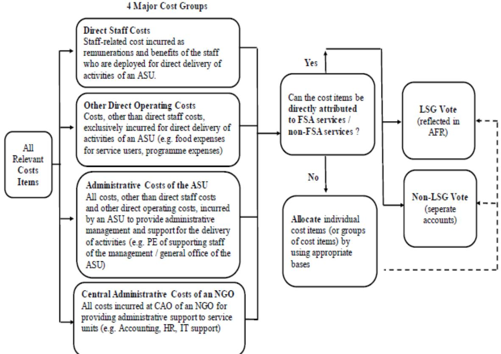

## SOCIAL WELFARE SERVICES LUMP SUM GRANT SUBVENTION MANUAL

Social Welfare Department The Government of the Hong Kong Special Administrative Region

October 2024 (Updated in May 2025)

### **Table of Contents**

| CHAPTER |                                                    | Page No.   |
|---------|----------------------------------------------------|------------|
| 1       | Introduction                                       | 2 - 3   |
|         | 1.1 Purpose                                     |            |
|         | 1.2 Ambit                                       |            |
|         | 1.3 Compliance                                  |            |
|         | 1.4 Provisions                                  |            |
|         | 1.5 Publication                                 |            |
|         | 1.6 Icons and Hyperlinks                     |            |
|         | 1.7 Enquiries                                   |            |
| 2       | The Lump Sum Grant Subvention System               | 5 - 8   |
|         | 2.1 Introduction                                |            |
|         | 2.2 Lump Sum Grant                           |            |
|         | 2.3 Guiding Principles                       |            |
|         | 2.4 No Cross-subsidisation                   |            |
|         | 2.5 Eligibility for Operating Subvented Welfare |            |
|         | Services under the LSGSS                        |            |
|         | 2.6 Exit                                        |            |
| 3       | Funding and Service Agreement                      | 10 - 20 |
|         | 3.1 Introduction                                |            |
|         | 3.2 Contents of the FSA                      |            |
|         | 3.3 Agreement Service Unit                   |            |
|         | 3.4 FSA Services                             |            |
|         | 3.5 FSA-related Activities                   |            |
|         | 3.6 Subvented / Subsidised Services across      |            |
|         | NGOs and / or ASUs or Government Bureaux /      |            |
|         | Departments' Funds                              |            |
|         | 3.7 Donations                                   |            |
|         | 3.8 Mediation Clause                            |            |
| 4       | Allocation and Use of Subvention                   | 22 - 28 |
|         | 4.1 Subvention Allocation                    |            |
|         | 4.2 Payment of Subvention                    |            |
|         | 4.3 Adjustments to Subvention Allocation     |            |
|         | 4.4 Other Payments not included in LSG       |            |
|         | 4.5 LSG Reserve and PF Reserve               |            |
|         | 4.6 Use of LSG and LSG Reserve               |            |
|         | 4.7 Use of PF Reserve                        |            |
|         | 4.8 Investment of Reserves                      |            |
|         | 4.9 Insurance                                   |            |
|         | 4.10 Requirements for Opening Accounts to Hold  |            |
|         | DSW's Different Allocations                        |            |

| 5 | Financial Management                                                                 | 30 - 42 |
|---|--------------------------------------------------------------------------------------|---------------|
|   | 5.1 Introduction                                                                  |               |
|   | 5.2 Financial Accounting                                                       |               |
|   | 5.3 Books of Account and AccountingRecords                                        |               |
|   | 5.4 Financial Planning and Projection                                          |               |
|   | 5.5 Financial Reporting Requirements                                           |               |
|   |                                                                                      |               |
|   | 5.6 Financial Auditing                                                         |               |
|   | 5.7 Disclosure Requirements                                                    |               |
|   | 5.8 Internal Control                                                              |               |
|   | 5.9 Subvention Inspection                                                      |               |
| 6 | Non-subvented Services and Cost Apportionment                                        | 44 - 54 |
|   | 6.1 Non-subvented Services                                                     |               |
|   | 6.2 No Cross-subsidisation                                                     |               |
|   | 6.3 Guiding Principles                                                         |               |
|   | 6.4 Cost Apportionment                                                         |               |
|   |                                                                                      |               |
|   | 6.5 Case Examples (for reference only)                                            |               |
| 7 | Service Performance Monitoring System                                                | 56 - 60 |
|   | 7.1 Introduction                                                                  |               |
|   | 7.2 Service Performance Standards                                              |               |
|   | 7.3 Service Performance Assessment                                             |               |
|   | 7.4 Self-assessment by NGOs                                                    |               |
|   | 7.5 Performance Review                                                         |               |
|   |                                                                                      |               |
| 8 | Public Accountability and Complaint Handling                                         | 62 - 71 |
|   | 8.1 Public Accountability of Non-governmental                                  |               |
|   | Organisations                                                                        |               |
|   | 8.2 Monitoring Roles of SWD                                                    |               |
|   | 8.3 Safeguarding National Security                                             |               |
|   |                                                                                      |               |
|   | 8.4 Display of Logo "Subsidised Service by the Social                             |               |
|   | Welfare Department" 8.5 Monitoring of Remunerations of Senior Executives |               |
|   |                                                                                      |               |
|   | 8.6 Special Incident Report                                                    |               |
|   | 8.7 Significant Incident Report                                                |               |
|   | 8.8 External Audit                                                             |               |
|   | 8.9 Roles and Responsibilities of NGOs in Handling                                |               |
|   | Complaints                                                                           |               |
|   | 8.10 Lump Sum Grant Independent                                                   |               |
|   | Complaints Handling Committee                                                     |               |
| 9 | Corporate Governance                                                                 | 73 - 78 |
|   | 9.1 Introduction                                                                  |               |
|   | 9.2 The Governing Board and the NGO's Management                               |               |
|   | 9.3 Delineation of Roles and Responsibilities of the                              |               |
|   |                                                                                      |               |
|   | Governing Board                                                                   |               |
|   | 9.4 Terms of Office of the Governing Board                                     |               |
|   | 9.5 Communication with Staff and Service Users                                 |               |
|   | 9.6 Human Resource Management                                                  |               |
|   | 9.7 Corruption Prevention and Probity Requirements                             |               |
|   |                                                                                      |               |

# Chapter 1 Introduction

## CHAPTER 1 INTRODUCTION

#### **1.1 Purpose**

This Lump Sum Grant Subvention Manual (the Manual) is issued by the Social Welfare Department (SWD), setting out the principles, procedures, standards and requirements pertaining to the use of subvention allocations provided by SWD for operating welfare services, as well as providing administrative guidelines for the management and control of nongovernmental organisations (NGOs) receiving Government subvention under the Lump Sum Grant Subvention System (LSGSS)1 .

#### **1.2 Ambit**

For the purposes of this Manual, NGOs refer to non-governmental organisations receiving recurrent subvention by SWD for meeting the expenses of providing welfare services to the public. NGOs which only receive funding from SWD in the form of non-recurrent subsidies2or service contract payments are not regarded as organisations operating subvented services.

#### **1.3 Compliance**

NGOs receiving subvention by SWD are required to observe the principles underlying the provision of grants and comply with the conditions of subvention and other requirements as stipulated in this Manual. Failure to comply with the terms and conditions of this Manual may lead to withdrawal of subvention by the Government.

#### **1.4 Provisions**

The provisions of this Manual are prescribed by the Director of Social Welfare as the Controlling Officer overseeing the deployment of subvention by SWD, who may amend, supplement, apply, interpret and make exceptions to them. NGOs shall also comply with the requirements as stipulated in the management letters, guidelines and circulars issued by SWD from time to time.

1 This Manual may be applicable to NGOs receiving subvention under the conventional mode where appropriate.

2 For example, some organisations operate welfare services on a self-financing basis but they may receive rent and rates subsidies from SWD which are non-recurrent in nature.

#### **1.5 Publication**

This Manual is published in electronic form only. There will be periodic reviews and updates of the Manual. Users of this Manual are advised to note the latest edition of the Manual, management letters, guidelines and circulars which are available on [SWD's website.](https://www.swd.gov.hk/en/ngo/subventions/)

#### **1.6 Icons and Hyperlinks**

1.6.1 There are two types of icons in this Manual which can facilitate Users to grasp and take heed of the submission requirements as follows -

This icon reminds that NGOs shall submit the documents/ statistical information to SWD as scheduled.

This icon reminds that NGOs shall submit the reports/documents/ other information to SWD according to actual situation.

1.6.2 There are hyperlinks in blue built in this Manual which can directly link Users to the individual Chapters, Annexes and other relevant information of the Manual.

#### **1.7 Enquiries**

For any enquiries relating to this Manual, please contact the Subventions Section of SWD on telephone number 2832 4308 or by email at [suenq@swd.gov.hk.](mailto:suenq@swd.gov.hk)

# Chapter 2 The Lump Sum Grant Subvention System

### CHAPTER 2 THE LUMP SUM GRANT SUBVENTION SYSTEM

#### **2.1 Introduction**

The Lump Sum Grant Subvention System (LSGSS) has been implemented by the Social Welfare Department (SWD) since 2001, with a view to enhancing accountability, efficiency and cost-effectiveness in the use of subvention allocations.

#### **2.2 Lump Sum Grant**

Under the LSGSS, recurrent subvention is allocated on a nongovernmental organisation (NGO) basis with grants in a lump sum [therefore named as Lump Sum Grant (LSG)] for operating subvented welfare services governed by the respective Funding and Service Agreements (FSAs). Subject to compliance with this Manual and the relevant rules of subvention, NGOs may deploy LSG resources (except the Provident Fund) across different cost items and Agreement Service Units (ASUs) which are subvented by SWD for providing services with the intended purposes and objectives as governed by the FSAs.

#### **2.3 Guiding Principles**

In deploying LSG resources, it is necessary for the Government to ensure that an appropriate system of cost control and monitoring is in place for overseeing the spending of public money by NGOs, having regard to economy, efficiency and effectiveness in the delivery of welfare services and the use of public funds. On this premise, the LSGSS is implemented along the following guiding principles –

#### 2.3.1 Flexibility, Efficiency and Cost-effectiveness

NGOs are encouraged to make use of the flexibility in using LSG resources in an efficient and cost-effective manner to achieve better value for money in the delivery of welfare services, as well as to proactively respond to the changing needs of the society.

#### 2.3.2 Accountability on the Use of Public Funds

The governing board1and management of NGOs shall be accountable for the use of public funds to maintain proper control of LSG and ensure that subvention is used for the intended purposes only as governed by the FSAs and prescribed by the Director of Social Welfare.

#### 2.3.3 Corporate Governance of NGOs

The governing board and management of NGOs are responsible for directing the operation of services and controlling the use of resources, including financial and human resource management. An effective corporate governance framework comprises a well-defined management structure, high standards of conduct, comprehensive procedures and independent checks and balances. Appropriate probity requirements and corruption prevention measures should also be put in place to prevent corruption and malpractice as well as to avoid and manage any conflict of interests.

#### 2.3.4 Service Quality and Performance

NGOs are required to meet the relevant standards and requirements in order to ensure that subvented services are provided as agreed by SWD. NGOs shall put in place effective internal monitoring mechanisms to supervise and monitor the performance of service units in compliance with the requirements of the FSAs and the 16 Service Quality Standards. Complaints and feedbacks from service users should be handled by NGOs in the first instance in accordance with the established policies and procedures, with a view to improving service quality.

#### 2.3.5 Transparency

Transparency and disclosure of information enables an NGO to solicit support from stakeholders as well as to facilitate an effective communication with its staff and service users. The governing boards and management of NGOs are encouraged to engage staff and service users in the process of making important decisions through appropriate means.

1The governing body of an NGO may be referred to as "Board of Directors", "Management Board", "Executive Committee", "Management Committee", "Council", etc. In this Manual, the governing body of an NGO is collectively referred to as "the governing board".

#### **2.4 No Cross-subsidisation**

- 2.4.1 Apart from providing FSA services funded by LSG subvention, some NGOs also conduct other activities to render services on a self-financing basis or supported by grants or subsidies of other Government departments or funding bodies, which are not subvented or subsidised by SWD.
- 2.4.2 The recurrent subvention provided by SWD contributes toward the NGOs' operational expenses, in exchange for their services to the public as specified in the FSAs, which may account for the bulk of the NGO's income or may only form a small percentage of the NGO's total income.
- 2.4.3 NGOs receiving subvention from SWD should ensure that there is no cross-subsidisation of non-FSA services by the subvented programmes in money or in kind. Apportionment of costs is required if LSG resources are spent on non-FSA services. Please refer to Chapter 6 for details. For situations where costapportionment are exempted, please refer to Chapter 3.

#### **2.5 Eligibility for Operating Subvented Welfare Services under the LSGSS**

To be eligible for operating subvented welfare services under the LSGSS, an NGO must be a bona fide non-profit-making organisation which is also a charitable institution exempt from tax under section 88 of the Inland Revenue Ordinance (Cap. 112). An NGO applying for operating subvented welfare services is required to provide the following information to assess its eligibility to receive subvention –

- a certificate issued by the Inland Revenue Department under section 88 of the Inland Revenue Ordinance;
- the Memorandum and Articles of Association / Articles of Association / constitution of the NGO (if applicable);
- the corporate governance and management structure, and management personnel involved in operating the NGO;
- records of social welfare services provided by the NGO which should be in line with the objects of the organisation;
- audited financial statements for the past three financial years; and
- any other documentary proofs as requested by SWD.

#### **2.6 Exit**

- 2.6.1 If an NGO intends to cease operating subvented welfare services, the Chairperson of the NGO should give an advance notice to SWD to indicate such intention at least six months prior to termination of service. The decision to cease operating subvented welfare services should be endorsed in writing by the governing board. The NGO should co-operate with SWD in effecting a smooth termination, or transfer of services or service users to other service operator(s).
- 2.6.2 In case there are any special circumstances that the Government considers the subvented welfare service provided by the NGO is no longer required or suitable, SWD reserves the right to terminate the subvention by giving 30 days' notice in writing to the service operator.
- 2.6.3 In the event of the circumstances mentioned in paragraph 2.6.1 and 2.6.2 that the operation of subvented welfare services is ceased for whatever reason or upon expiry of the service agreement period, the FSA of the relevant services is deemed to be terminated. The NGO should submit the relevant service statistical returns, reports and documentation within two months after the last day of the operation or any date as directed by SWD, including the Annual Financial Report together with an assurance report thereon issued by the external auditors in respect of all FSA services and the audited financial statements of the NGO as a whole up to the last day of the operation. Any unspent LSG and Provident Fund Reserves, together with Central Item, if any, must be refunded to the Government within the period as required by SWD.

# Chapter 3 Funding and Service Agreement

**9 |** SOCIALWELFARE SERVICES LUMP SUM GRANT SUBVENTION MANUAL

#### CHAPTER 3

### FUNDING AND SERVICE AGREEMENT

#### **3.1 Introduction**

The Funding and Service Agreement (FSA), which is a binding document between the Social Welfare Department (SWD) as a funder and a nongovernmental organisation (NGO) as a service operator, forms the basis of subvention for providing social welfare services under the Lump Sum Grant Subvention System (LSGSS). The FSA includes generic sections setting out the general obligations of SWD and the responsibilities of service operators; and service-specific sections which define the purpose and objectives, service nature and contents, target service users, essential service requirements and service performance standards on a specific type of service subvented by SWD.

#### **3.2 Contents of the FSA**

#### 3.2.1 Purpose and Objectives

The FSA sets out the purpose and objectives of a specific service, stating the reasons why the service is to be provided and the ultimate goals to be achieved, for example –

#### *Integrated Family Service Centre (IFSC)*

• "to support and strengthen the family as a unit through enhancing family functioning";

#### *Integrated Children and Youth Services Centre (ICYSC)*

• "to facilitate the personal development of children and youth by developing their life skills, potentials and problem-solving ability";

#### *District Elderly Community Centre (DECC)*

• "to enable elderly persons to continue to stay in the community" and "to provide social networking and outreaching services to vulnerable elderly persons"; and

#### *Integrated Community Centre for Mental Wellness (ICCMW)*

• "to provide one-stop, district-based and outreaching support services for persons with mental health problems or suspected mental health problems in the service area to improve their social adjustment capabilities, to prepare them to re-adjust to

community living, and to help them develop their social and vocational skills to the fullest extent".

#### 3.2.2 Service Nature and Contents

The FSA defines the service nature and contents for meeting the purpose and objectives through the provision of direct services, which may be preventive, supportive or remedial in nature, such as counselling and support services, therapeutic groups, developmental and socialisation programmes, accommodation and meals, personal care services, etc.; or through collaboration and cooperation with other service operators in the community.

#### 3.2.3 Target Service Users

The FSA specifies the target service users that are to be served, such as children and youth aged between 6 and 24, elderly persons aged 60 or above residing in the district as determined by SWD. There may be specific eligibility criteria for access to some services which are provided for people with a certain type of disability or level of impairment or for persons with specified social conditions / needs / disadvantaged circumstances.

#### 3.2.4 Service Performance Standards

(a) Essential Service Requirements (ESRs)

The ESRs specify the necessary features of the infrastructure for a specific service such as the operating hours, e.g. 8:00 a.m. to 6:00 p.m. on Mondays to Fridays, 24 hour operation, essential staffing (e.g. nurses) and the requirement to comply with the relevant ordinances and / or regulations.

(b) Service Output Standards (OSs)

OSs are used to measure the service volume. An operator is required to meet the agreed level of service outputs such as the number of cases served, number of groups and programmes, enrolment or occupancy rates.

(c) Service Outcome Standards (OCs)

OCs are used to evaluate the effectiveness of services. An operator is required to meet the agreed level of service outcomes such as the rate of satisfaction by service users and / or their family members.

#### (d) Service Quality Standards

Service operators shall meet the requirements of the 16 Service Quality Standards (SQSs) which define the level of which, in terms of management and service provision, service units are expected to attain.

#### 3.2.5 Validity Period

At present, there are time-defined or non-time-defined FSAs. Nontime-defined FSAs were signed between SWD and NGOs prior to the implementation of the LSGSS. SWD will conduct reviews for different services as necessary, and convert non-time-defined FSAs into time-defined FSAs following the reviews, so as to meet the everchanging service needs and the relevant requirements. Renewal of an expiring FSA is subject to service demand and satisfactory service performance of the operator.

#### **3.3 Agreement Service Unit**

An Agreement Service Unit (ASU) refers to a unit operating welfare services governed by the concerned FSA with subvention provided by SWD, which may or may not be premises-tied. An NGO may operate more than one ASU on the same premises.

#### **3.4 FSA Services**

- 3.4.1 FSA services refer to the services carried out by an operator as defined by the respective FSA with subvention provided by SWD. Services meeting the (i) purpose and objectives; (ii) service nature; (iii) service contents; and (iv) target service users of an FSA are regarded as FSA services.
- 3.4.2 In the course of service delivery, NGOs may carry out activities that are incidental to the operation of services which may not be specified in the FSA. These activities may be regarded as FSA services if they meet the criteria in paragraph 3.4.1 above. In case of doubt, NGOs may consult the concerned service branch of SWD for advice as to whether certain activities may be regarded as FSA services.
- 3.4.3 If an NGO receives Other Funds or Donations for Designated Purposes1for operating activities that are regarded as FSA services as mentioned in paragraph 3.4.2 above, the NGO may consider including all the income (including Other Funds or Donations for Designated Purposes) and expenditure of these activities in the Annual Financial Report (AFR) by completing the column "Other Funds or Donations for Designated Purposes " in Note 8 to the AFR on cash basis and **Annex 3.1** as an attachment to the AFR, with no need to apportion the costs between the activities financed by LSG subvention and this type of fund or donations. The cumulative balance of uncompleted activities under the column "Other Funds or Donations for Designated Purposes" in Note 8 (if any) may be carried forward to the next financial year. For activities completed within a financial year, the unspent balance (if any) of these activities shall be transferred to and formed part of the LSG Reserve which is subject to recovery by the Government as mentioned in paragraph 3.5.10(c). If there is any unspent balance out of these activities that must be returned to the funder, such payment shall be borne by the NGO's own resources.
- 3.4.4 In calculating the amount of LSG reserve to be clawed back by the Government in the following financial year as set out in paragraph 3.5.10(c) below, expenditure as reflected in the column of "Other Funds or Donations for Designated Purposes" in Note 8 will not be taken into account as the operating expenditure of the NGO.
- 3.4.5 On the contrary, if an NGO receives Other Funds or Donations for Designated Purposes for operating activities that may be regarded as FSA services as mentioned in paragraph 3.4.2 above, but the income and expenditure of these activities are not included in the AFR, it would be necessary for the NGO to apportion the costs of operating subvented and non-subvented services so as to avoid crosssubsidisation. Please refer to Chapter 6 for the principles and methodology of cost apportionment.

1Other Funds or Donations for Designated Purposes generally refer to non-SWD subsidies, or those not listed on [SWD's](https://www.swd.gov.hk/storage/asset/section/585/en/List%20of%20funds%20or%20subsidy%20schemes%20exempt%20from%20cost-apportionment.pdf)  [website](https://www.swd.gov.hk/storage/asset/section/585/en/List%20of%20funds%20or%20subsidy%20schemes%20exempt%20from%20cost-apportionment.pdf) under funds or subsidy schemes from government bureaux / departments, including subsidies from public / private organisations. Examples include The Community Chest, The Hong Kong Jockey Club Charities Trust, and private donations, etc.

#### **3.5 FSA-related Activities**

- 3.5.1 FSA-related activities are services that are not specified in the FSAs but they are carried out by service operators meeting the following criteria –
	- (a) they have the **same** purpose and objectives as the FSA;
	- (b) they have the **same** service nature as covered by the FSA;
	- (c) the service contents are **in line** with the FSA; and
	- (d) the target service users are **in line** with those covered by the FSA.
- 3.5.2 NGOs may operate FSA-related activities on the following conditions –
	- (a) For FSA-related activities using 10% or less of an ASU's LSG subvention as allocated by an NGO, the NGO concerned must ensure that the activities meet the four criteria as set out in paragraph 3.5.1.
	- (b) For planned FSA-related activities using more than 10% of an ASU's LSG subvention as allocated by an NGO, the NGO concerned, in addition to ensuring that the activities meet the four criteria as set out in paragraph 3.5.1, must also take the following actions –
		- (i) the activities must first be put forward to the governing board for discussion and assessment of their implications on the NGO's services, staff and service users, and supported by the governing board;
		- (ii) frontline staff and service users must be consulted according to established mechanisms; and
		- (iii) prior agreement must be sought from relevant service branch of SWD before the activities are conducted.
	- (c) For FSA-related activities using more than 20% of an ASU's LSG subvention as allocated by an NGO, the NGO concerned shall be responsible for the exceeded amount with its own resources. SWD will not recognise any excessive expenditure to be charged to LSG subvention or provide any additional subvention for this purpose.

3.5.3 The basis of calculating the use of LSG resources on FSA-related activities of an ASU is set out below –

> *Annual expenditure of FSA-related activities charged to LSG* [including staff salary, provident fund, other operating costs, but excluding central items and rent and rates] plus / minus the deficit / surplus respectively of completed activities funded by Other Funds or Donations for Designated Purposes in the concerned year *Amount of annual LSG subvention allocated by the NGO to the ASU concerned*  [including staff salary, provident fund, other charges, but excluding central items and rent and rates] X 100%

NGOs operating FSA-related activities are required to submit to SWD an Annual Statement (**Annex 3.2**) via Service Performance Management Information System (SPMIS) by 31 October, following the end of a financial year, to report the following –

- (a) whether the FSA-related activities meet the four criteria as set out in paragraph 3.5.1;
- (b) the proportion of the use of LSG resources on the FSArelated activities against LSG subvention allocated by the NGO to the ASU concerned; and
- (c) whether the NGO suggests incorporating the FSA-related activities into FSA services (the NGO should provide details including output and outcome of the FSA-related activities to be incorporated into FSA services for SWD's consideration).
- 3.5.5 Regardless of the proportion of the use of LSG resources for planned FSA-related activities against an ASU's LSG subvention allocated by the NGO, the NGO must obtain the agreement of relevant service branches of SWD prior to conducting the FSArelated activities if such activities are not in line with the terms as stipulated in the FSA, such as –
	- (a) the planned FSA-related activities fall outside the scope of target service users specified in the FSA, for example, beyond the upper or lower age limits of target service users;
	- (b) the planned FSA-related activities fall outside / beyond the scope of service districts specified in the FSA.
- 3.5.6 For the avoidance of doubt, activities regarded as FSA services or FSA-related activities do not include self-financing services2 or social enterprises3which are regarded as non-subvented / nonsubsidised services for the purposes of this Manual.
- 3.5.7 To facilitate NGOs in assessing whether the proposed activities or service programmes should be regarded as FSA services, FSArelated activities or non-FSA services, an assessment template is provided at **Annex 3.3** for reference and deployment.
- 3.5.8 When operating FSA-related activities, NGOs should observe the following conditions –
	- (a) the normal operation of FSA services are not adversely affected;
	- (b) the FSA-related activities must be operated in compliance with the requirements of the FSA concerned including the 16 SQSs;
	- (c) the FSA-related activities do not contravene any statutory requirements, land lease or tenancy conditions; and
	- (d) a regular review of the FSA-related activities should be conducted by the NGO to ensure that the ASU concerned is operated to the satisfaction of SWD.
- 3.5.9 If an NGO receives Other Funds or Donations for Designated Purposes for operating activities that are regarded as FSArelated as mentioned above, the NGO may consider whether these activities should be reported in the AFR with the following arrangements –
	- (a) the NGO may include all the income (including Other Funds or Donations for Designated Purposes) and expenditure of these activities in the AFR by completing the column "Other Fund or Donations for Designated Purposes" in Note 8 to the AFR on cash basis and **Annex 3.1** as an attachment to the AFR, with no need to apportion the costs between the activities financed by LSG subvention and this type of funds or donations. The cumulative balance of uncompleted activities

2Self-financing services refer to non-SWD-subvented programmes operated by NGOs with its own resources, such as the self-financing section of a subvented residential care home for the elderly. No cross-subsidisation of self-financing services is allowed.

3 For the purposes of this Manual, social enterprises refer to self-sustaining businesses without receiving recurrent subsidies from the Government, for which financial accounts are prepared separately.

under the column "Other Funds or Donations for Designated Purposes" in Note 8 (if any) may be carried forward to the next financial year. For activities completed within a financial year, the unspent balance (if any) of these activities shall be transferred to and formed part of the LSG Reserve which is subject to recovery by the Government as mentioned in paragraph 3.5.10(c). If there is any unspent balance out of these activities that must be returned to the funder, such payment shall be borne by the NGO's own resources.

- (b) FSA-related activities reported in the AFR should also be reported in both Part A (applicable to FSA-related activities using 20% or less of an ASU's LSG subvention) and Part B (applicable to FSA-related activities that are recommended by the NGO to be incorporated into FSA services) of the Annual Statement at **Annex 3.2** as mentioned in paragraph 3.5.4 above.
- (c) In calculating the amount of LSG reserve to be clawed back by the Government in the following financial year as set out in paragraph 3.5.10(c) below, expenditure as reflected in the column of "Other Funds or Donations for Designated Purposes" in Note 8 will not be taken into account as the operating expenses of the NGO.
- (d) If non-SWD-subvented FSA-related activities are not reported in the AFR, but subvented resources have been used for these activities, apportionment of costs should be arranged in accordance with the principles and procedures set out in Chapter 6 of this Manual. These activities would not be counted toward the proportion of the use of LSG on FSArelated activities of an ASU, but they may be reported in Part B of the Annual Statement at **Annex 3.2** (if the activities are recommended by the NGO to be incorporated into FSA services) for reference.
- 3.5.10 NGOs should take into consideration the following concerns when planning and conducting FSA-related activities –
	- (a) to assess the implications on staff and service users arising from the FSA-related activities, and solicit support from them for carrying the FSA-related activities;
- (b) to inform the funding bodies, if any, that the programmes concerned are regarded as FSA-related activities of ASUs under the subvention of SWD, which must comply with the relevant requirements; and
- (c) to monitor the spending position of the budget, as the AFR is prepared on a cash-accounting basis, having regard to the requirement under the LSGSS that the cumulative reserve (including interest, but excluding Provident Fund (PF) Reserve, Holding Account balance and closing balance arising from FSA services / FSA-related activities funded by Other Funds or Donations for Designated Purposes which are not yet completed) exceeding 25% of the NGO's operating expenditure4(excluding PF expenditure) for operating the subvented services for that year shall be returned to the Government.

#### **3.6 Subvented / Subsidised Services across NGOs and / or ASUs or Government Bureaux / Departments' Funds**

- 3.6.1 For contract services and time-defined projects that are subvented or subsidised by SWD with designated purposes5 , NGOs are required to submit financial reports separately for which recovery of surpluses is necessary (if applicable). As far as they are subsidised by SWD (including programmes initiated or coordinated by SWD), there is no need to include those services / projects in the AFR and apportion the costs of these services / projects regardless of whether LSG resources are deployed.
- 3.6.2 To promote synergy and efficiency on the use of resources, LSG subvention and subvented resources (such as premises and manpower, etc.) may be deployed across NGOs and / or ASUs to carry out FSA services (and FSA-related activities) or services subsidised by SWD, by ways including the following –
	- (a) NGOs may operate different ASUs by the same team of staff and / or on the same premises.

4This refers to the NGO's operating expenditure funded by LSG only.

5 Examples are Contract Homes, Residential Care Service Voucher Scheme for the Elderly, Community Care Service Voucher Scheme for the Elderly, Employment Support Services under the Support for Self-reliance Scheme, Portable Comprehensive Social Security Assistance Scheme, projects funded by the Partnership Fund for the Disadvantaged and programmes administered by SWD.

- (b) NGOs may operate activities subsidised by SWD at the subvented premises of an ASU, such as running the After School Care Programme6at an ICYSC, or providing services under the Community Care Service Voucher Scheme for the Elderly (CCSV) at a subvented Residential Care Home for the Elderly (RCHE) cum Day Care Unit7 .
- (c) NGOs may co-operate with one another (including service units of SWD) to carry out FSA services (and FSA-related activities) such as organising joint programmes or using the subvented premises of another ASU for the benefit of services users 8 .
- 3.6.3 LSG subvention and subvented facilities may be deployed across NGOs and / or ASUs to carry out FSA services (and FSA-related activities) subject to the following considerations –
	- (a) the requirements of the concerned FSAs and / or relevant service agreements are met;
	- (b) the terms and conditions on the use of premises are observed9 ;
	- (c) the normal operation of FSA services (and FSA-related activities) or ASUs concerned are not adversely affected; and
	- (d) the related arrangements are mutually agreed between the concerned NGOs and / or ASUs taking into consideration management issues such as coverage of insurance and any liability arising from the use of premises.
- 3.6.4 To increase the overall effectiveness of government resource utilisation, promote cross-sector collaboration, and enhance synergy, if NGOs receive subsidies under funds or subsidy schemes from government bureaux / departments listed on [SWD's website](https://www.swd.gov.hk/storage/asset/section/585/en/List%20of%20funds%20or%20subsidy%20schemes%20exempt%20from%20cost-apportionment.pdf) to implement services or projects, they are not required to include these in the AFR and are not required to apportion the costs of operating such services or projects, regardless of whether LSG resources are utilised or whether the services provided are FSA services or FSArelated activities.

(Updated in February 2025)

6 Some NGOs are provided with subsidies by SWD to operate the After School Care Programme with a specified number of fee-waiving quotas allocated on a half-yearly basis.

7 For example, a service user of the CCSV may receive residential respite service at a subvented RCHE cum Day Care Unit operated by the same NGO.

8 For example, the staff of a DECC may carry out FSA services or FSA-related activities at an ICYSC of another NGO which are located in the vicinity, or vice versa.

9 Including but not limited to the "user" and "non-assignment / restriction on alienation" clauses on the land lease or tenancy agreement as appropriate.

#### **3.7 Donations**

Donations refer to contributions in cash or in kind to which the concerned NGO or ASU is not bound by the funding bodies to deliver specific services as defined by a service agreement. An NGO receiving donations to an ASU should observe the following conditions –

- 3.7.1 some donated items (e.g. computers, vehicles, washing machines, etc.) may incur related operating expenses which may be charged to LSG, on condition that they are solely used for FSA services and / or FSA-related activities. The NGO should ensure the proper accounting and record of all donations received, and put in place effective mechanism to monitor the usage of the donations to ensure accountability and fulfilment of the stated objectives;
- 3.7.2 the NGO must ensure that the donated items will not bring any adverse effects to the operation of the ASU concerned or financial difficulty of the NGO concerned;
- 3.7.3 donations in cash or any income generated from the donated items (e.g. fees collected from the provision of transportation service with a sponsored vehicle) shall be treated as Other Income of the ASU concerned and included in the AFR;
- 3.7.4 SWD will not be responsible for the replacement or replenishment of the donated items; and
- 3.7.5 SWD will not provide any additional subvention for meeting the recurrent expenses incurred by the donated items.

#### **3.8 Mediation Clause**

In the event of any dispute or difference arising out of or in connection with FSA, SWD and the concerned NGO shall first refer to mediation in accordance with the Government of Hong Kong Special Administrative Region Mediation Rules prevailing at the time. If the said dispute or difference is not settled by mediation, SWD or the concerned NGO may institute litigation / arbitration in respect of the said dispute or difference. SWD and the concerned NGO agree that the courts of Hong Kong shall have exclusive jurisdiction in respect of the said dispute or difference.

## Chapter 4

# Allocation and Use of Subvention

**21 |** SOCIALWELFARE SERVICES LUMP SUM GRANT SUBVENTION MANUAL

#### CHAPTER 4

### ALLOCATION AND USE OF SUBVENTION

#### **4.1 Subvention Allocation**

Under the Lump Sum Grant Subvention System (LSGSS), subvention is allocated annually on a non-governmental organisation (NGO) basis. The sum of subvention allocated to NGOs is mainly composed of personal emoluments and other charges, less fee income recognised by the Social Welfare Department (SWD).

#### 4.1.1 Personal Emoluments (PE)

PE includes salaries, provident funds and salary-related allowances applicable to staff for subvented welfare services operated by an NGO.

- (a) Salaries
	- (i) As a reference for calculating subvention, there is a prescribed set of notional staffing establishment for each Agreement Service Unit (ASU), setting out the number of staff for different ranks. The allocation for salaries is calculated by making reference to the notional staffing establishment of an ASU at the prevailing mid-point salaries of the relevant posts of the Salary Scale of Common Posts in NGOs1(or above midpoint salaries for some specified posts2 ).
	- (ii) Job-related allowances under PE such as training allowance are provided for designated purpose. 3

1 The Salary Scale of Common Posts in NGOs is available o[n SWD's website.](https://www.swd.gov.hk/storage/asset/section/586/en/Salary_Scale_of_Common_Posts.pdf)

2 The subvention for some specified posts is provided above the mid-point salaries, such as Senior Nursing Officer, Nursing Officer, Nursing Officer (Psychiatric), Registered Nurse, Registered Nurse (Psychiatric), Enrolled Nurse, Enrolled Nurse (Psychiatric), Senior Physiotherapist, Physiotherapist I, Physiotherapist II, Senior Occupational Therapist, Occupational Therapist I, Occupational Therapist II, Clinical Psychologist, Speech Therapist, Child Care Supervisor, Child Care Worker, Senior Special Child Care Worker, Special Child Care Worker, Ward Attendant, Personal Care Worker and Home Helper.

3The provisions for job-related allowances under PE are based on the existing formulae or the amount recognised prior to the implementation of LSGSS. For example, training allowances (i.e. two additional salary points) are provided for recognised posts (e.g. Workshop Instructor and Certified Master/Mistress working in rehabilitation units, Special Child Care Workers and Welfare Workers in residential child care units) to promote in-service training in the relevant service units.

- (b) Provident Fund (PF)
	- (i) PF is a staff retirement fund allocated to NGOs to which contributions are made by employers and employees in accordance with the Mandatory Provident Fund Schemes Ordinance (Cap. 485). A separate account should be maintained in respect of each contributing employee.
	- (ii) Under the LSGSS, the PF provision for staff is calculated by making reference to 6.8% of the salaries allocation of the notional staffing establishment of an ASU.
	- (iii) For the PF provision for Snapshot Staff, please refer to **Annex 4.1**.

The subvention allocation for PE is subject to adjustment of salaries and provident fund with reference to the civil service pay adjustment.

- 4.1.2 Other Charges (OC)
	- (a) OC refer to expenses, other than PE, which are incurred in the operation of an ASU, such as utilities, programme and administrative expenses, minor repairs and maintenance, employees' compensation insurance and public liability insurance, etc.
	- (b) The subvention allocation for OC is subject to adjustment with reference to the Composite Consumer Price Index (CCPI) to reflect the change in price levels.

#### 4.1.3 Fee Income

- (a) Income from recognised fees charged on service users is deducted from the sum of subvention allocation, which is subject to review by SWD from time to time. Please refer to **Annex 4.2** for the list of fees and charges recognised by SWD.
- (b) Other than those recognised fee income as mentioned in paragraph 4.1.3(a) above, NGOs may retain income that is incidental to the operation of subvented services (e.g.

running a gift shop or providing photocopying service). Income so generated will not be deducted from the LSG, but it must be used on subvented services, separately accounted for and included in the Annual Financial Report (AFR). In administering fees and charges in respect of subvented welfare services, NGOs should observe the rules and feecharging principles at **Annex 4.3**.

#### **4.2 Payment of Subvention**

Subvention payment is released on a monthly basis by crediting to the bank account of an NGO on around the 15th of each month, with a payment advice issued to the NGO for reference.

#### **4.3 Adjustments to Subvention Allocation**

- 4.3.1 The subvention allocation to an NGO is calculated annually provided in a lump sum with no topping-up during the year. The amount of subvention is subject to annual adjustment on the following basis –
	- (a) PE : Civil Service PayAdjustment
	- (b) OC : Price Adjustment Factor (currently the CCPI)
	- (c) Recognised Fees : Subject to review bySWD
- 4.3.2 Adjustments to subvention may be considered by the Government for meeting statutory obligations which are unforeseen and therefore not budgeted for in the subvention allocation.
- 4.3.3 The allocation of subvention may be adjusted by SWD subject to the availbility of funds.

#### **4.4 Other Payments not included in LSG**

4.4.1 Accommodation Expenses

Accommodation expenses such as rent, rates, Government rent and management fees are paid on an actual reimbursement basis in respect of the premises recognised by SWD for operating subvented services, which are not included in the LSG subvention allocation.

#### 4.4.2 Central Items

Allocation for Central Items may be provided for specified purposes which are not included in the LSG subvention allocation. Any surplus, which is not allowed to be offset by any deficit of another item, is subject to claw-back by SWD according to the terms and conditions of individual Central Items.

#### **4.5 LSG Reserve and PF Reserve**

#### 4.5.1 LSG Reserve

Any unspent LSG subvention in a financial year must be kept in a reserve and reported in the AFR of an NGO. The cumulative reserve must be kept in an interest-bearing account with a bank licensed in Hong Kong (please refer to paragraph 4.10 for details). The cumulative reserve [separated from the PF Reserve and Holding Account (please refer to paragraph 5.4.5) balance and closing balance arising from Funding and Service Agreement (FSA) services / FSA-related activities funded by Other Funds or Donations for Designated Purposes which are not yet completed but including interest] is capped at 25% of the annual operating expenditure4 (i.e. total expenditure excluding PF) of the subvented services of an NGO. Any amount above the 25% cap at financial year end is subject to claw-back5 and must be returned to the Government in the following financial year by deducting the amount from the monthly subvention payment(s) until it is fully clawed back.

#### 4.5.2 PF Reserve

Any unspent PF provision must be kept in an interest-bearing account with a bank licensed in Hong Kong (please refer to paragraph 4.10 for details) and reported to SWD in the AFR of an NGO. The PF Reserve of Other Posts (i.e. non-Snapshot Staff) as reported in AFR will be used for PF contribution of Other Posts while the surplus, if any, of the Snapshot Staff PF provision as reported in AFR will be used to offset future PF provision for Snapshot Staff. PF Reserve is not capped by the 25% ceiling rule as in the case of LSG Reserve.

4 This refers to the NGO's operating expenditure funded by the LSG only.

5 Except otherwise stipulated by SWD.

#### **4.6 Use of LSG and LSG Reserve**

NGOs are required to observe the following rules and principles in the use of LSG and LSG Reserve –

- 4.6.1 Government subvention, including the LSG and LSG Reserve, shall only be used for the intended purposes of operating services as specified or approved by SWD.
- 4.6.2 Subject to their compliance with the requirements of the FSAs and the relevant statutory staffing requirements, NGOs may determine their staffing establishment in accordance with their human resource policies as well as flexibly deploying resources for employment of staff to deliver the services as specified in the FSAs.
- 4.6.3 As stated in paragraph 4.1 above, the LSG subvention is provided by SWD for meeting operational expenditure such as staff costs6 and administrative expenses, including minor repair and maintenance works. For major acquisitions and renovation works, NGOs should make use of the Lotteries Fund (LF), either through annual block grants or major grants, unless there are justifiable reasons in consideration of expediency and genuine needs. The financial thresholds and conditions for using LSG / LSG Reserve on capital expenditure are set out at **Annex 4.4**. NGOs should put in place a proper mechanism for deployment of LSG Reserve. Any decisions relating to the deployment of LSG Reserve to meet major acquisitions and renovation works should be thoroughly discussed in the NGO's governing board with sound justification and proper documentation. The NGO management should ensure that such expenditure will not cause any financial difficulty to the NGO or pose any adverse effect on the provision of service and the interest of service users.
- 4.6.4 When using LSG / LSG Reserve for purchasing goods and/or services, NGOs should follow the procedures and guidelines as set out at **Annex 5.17** to Chapter 5. For major acquisitions and renovation works, please refer to the LF [Manual.](https://www.swd.gov.hk/storage/asset/section/51/en/Eng_LF_Manual_2022-01.pdf)
- 4.6.5 For the financial management of LSG / LSG Reserve, please refer to Chapter 5 for details.

6 Including severance payments / long service payments arising from the abolition of the Mandatory Provident Fund (MPF) offsetting arrangement. If NGOs apply for the Labour Department's Subsidy Scheme for Abolition of MPF Offsetting Arrangement (Subsidy Scheme) to offset the costs of severance payments / long service payments for subvented employees, the NGOs must then include it as part of LSG and disclose it in the AFR after receiving the subsidy.

#### **4.7 Use of PF Reserve**

- 4.7.1 If there is a surplus from the PF provision for staff, NGOs may retain the surplus as PF Reserve (excluding the accumulated surplus of the Snapshot Staff PF which is to be used to offset future PF provision for Snapshot Staff) to meet their PF commitments towards staff, including making special contributions to reward staff for good performance. Moreover, NGOs may, after ensuring that sufficient funds are reserved to honour their contractual and statutory PF contribution obligations for staff, and with the agreement of the governing board and proper communication with staff through established mechanisms, use the remaining PF Reserve in the same areas as LSG Reserve, including covering operational expenditure, paying personal emoluments for staff, meeting severance payments / long service payments arising from the abolition of MPF offsetting arrangement, and / or making investments in accordance with the requirements provided at **Annex 4.5**, etc.
- 4.7.2 For the financial management of PF Reserve, please refer to Chapter 5 for details.

#### **4.8 Investment of Reserves**

Other than ordinary bank deposits, NGOs may consider investing the LSGrelated reserves (including the LSG Reserve, PF Reserve and Holding Account Reserve) which are not required for use in the short-term in accordance with the rules as detailed at **Annex 4.5**. However, when investing, NGOs must ensure that there is sufficient cash flow to meet daily operational expenditure7 . In addition, if multiple reserves are pooled together for investment purposes, the interest income generated must be reflected in Note 8 of the AFR.

#### **4.9 Insurance**

- 4.9.1 NGOs are required to procure insurance for subvented welfare services in respect of the Employees' Compensation Insurance (ECI) and Public Liability Insurance (PLI) throughout their operation.
- 4.9.2 Subject to compliance with the FSAs and the related requirements as stipulated in this Manual, NGOs may select appropriate insurance packages for the best protection of service users and staff, including items such as Malpractice Liability Insurance and Staff Group Life Insurance, other than ECI and PLI, taking into account the nature of service, as long as the packages are within NGOs' financial capability without affecting the quality of service.

7 If the reserves used for investment include the PF Reserve or the Holding Account Reserve, NGOs must ensure that there is sufficient cash flow to meet expenses related to staff's PF contributions and related costs for Snapshot Staff.

- 4.9.3 In administering insurance policies, NGOs are required to
	- (a) monitor the insurance procurement closely and strictly comply with and observe the mandatory insurance requirements for subvented welfare services;
	- (b) ensure occupational or workplace safety for the benefit of staff;
	- (c) ensure a safe environment for the benefit of service users; and
	- (d) strengthen risk and claim management continuously.

#### **4.10 Requirements for Opening Accounts to Hold SWD's Different Allocations**

NGOs may use a single **interest-bearing** Hong Kong dollar bank account 8 to receive and hold SWD's different allocations, including the LSG, LSG **Reserve**, PF **Reserve**, Holding Account **Reserve**, and other allocations, such as the block grants from the Lotteries Fund. However, **separate accounting records** for each type of allocation must be maintained and kept by NGOs. In addition, NGOs may withdraw / transfer the LSG Reserve, PF Reserve and Holding Account Reserve from this account to other bank accounts within the NGOs for other necessary purposes.

8 The interest-bearing account should be used to receive and hold allocations from SWD only.

## Chapter 5

## Financial Management

**29 |** SOCIALWELFARE SERVICES LUMP SUM GRANT SUBVENTION MANUAL

## CHAPTER 5 FINANCIAL MANAGEMENT

#### **5.1 Introduction**

Non-governmental organisations (NGOs) receiving subvention by the Social Welfare Department (SWD) should put in place a sound system of financial control to ensure that their funds are properly managed and accounted for. This Chapter sets out the financial accounting and reporting requirements, as well as the relevant financial control measures pertaining to the use of subvention.

#### **5.2 Financial Accounting**

- 5.2.1 For the allocation of subvention, a financial year refers to a period of 12 months commencing on 1 April every year and ending on 31 March of the following year.
- 5.2.2 NGOs should ensure that books of account and other accounting records are properly kept for all transactions, separately identified into Funding and Service Agreement (FSA) services, FSA-related activities (if applicable) and support services (including central administration and supervisory support), and non-FSA services.
- 5.2.3 NGOs must comply with the following financial accounting requirements in respect of FSA services, FSA-related activities (if any) and the related support services (including central administration and supervisory support) operated with subvention by SWD –
	- (a) NGOs must properly account for the receipt of income, including the Lump Sum Grant (LSG) and non-LSG subvention (such as Central Items, rent and rates) supporting FSA services and FSA-related activities (if any), subsidies and other income, and expenditure in their accounts and annual financial statements;
	- (b) a separate Operating Income and Expenditure (I&E) Account must be kept for each subvented service unit, including LSG, the related support services (including central administration and supervisory support), and other non-LSG subsidies and other income. The Operating I&E Account for each subvented service unit must be –
- (i) separated into FSA services, FSA-related activities (if any) and non-FSA services (if any);
- (ii) maintained by using the income and expenditure items in the Chart of Accounts (**Annex 5.1**);
- (iii) the source of information for the NGO to prepare the Annual Financial Report (AFR) (**Annex 5.2**); and
- (iv) an integral part of the overall audited accounts of the NGO.

#### **5.3 Books of Account and Accounting Records**

- 5.3.1 NGOs are required to keep the following books of account and accounting records –
	- (a) Books of Account and Records
		- (i) cash book;
		- (ii) daily collection summaries, revenue receipt counterfoils and receipt vouchers in respect of donations, subscriptions and fees, etc.;
		- (iii) payment vouchers in respect of all types of expenditure;
		- (iv) paylists in respect of all Personal Emoluments (PE) expenditure;
		- (v) staff records, including appointment letters, documents relating to changes in PE such as promotion, transfer, incremental date, etc.;
		- (vi) register of fixed assets;
		- (vii) ledgers showing accounts in respect of all income and expenditure, assets and liabilities; and
		- (viii) journal for all transfers and adjustments.
	- (b) Books of account and other related records must be retained for a minimum duration as specified below –
- (i) records of a permanent nature, e.g. annual financial statements, inventories, records of capital nature and government non-recurrent grants, etc. shall not be destroyed without the prior approval of SWD;
- (ii) records which may be destroyed after a minimum retention period of 7 years include all books of account (e.g. ledgers, cash books etc.), vouchers, invoices/ claims, fee receipts and bank statements; and
- (iii) records which may be destroyed after a minimum retention period of 2 years include duplicate documents, e.g. quarterly returns, quotation details, paysheets and vouchers.
- (c) Books of account and all other relevant records and information must, at all reasonable times, be available for inspection by the staff of SWD and the Audit Commission.

#### **5.4 Financial Planning and Projection**

#### 5.4.1 Annual Financial Planning

NGOs should conduct annual budgeting at the beginning of each financial year. If an NGO anticipates any financial difficulty, the governing board should have thorough discussion and inform SWD as soon as possible for taking timely actions. On exceptional and justifiable circumstances, NGOs may apply to SWD for advance payment in respect of subvention allocation on Other Charges within the same financial year.

#### 5.4.2 Annual Financial Projections

To ensure financial stability and more effectively manage the LSG resources, NGOs are required to conduct annual financial projections for the next three years. A financial projection framework is provided at **Annex 5.3** for reference. In conducting annual financial projections, NGOs should –

- (a) appoint professionals or assign designated staff / divisions to conduct annual financial projections;
- (b) examine reserve status, assess financial position, examine the accuracy and limitations of the projection for the last

financial year as well as to make revisions for the next year accordingly;

- (c) report the financial projections to the governing board in detail; and
- (d) provide channels for staff to note the results of financial projections.

#### 5.4.3 Management of LSG Reserve

- (a) The NGO management should report the latest position of LSG Reserve to the governing board regularly; and the governing board is required to discuss, **at least once a year**, how the LSG Reserve should be managed and utilised, with proper records.
- (b) NGOs should optimise the use of LSG Reserve and ensure that the reserve is fairly, reasonably, properly and effectively used for the intended purposes as stipulated by SWD. Based on the actual circumstances and their development strategies, NGOs should prudently decide how the LSG Reserve be deployed for meeting operational needs, such as fulfilling contractual commitments to staff, maintaining or strengthening service delivery and implementing strategic development plans, supporting the professional development of staff, etc. NGOs are required to have documents setting out the policies and procedures on managing and monitoring the use of LSG Reserve, and to make known to staff such procedures.
- (c) NGOs should, having regard to their sizes and actual needs, draw up planning and evaluation mechanisms to determine the appropriate level of reserve, and monitor the use of LSG Reserve effectively through appropriate years of projection. NGOs should lay down their mechanisms in planning, evaluating and determining the level of LSG Reserve, taking into consideration factors such as the salary structure, staff turnover rate, projection of income and expenditure, contractual commitments to staff, and long-term financial viability, etc.

#### 5.4.4 Management of Provident Fund (PF) Reserve

(a) The governing board is required to discuss, **at least once a year**, how the PF Reserve should be managed and utilised

for protecting staff retirement benefits, enhancing staff morale and their sense of belonging to the organisation, with proper records.

- (b) In utilising the PF Reserve, NGOs are required to observe the relevant legislation and the purposes as stipulated by SWD, which should be properly documented such as financial reports and financial plans, etc.
- (c) Based on actual needs and circumstances, NGOs should determine the use of PF Reserve, such as adjusting the PF contribution rates, offering a one-off additional contribution to staff, or using it in the same areas as LSG. NGOs are required to establish policies and procedures for the management and monitoring of the PF Reserve for staff members.
- (d) NGOs should separately account for PF contributions of staff members in their accounting records in order to facilitate staff to have better understanding of the utilisation of PF.
- (e) NGOs are required to inform all the contributors annually of (i) the position of their benefits under the PF scheme; and (ii) the amounts of employee's and employer's contributions during the year by providing the contributors with an annual statement of their accounts. The total of each contributor's account must be available for inspection by the contributors and SWD upon request.

#### 5.4.5 Use and Management of Holding Account Reserve

(a) Other than using the Holding Account Reserve to honour NGOs' contractual commitments towards Snapshot Staff and to enhance human resource arrangements, after ensuring that sufficient funds are reserved to meet all contractual commitments towards Snapshot Staff, and with the agreement of the governing board and proper communication with staff through established mechanisms, NGOs can use the remaining Holding Account Reserve in the same areas as LSG Reserve, including covering operational expenditure, paying personal emoluments for staff, meeting severance payments / long service payments arising from the abolition of the MPF offsetting arrangement, and / or making investments in accordance with the requirements provided at **Annex 4.5**, etc.

(b) For NGOs having a Holding Account, they are required to report the position of Snapshot Staff (as at 1 September) in September as directed by SWD's annual letter. To optimise the use of Holding Account Reserve, NGOs are required to improve the management of Holding Account Reserve (if applicable) as follows –

- (i) For NGOs having a Holding Account Reserve without any Snapshot Staff, the Holding Account Reserve will be merged with the account of LSG Reserve in the following financial year. For the first three years after merging the Holding Account Reserve with LSG Reserve, any expenditure funded by the Holding Account Reserve and the closing balance of the Holding Account Reserve will be disregarded for the purpose of calculating the cap of LSG Reserve. From the fourth financial year onwards, any balance of the Holding Account Reserve and LSG Reserve will be counted towards a combined reserve, of which any amount over 25% of the operating expenditure of the year must be refunded to the Government.
- (ii) For NGOs having a Holding Account Reserve with Snapshot Staff, utilisation plans and financial projections should be formulated on the use of the Holding Account Reserve, including honouring its contractual commitments towards the Snapshot Staff and enhancing human resource arrangements. Any expenditure funded by the Holding Account Reserve is regarded as part of the operating expenditure.
- (c) NGOs should formulate utilisation plans and carry out financial projections for the Holding Account Reserve through the following procedures –
	- (i) The plans and projections should be discussed, assessed and agreed by the governing board with proper documentation; and
	- (ii) The staff, including frontline staff, should be consulted through the established mechanism.

#### **5.5 Financial Reporting Requirements**

An NGO receiving subvention by SWD is required to submit two copies of the following documents to SWD on or before 31 October every year, covering the preceding financial year from 1 April to 31 March –

- (a) the AFR, together with the auditor's assurance report;
- (b) the audited financial statements of the NGO as a whole, together with the auditor's management letter; and
- (c) the relevant schedules as mentioned in paragraph 5.5.4, where applicable.
- 5.5.2 NGOs should accord priority to the timely preparation and submission of AFRs and financial returns to SWD for effective control and monitoring on the use of public funds. If an NGO fails to submit an AFR on the specified date, the governing board will be required to provide explanations and make improvements. For NGOs which have been late in submitting AFRs for three consecutive reporting years, the record of late submissions will be displayed on SWD's website.
- 5.5.3 The AFR must be prepared in respect of all FSA services, FSArelated activities (if any), related support services (including central administration and supervisory support) funded by LSG; non-LSG subvention (such as Central Items, rent and rates, etc.); and Other Funds or Donations for Designated Purposes spent on FSA services and FSA-related activities (if applicable). The prescribed form of an AFR is provided at **Annex 5.2**. The AFR must be –
	- (a) prepared on cash accounting basis for stewardship purposes and in line with Government accounts, as the AFR is a separate document required for the purpose of accounting to SWD for ensuring proper use of subvention;
	- (b) derived from and reconcilable with the Operating I&E Account of all subvented service units under FSAs; and
	- (c) presented at the NGO level, in respect of
		- (i) PF subvention received and PF expenditure, the split between Snapshot Staff and Other Posts;
- (ii) analysis on the number of posts with annual PE each costing above \$1,000,000 that are funded by LSG; and
- (iii) analysis of the LSG Reserve and balances of other non-LSG subvention.

#### 5.5.4 Reporting of Specific Items

(a) Investment

NGOs with positive LSG Reserve, PF Reserve or Holding Account Reserve balances are required to attach a schedule to the AFR showing separate breakdowns of investments at the end of a financial year **(Annex 5.4)**, which should be certified by the chairperson of the governing board and another authorised representative of the NGO, such as the NGO Head / Head of Social Welfare Services. Explanations should be provided for any difference between the total amount of reserves (including LSG Reserve, PF Reserve and Holding Account Reserve) and investments by way of Notes to be attached to the schedule.

(b) Provident Fund (PF)

The PF received and contributed for staff under the Central Items should be separately included as part of the income and expenditure of the relevant Central Items as specified in paragraph 3 of the Notes on the AFR at **Annex 5.2**, which should not be included in paragraph 1c of the Notes.

(c) Central Items

NGOs are required to submit an analysis of subvention and expenditure of Central Items at the subvented service unit level (**Annex 5.5**) together with the AFRs, because the surplus or deficit of Central Items for each financial year should be ascertained separately and any surplus, which is not allowed to be offset by any deficit, is subject to claw-back by SWD according to the terms and conditions of individual Central Items.

(d) Rent and Rates

NGOs are required to submit an analysis of Rent and Rates at the subvented service unit level (**Annex 5.6**) together with the AFRs, because Rent and Rates are paid on actual basis and the surplus or deficit of each unit for each financial year should be ascertained separately and any surplus, which is not allowed to be offset by any deficit, should be refunded to SWD. Vice versa, NGOs may apply for supplementary provision to cover any deficit on these items if needed.

(e) Special Items

(i) Standalone Child Care Centres, which are subsidised under specific rules and accounting requirements, are not required to be included in the AFR. NGOs should report these items in their Accompanying Financial Statements for submission to SWD together with the AFRs.

- (ii) If special items or grants are allocated by SWD to NGOs as LSG subvention, these allocations should be reported in the AFR.
- (f) Comparative Figures

For the first financial year after joining the Lump Sum Grant Subvention System (LSGSS), the comparative figures for the previous year in the AFR are not mandatory. However, comparative figures for the previous year should be provided in subsequent years.

(g) Holding Account Reserve

For NGOs with Holding Accounts, they are required to submit an analysis for the utilisation of reserve in Holding Account for the current year and the utilisation plan of Holding Account reserve for the following year (**Annex 5.7**) together with their AFRs

(h) Other Income

Subject to the principles governing fees and charges as mentioned in paragraph 4.1.3(b) of Chapter 4, NGOs may generate and retain income other than the recognised fee income, i.e. income from other services that are incidental to the operation of subvented services. Other income should be separately accounted for and reported in the NGOs' annual audited accounts and AFR as "Other Income".

(i) "Other Funds or Donations for Designated Purposes" spent on FSA Services / FSA-related Activities

If an NGO receives Other Funds or Donations for Designated Purposes for operating activities that are regarded as FSA services/ FSA-related activities, NGOs may include all these income as "Other Income", and expenditure under the column of "Other Funds or Donations for Designated Purposes" in Note 8 to the AFR. NGOs are also required to submit an analysis for relevant funding received for the provision of FSA services / FSA-related activities (**Annex 3.1**) as attachment(s) to AFRs, with no need to apportion the costs between the activities funded by LSG subvention and Other Funds or Donations for Designated Purposes. For details, please refer to paragraphs 3.4.3, 3.4.4 and 3.5.10 of Chapter 3.

#### **5.6 Financial Auditing**

- 5.6.1 The AFR must be reviewed by an external auditor in accordance with the latest edition of the Practice Note 851 "Reporting on the Annual Financial Reports of Non-governmental Organisations" issued by the Hong Kong Institute of Certified Public Accountants. An example of assurance report on the AFR is provided at Appendix III to the [Practice Note 851](https://www.hkicpa.org.hk/-/media/HKICPA-Website/Members-Handbook/volumeIII/r851.pdf) (Revised).
- 5.6.2 The AFR must be reviewed and the annual financial statements of the NGO as a whole must be audited by a certified public accountant holding a practising certificate as defined in the Professional Accountants Ordinance (Cap. 50) and signed by two authorised representatives of the NGO, i.e. the chairperson of the governing board and the NGO Head.

5.6.3 The external audit should involve a general appraisal of the adequacy and effectiveness of financial and accounting records and procedures aimed at providing proper and effective internal control. The auditor may identify, during the course of the audit, weaknesses in the NGO's internal control which should be brought to the attention of the governing board together with recommendations for improvement in the auditors' management letter. NGOs should take necessary action in response to the audit findings and recommendations.

#### **5.7 Disclosure Requirements**

v

#### 5.7.1 Disclosure of AFR

available their AFRs to the public to enhance transparency and public accountability. The AFR must be an integral part of the NGO's Annual Report. An NGO should provide an electronic version of the AFR or the relevant web link for uploading to SWD's website by completing the proforma at **Annex 5.8** to SWD via the Service Performance Management Information System (SPMIS) on or before 31 October every year, and disclose the AFR in one or more of the following ways –

NGOs receiving subvention by SWD are required to make

- (a) posting the latest AFR prominently on the notice board(s) at the Head Office of the NGO at all times;
- (b) uploading the latest AFR to the NGO's website;
- (c) reporting the AFR in full or display the website link to it in NGO's Annual Report (for NGOs publishing Annual Report); or
- (d) publishing the latest AFR through circular(s), newsletter(s) or other publications.

#### 5.7.2 Disclosure on the Use of LSG and PF Reserves

NGOs are required to, through convenient and effective channels such as notice boards, annual general meetings, annual reports, etc., disseminate information about LSG and PF Reserves to staff members and the public (including service users) in a timely and reader-friendly manner. Such information should include how the reserves were used in the past year and a brief plan on how the reserves will be used in future.

#### **5.8 Internal Control**

- 5.8.1 Internal control is fundamental to sound and prudent financial management, which helps to provide reasonable assurance that an organisation will avoid being hindered in achieving its objectives, or in the orderly and legitimate conduct of its business, by circumstances that may reasonably be foreseen. An NGO should always ensure that an adequate internal control mechanism is in place having regard to the size of the organisation and service nature, with reference to the handling procedures in respect of the following key financial items as recommended by SWD –
	- (a) Revenue collection and receipt (**Annex 5.9**);
	- (b) Safe custody of cash, cheque and valuables (**Annex 5.10**);
	- (c) Bank account and cheque (**Annex 5.11**);
	- (d) Petty cash (**Annex 5.12**);
	- (e) Payment (**Annex 5.13**);
	- (f) Programme income and expenses (**Annex 5.14**);
	- (g) Fixed assets (**Annex 5.15**); and
	- (h) Accounting records and financial reports (**Annex 5.16**).
- 5.8.2 NGOs should put in place a prudent procurement system to ensure that goods and services are purchased in a competitive, open and equitable manner. In deploying LSG subvention for procurement, NGOs should observe the following rules –
	- (a) always be prepared to account for their purchasing decisions and exercise prudence to ensure the best value for money for their procurements;
	- (b) observe due diligence and avoid conflict of interest in all circumstances. All requirements and specifications of the intended procurement should be clear and made known to all possible suppliers and contractors that should be treated equally. It is necessary to uphold the principle of fair and open competition on a level playing field in all procurements.
- (c) responsible for setting up and monitoring its own procurement and stores management system with adequate checks and controls and in accordance with the abovementioned principles. The guidelines for procurement at **Annex 5.17** provide a framework for an NGO to establish its own system which should be no less stringent than those provisions.
- (d) take into account their duty to safeguard national security when using subvention for procurement. For details, please refer to paragraph 8.3 of this Manual.

#### **5.9 Subvention Inspection**

- 5.9.1 Subvention inspections are conducted by SWD on need basis or by random selection for reviewing the compliance of NGOs/ subvented service units in respect of the financial accounting and reporting requirements in accordance with this Manual. NGOs/ subvented service units are required to provide the relevant information and produce income and expenditure statements in respect of each subvented service unit upon request by an officer of SWD.
- 5.9.2 SWD may give advice to NGOs on the enhancement of internal control procedures based on the results of subvention inspections and the key financial metrics of the NGOs concerned. Performance audits or value-for-money audits may also be conducted to evaluate the effectiveness of service programmes subvented by SWD.

## Chapter 6

Non-subvented Services and Cost Apportionment

**43 |** SOCIALWELFARE SERVICES LUMP SUM GRANT SUBVENTION MANUAL

### CHAPTER 6 NON-SUBVENTED SERVICES AND COST APPORTIONMENT

#### **6.1 Non-subvented Services**

Non-governmental organisations (NGOs) receiving subvention may concurrently operate self-financing services or implement projects that are not subsidised by the Social Welfare Department (SWD) and outside the scope of Funding and Service Agreements (FSAs) (also known as non-FSA services or non-subvented services). As a ground rule, Lump Sum Grant (LSG) subvention must not be deployed for operating non-FSA services. This chapter sets out the principles and methodology of apportioning the operating costs of NGOs between subvented and non-subvented services.

#### **6.2 No Cross-subsidisation**

To safeguard the use of public funds, NGOs must ensure that there is no cross-subsidisation of non-subvented activities by the subvented programmes in money or in kind. An appropriate basis should be adopted for apportioning the costs between FSA and non-FSA services, including the apportionment of the overheads of the central administration office (CAO) of an NGO between FSA services and non-FSA services.

#### **6.3 Guiding Principles**

To form the basis of cost apportionment, cost apportionment models should be developed based on the following guiding principles –

6.3.1 Transparency

Costs that are attributed to relevant cost groups should be traceable to supporting documentation and reconcilable to the Annual Financial Report (AFR) of an NGO.

6.3.2 Consistency

The cost apportionment model should be consistent with the definitions and approaches as set out in this Manual. The model should be endorsed by the governing board of the NGO and applied consistently.

6.3.3 Fairness and Reasonableness

Each cost needs to be fair and reasonably stated based on relevant, available and reliable data. Any estimation made should be justified with supporting documents.

6.3.4 Materiality

A cost item is considered as material if the omission or misstatement of that cost item could affect the representativeness of the financial information reported in the AFR.

6.3.5 Causality and Relevance

The correlation between the basis of apportionment and the cost incurred should be considered. Where it is not possible to attribute costs on a causal basis, the attribution is on a reasonable basis with records of calculations and steps undertaken to support the decision.

The basis of cost apportionment should be reviewed periodically by a designated authority of the NGOs with proper documentation of the review results.

#### **6.4 Cost Apportionment**

6.4.1 Concept and Approach

When an NGO concurrently provides FSA services and non-FSA services, cost apportionment shall be applicable1to ascertain the portion of expenditure for FSA services and their support services that should be charged to the LSG subvention in the AFR. Costs that benefit both FSA services and non-FSA services of different funding sources and ambits should be apportioned to each activity concerned on a reasonable and practicable basis.

- 6.4.2 Cost Items
	- (a) A cost item refers to an expenditure recorded in the financial systems. Each cost item may represent a charge on a single transaction (e.g. salary of a Programme Assistant) or a combination of transactions (e.g. the monthly electricity bill for an accommodation, which may cover various premises and activity rooms).
	- (b) For the purposes of this Manual, cost items refer to categories of expenditure that are chargeable to LSG. (Note: The expenditure on purchasing major equipment or renovation works are normally not chargeable to LSG, and therefore these cost items should not be apportioned to FSA services.)

1 Not include the services/projects mentioned in paragraph 3.6 of Chapter 3 of this Manual.

- (c) Rent and Rates (R&R) for recognised premises / areas are paid by SWD on an actual reimbursement basis for delivering FSA services as agreed by SWD. Prior approval must be sought from SWD for operating non-FSA services on the recognised premises / areas. In the case of any approved long-term deployment of the recognised premises / areas for operating non-FSA services (e.g. self-financing section of a residential care home for the elderly), adjustment of the recognised area and reimbursable expenditure should be made appropriately. For approved temporary deployment of the recognised premises / areas for operating non-FSA services, NGOs should not claim the R&R expenditure for that portion. R&R expenditure of unrecognised premises / areas should not be charged to LSG.
- (d) All relevant cost items (excluding R&R of unrecognised premises / areas) should be examined and classified into one of the major cost groups as defined in paragraph 6.4.3 below. It should be noted that relevant cost items, after all necessary cost apportionment processes, should be fully apportioned to either FSA services or non-FSAservices.

#### 6.4.3 Cost Groups

In formulating a suitable apportionment basis for each relevant cost item, all relevant cost items have to be segmented into different major cost groups. These cost groups facilitate NGOs to identify cost items that are similar in nature and require similar apportionment treatment. The four major cost groups include –

(a) Direct Staff Costs

These are staff-related costs incurred (including salaries, provident fund contributions, housing benefits, other fringe benefits and allowances, etc.) on staff who is deployed for the direct delivery of activities of an Agreement Service Unit (ASU) (the direct staff), on FSA services and non-FSA services as follows –

- (i) FSA staff who works full-time solely on FSAservices
- (ii) Non-FSA staff who works full-time solely on non-FSA services
- (iii) Shared staff who works on both FSA services and non-FSA services on a shared basis

#### (b) Other Direct Operating Costs

These are the operating costs, other than direct staff costs, exclusively incurred for the direct delivery of activities of an ASU, including food expenses for service users, programme expenses (e.g. admission tickets, hire of venue, hire of transport service, etc.), R&R of venues for direct service delivery, stores and equipment used solely for a particular programme or activity.

(c) Administrative Costs of the ASU

These are all costs, other than (a) Direct Staff Costs and (b) Other Direct Operating Costs above, incurred by an ASU to provide administrative and management support for the delivery of activities, including –

- (i) Personal Emoluments (PE) of supporting staff of the management / general office of the ASU (e.g. salaries and allowances for supervisory staff, administrative and clerical staff);
- (ii) General expenses incurred for the management / general office (e.g. advertisement, and stores and equipment); and
- (iii) Accommodation-related costs, e.g. R&R (recognised by SWD), utilities, repair and maintenance, and insurance expenses in relation to general office of the ASU.
- (d) Central Administrative Costs of an NGO

These are all costs incurred at the CAO of an NGO for providing administrative support to service units, including –

- (i) PE for senior management staff, e.g. Chief Executive Officer, managers and other administrative staff;
- (ii) Cost of general support services provided by the CAO (e.g. accounting, human resources management, information technology, advertisement, etc.); and
- (iii) Accommodation-related costs incurred for the CAO, such as utilities and R&R as recognised by SWD, if any 2

2 This refers to the NGO's operating expenditure funded by the LSG only.

#### 6.4.4 Methodology of Cost Apportionment 6.4.4 Methodology of Cost Apportionment

Apportionment of costs should be conducted for cost items that are attributable to both FSA services and non-FSA services. NGOs may adopt an appropriate method of cost apportionment taking into consideration the circumstances of different service operations. **Figure 1** below illustrates an overview of the cost apportionment mechanism, with some examples set out below – Apportionment of costs should be conducted for cost items that are attributable to both FSA services and non-FSA services. NGOs may adopt an appropriate method of cost apportionment taking into consideration the circumstances of different service operations. **Figure 1** below illustrates an overview of the cost apportionment mechanism, with some examples set out below –

(i) The apportionment basis for direct staff costs is the time (a) Direct Staff Costs

(a) Direct Staff Costs

- spent on activities (i.e. FSA services and non-FSA services). (ii) Staff who is solely deployed to FSA services or non-FSA (i) The apportionment basis for direct staff costs is the time spent on activities (i.e. FSA services and non-FSA services).
- services may be directly classified under FSA services or non-FSA costs respectively. (iii) The time-spent by staff on FSA services and non-FSA (ii) Staff who is solely deployed to FSA services or non-FSA services may be directly classified under FSA services or non-FSA costs respectively.
- services should be supported by relevant records (e.g. attendance record, duty list, etc.) for the purpose of cost apportionment. (iii) The time-spent by staff on FSA services and non-FSA services should be supported by relevant records (e.g. attendance record, duty list, etc.) for the purpose of cost apportionment.

(iv) **Figure 2** below illustrates the cost apportionment process of Direct Staff Costs; and **Figure 3** shows some commonly used cost apportionment bases for Direct Staff Costs. (iv) **Figure 2** below illustrates the cost apportionment process of Direct Staff Costs; and **Figure 3** shows some commonly used cost apportionment bases for Direct Staff Costs.

Cost Items / Types Apportionment bases and methods *Figure 3: Commonly Used Cost Apportionment Bases for Direct Staff Costs*

| Salaries                                                                                                                                                                                                                   |  Time spent by direct staff on FSA                                                                                                                                                                                                                 |  |
|----------------------------------------------------------------------------------------------------------------------------------------------------------------------------------------------------------------------------|-----------------------------------------------------------------------------------------------------------------------------------------------------------------------------------------------------------------------------------------------------|--|
|                                                                                                                                                                                                                           | services                                                                                                                                                                                                                                            |  |
| Cost Items / Types                                                                                                                                                                                                         | Apportionment bases and methods                                                                                                                                                                                                                     |  |
|  Provident Fund Contributions Salaries  Allowances  Provident Fund Contributions   Fringe Benefits Allowances  Fringe Benefits  (b) Other Direct Operating | and non-FSA services, irrespective of Time spent by direct staff on FSA services  whether they work during normal office and non-FSA services, irrespective of hours whether they work during normal office hours Costs |  |

#### (i) NGOs should consider the most relevant apportionment (b) Other Direct Operating Costs

- bases for the cost items of a particular programme or activity. For example, (i) the number of service users joining FSA services and non-FSA services, or (ii) the time spent by staff on FSA services and non-FSA services should be most relevant. (ii) For accommodation-related costs, NGOs may consider (i) NGOs should consider the most relevant apportionment bases for the cost items of a particular programme or activity. For example, (i) the number of service users joining FSA services and non-FSA services, or (ii) the time spent by staff on FSA services and non-FSA services should be most relevant.
- bases such as (i) the ratio of floor area deployed for FSA services and non- FSA services, (ii) number of service users joining FSA services and non-FSA services, or (iii) duration of utilisation (based on available operating hours). (iii) **Figure 4** below illustrates the cost apportionment process (ii) For accommodation-related costs, NGOs may consider bases such as (i) the ratio of floor area deployed for FSA services and non- FSA services, (ii) number of service users joining FSA services and non-FSA services, or (iii) duration of utilisation (based on available operating hours).
- of Other Direct Operating Costs while **Figure 5** shows some commonly used cost apportionment bases for Other Direct Operating Costs. (iii) **Figure 4** below illustrates the cost apportionment process of Other Direct Operating Costs while **Figure 5** shows some commonly used cost apportionment bases for Other Direct Operating Costs.

*Figure 4: Cost Apportionment Process of Other Direct Operating Costs*

*Figure 5: Commonly Used Cost Apportionment Bases for Other Direct Operating Costs*

| Cost Items / Types                                                                                                                                               | Apportionment bases and methods                                                                                                                                                                                             |
|------------------------------------------------------------------------------------------------------------------------------------------------------------------|-----------------------------------------------------------------------------------------------------------------------------------------------------------------------------------------------------------------------------|
| Food, e.g. food for service  users and food for staff                                                                                                  | Number of service users joining FSA  services and non-FSAservices                                                                                                                                                    |
| Programme Expenses, e.g.  admission fees, hire of venue, hire of transport service                                                                  | Time spent by direct staff on FSA services  and non-FSAservices Number of service users joining FSA  services and non-FSAservices                                                                          |
| Accommodation related costs,  e.g. R&R (recognised by SWD), utilities, repair and maintenance, and insurance expenses | Floor area deployed for FSA services and  non-FSA services Number of service users joining FSA  services and non-FSAservices Duration of utilisation (based on available  operating hours) |

- (c) Administrative Costs of the ASU
	- (i) The appropriate basis for each cost item under the administrative costs of an ASU should be considered on a case-by-case basis, balancing the total value or materiality of each against the effort required to allocate the cost items.
- (ii) For the PE of supporting staff of the management / general office, the time spent ratio by direct staff or the direct staff headcount would normally be the most relevant basis in apportioning these costs.
- (iii) For general expenses, NGOs may consider apportioning them to FSA services or non-FSA services based on (i) the time spent ratio by direct staff, (ii) the direct staff headcount, or (iii) the number of service users joining FSA services or non-FSAservices.
- (iv) For accommodation related costs, NGOs may consider apportioning them to FSA services or non-FSA services based on (i) the ratio of floor area deployed for FSA services and non-FSA services, or (ii) number of service users joining FSA services and non-FSAservices.
- (v) **Figure 6** below illustrates the cost apportionment process of the Administrative Costs of the ASU; and **Figure 7**  shows some commonly used cost apportionment bases for the Administrative Costs of theASU.

*Figure 6: Cost Apportionment Process of the Administrative Costs of an ASU*

#### *Figure 7: Commonly Used Cost Apportionment Bases for the Administrative Costs of an ASU*

| Cost Items / Types                                                                                                                         | Apportionment bases and methods                                                                                                                                                                                                      |  |
|--------------------------------------------------------------------------------------------------------------------------------------------|--------------------------------------------------------------------------------------------------------------------------------------------------------------------------------------------------------------------------------------|--|
| Salaries  Provident Fund  Contributions Allowances  Fringe Benefits                                         | Total time spent by direct staff on FSA services  and non-FSA services, irrespective of being in normal office hours or not Headcount of direct staff for FSA services and  non-FSA services               |  |
| Accommodation  related costs, e.g. R&R (recognised by SWD), utilities                                                         | Floor area deployed for FSA services and non  FSA services Number of service users joining FSA services  and non-FSAservices                                                                                     |  |
| Stores and Equipment,  e.g. consumables, computer hardware, software and network product                                   | Time spent by direct staff on FSA services and  non-FSA services Headcount of direct staff for FSA services and  non-FSA services Number of service users joining FSA services  and non-FSAservices |  |
| Repair and Maintenance  - for accommodation - for equipment                                                       | For accommodation related expenses: Floor  area deployed for FSA services and non-FSA services For equipment related expenses:  Number of service users joining FSA services and non-FSA services          |  |
| Transportation and  Travelling (e.g. vehicle license, vehicle third party insurance, vehicle repair and maintenance, etc.) | Proportion of utilisation level of vehicles in  terms of mileage or time spent deployed for FSAservices and non-FSA services                                                                                               |  |

#### (d) Central Administrative Costs of an NGO

(i) The CAO of an NGO provides support to the operation of ASUs but it may not be directly associated with any specific FSA services or non-FSA services. One of the methods for the apportionment of central administrative costs is represented by how the "costs incurred for service" are shared between FSA services or non-FSA

services, i.e. the ratio of "costs incurred for service" (the sum of direct staff costs, other direct operating costs, administrative costs at the unit level of all services) between FSA services and non-FSA services.

- (ii) Under this cost apportionment mechanism, the apportionment for the direct staff costs, other direct operating costs and administrative costs at the unit level of all services should be performed **before** proceeding to apportion the Central Administrative Costs.
- (iii) **Figures 8** and **9** below illustrate the cost apportionment process of Central Administrative Costs. Alternatively, NGOs may adopt the commonly used cost apportionment bases in **Figure 10** for apportionment of the Central Administrative Costs to FSA services and non-FSA services.

*Figure 8: Cost Apportionment Process of Central Administrative Costs of an NGO*

#### *Figure 9: Cost Apportionment Process of Central Administrative Costs of an NGO in table*

| Cost incurred for all services (both | FSA        | Non-FSA    |
|--------------------------------------|------------|------------|
| FSA services and non-FSA             | (HK\$'000) | (HK\$'000) |
| services) of an NGO                  |            |            |
| Direct staff costs                   | 400        | 200        |
| Other direct operating costs         | 100        | 100        |
| Administrative costs of all services | 100        | 100        |
| Total                                | 600        | 400        |
| % split applied to central           | 60%        | 40%        |
| administrative costs                 |            |            |
|                                      |            |            |
| If central administrative costs      | 90         | 60         |
| incurred for the NGO = \$150         |            |            |

#### *Figure 10: Commonly Used Cost Apportionment Bases for Central Administrative Costs of an NGO*

| Cost Items / Types                                                                                     | Apportionment basis and methods                                                                                                                                                                                                            |
|--------------------------------------------------------------------------------------------------------|--------------------------------------------------------------------------------------------------------------------------------------------------------------------------------------------------------------------------------------------|
| Salaries  Provident Fund  Contributions Allowances  Fringe Benefits  | Man-hour of staff of CAO spent between  FSA services and non-FSAservices                                                                                                                                                            |
| Utilities  Repairs and  Maintenance Stores and Equipment                       | Floor area occupied by staff of CAO  between FSA services and non-FSA services Percentage of man-hour of staff of CAO  spent between FSA services and non-FSA services |
| Audit fee                                                                                       | Total expenditure between FSA services  and non-FSA services                                                                                                                                                                  |

#### **6.5** Case Examples (for reference only)

Please refer to **Annex 6.1** for the case examples illustrating the application of above-mentioned cost apportionment models to apportion the costs between FSA services and non-FSA services.

# Chapter 7 Service Performance Monitoring System

**55 |** SOCIALWELFARE SERVICES LUMP SUM GRANT SUBVENTION MANUAL

### CHAPTER 7 SERVICE PERFORMANCE MONITORING SYSTEM

#### **7.1 Introduction**

The Service Performance Monitoring System (SPMS) was put in place prior to the implementation of Lump Sum Grant Subvention System (LSGSS), providing enhanced measures for service operators to identify areas for improvement through self-assessment with a view to providing welfare services in an efficient, accountable, client-focused and result- oriented manner. The governing boards and management of non-governmental organisations (NGOs) are responsible for monitoring the performance of subvented service units to ensure that they are –

- 7.1.1 operating the services in compliance with the relevantrequirements;
- 7.1.2 responsible and accountable to service users, the Government and the community for the proper and prudent use of public funds to deliver welfare services;
- 7.1.3 providing quality services to people in need; and
- 7.1.4 pursuing service quality improvement in response to changing community needs.

#### **7.2 Service Performance Standards**

Under the SPMS, the performance of subvented service units is assessed based on the Funding and Service Agreements (FSAs) in respect of the subvented services and evaluated against a set of well-defined service performance standards. NGOs receiving subvention for operating welfare services must comply with the relevant requirements and standards as stipulated in the FSAs, including –

- 7.2.1 Essential Service Requirements (ESRs) (please refer to paragraph 3.2.4(a) of Chapter 3);
- 7.2.2 Service Output Standards (OSs) (please refer to paragraph 3.2.4(b) of Chapter 3); and
- 7.2.3 Service Outcome Standards (OCs) (please refer to paragraph 3.2.4(c) of Chapter 3).

#### 7.2.4 Service Quality Standards (SQSs)

- (a) SQSs define the level of which, in terms of management and service provision, service units are expected to attain. The SQSs are developed according to four principles which set out the core values of welfare services. These four principles are to –
	- (i) clearly define the purpose and objectives of the service and make its mode of delivery transparent to the public;
	- (ii) manage resources effectively with flexibility, innovation and continuous quality improvement;
	- (iii) identify and respond to service users' specific needs; and
	- (iv) respect the rights of service users.
- (b) There are 16 SQSs under the SPMS, each of which is elaborated by a set of Criteria and Assessment Indicators (**Annex 7.1**). They are generic descriptions of the basic requirements so as to enable NGOs to have appropriate methods tailor-made for a certain service type or a particular service unit in meeting the SQS requirements. To facilitate NGOs' reference, the following information are available on SWD's website –
	- (i) [Assessment Templates](https://www.swd.gov.hk/en/ngo/subventions/sb_info/procguide/index.html) (including templates for interviewing staff and service users, document review and observation); and
	- (ii) [Self-assessment](https://www.swd.gov.hk/storage/asset/section/605/en/Self-assessment_Checklist_for_the_16_SQSs_eng.pdf) Checklist.
- 7.2.5 Value-added Items

For some subvented service units, NGOs may initiate valueadded items in their proposals. These value-added items may be applied in the form of enhanced OSs/OCs, extra types of services, or an innovative mode of service delivery. NGOs are required to materialise these value-added items and report deliverables as directed by SWD.

#### **7.3 Service Performance Assessment**

There is a quality assurance mechanism under the LSGSS to monitor the performance of subvented service units through self-assessment and performance review as follows –

- 7.3.1 NGOs are required to submit regular reports on the results of selfassessment on service performance in respect of ESRs, OSs/OCs, SQSs, with action plans for non-compliant area(s), if any; and
- 7.3.2 review by SWD on service performance indicators and assessment visits to subvented service units on need basis or by random selection.

#### **7.4 Self-assessment by NGOs**

- 7.4.1 NGOs are responsible for providing supervision and monitoring the operation of service units under their charge to ensure compliance with the relevant requirements through selfassessment which is an ongoing process for service operators to review their performance and identify areas for improvement in service quality.
- 7.4.2 NGOs should conduct internal service auditing of subvented service units by supervisors, internal service auditing units / teams (including members of the governing board, senior management and/or service coordinators, etc.) or designated persons (other than those from the service units) at least once every year. Such auditing should be conducted by means of on-site assessments, written reports, random checks, etc. to enhance the self-assessment mechanism. Consideration may also be given to inviting experts or supervisors of similar service units to participate in the internal service auditing. Participation of staff, service users and related professionals is encouraged.
- 7.4.3 For the purpose of assessing the performance of subvented service units, an NGO receiving subvention by SWD is required to submit the following reports to SWD through the Service Performance Management Information System (SPMIS) on a regular basis –

(a) quarterly statistical information on the actual performance on OSs and OCs in respect of each subvented service unit to be submitted on or before 20th of January, April, July and October every year, except for those otherwise specified; and

#### 7.4.4 Follow-up Actions on Non-Compliance or Under-performance

The management of NGOs shall monitor the performance of subvented service units, such as any variance against the agreed level of OSs and OCs as indicated on the SPMIS so that they may timely detect deficiencies and take prompt actions as follows –

- (a) If there is/are any non-compliance or under-performance of ESRs, OSs/OCs and/or SQSs identified during selfassessment, the NGO concerned is required to submit an action plan(s) which should be attached to the SAR, specifying –
	- (i) the reasons for not achieving the standards or requirements;
	- (ii) the actions taken or to be taken by the NGO to meet the agreed level of service performance standards as stipulated in the FSA; and
	- (iii) the planned time frame for completing the proposed actions.
- (b) The NGO concerned should implement the action plan(s) accordingly in consultation with the Subventions Branch and concerned service branch(es) of SWD. SWD will monitor the NGO's progress of improvements for meeting the relevant standards and requirements. In the event of serious non-compliance or persistent under-performance, SWD may consider reduction or withdrawal of subvention and variation or termination of the FSA concerned for the NGO/service unit in question. For the monitoring roles of SWD, please refer to paragraph 8.2 in Chapter 8.

1 Subvented service units which have been operated for less than 12 months are excluded.

#### **7.5 Performance Review**

- 7.5.1 Besides examining the statistical information and SAR submitted by NGOs, SWD conducts performance review assessment to subvented service units on need basis or by selection for reviewing their service performance by adopting a risk-based approach.
- 7.5.2 The scope of performance review covers the implementation of FSAs, including ESRs, SQSs and other relevant requirements.
- 7.5.3 Performance review may take the form of on-site observation, telephone contact or face-to-face interview with management, staff and / or service users, review of records and policy statements, etc. The service unit shall facilitate the review as requested by SWD officers, e.g. arranges staff and service users, makes available the relevant information/records, etc. for assessment.
- 7.5.4 The NGO concerned will be informed of the results and findings after the review visit. If there is any item(s) of non-compliance or underperformance, the NGO concerned will be required to submit an action plan for improvement as mentioned in paragraph 7.4.4 above.

# Chapter 8 Public Accountability and Complaint Handling

**61 |** SOCIALWELFARE SERVICES LUMP SUM GRANT SUBVENTION MANUAL

### CHAPTER 8 PUBLIC ACCOUNTABILITY AND COMPLAINT HANDLING

#### **8.1 Public Accountability of Non-governmental Organisations**

Non-governmental Organisations (NGOs) receiving social welfare subvention are accountable to the Social Welfare Department (SWD) as well as the public for the proper use of public funds. It is the responsibility of the governing board and management of NGOs to exercise proper control of the subvention and ensure that the use of subvention meets the requirements and objectives as governed by the Funding and Service Agreements (FSAs) and observes the rules of subvention in accordance with this Manual. In discharging this function under the Lump Sum Grant Subvention System (LSGSS), NGOs should put in place an accountability mechanism while remaining flexible and proactive in responding to the changing needs of the community.

#### **8.2 Monitoring Roles of SWD**

- 8.2.1 SWD is responsible for ensuring that social welfare services delivered by NGOs are meeting the Government's policy objectives as well as serving the needs of the community. To ensure that public money is used properly and cost-effectively, SWD has the following roles and functions on the use of subvention and monitoring the services provided by NGOs –
	- (a) impose conditions on granting subvention to NGOs;
	- (b) assess the service performance of NGOs in respect of FSAs and the relevant requirements;
	- (c) undertake value-for-money audit in respect of any programmes or activities being funded by subvention, or request an NGO to conduct on its subvented programmes / activities;
	- (d) access to the relevant records, documents and accounts of NGOs receiving subvention, which should also be accessible by the relevant authorities such as the Audit Commission and the Independent Commission Against Corruption (ICAC);
- (e) require the submission of annual audited accounts, financial reports, statements, statistics on performance indicators, and any other necessary reports and/or returns from NGOs receiving subvention;
- (f) examine the management and control procedures of NGOs with assistance from ICAC for providing advice to its governing board and/or management on corruption prevention; and
- (g) seek representation as an observer on the governing board of the NGO, if necessary.
- 8.2.2 In the event of non-compliance or under-performance with the FSAs and/or relevant requirements, SWD will require the NGO concerned to formulate an action plan for implementing rectification and improvement measures within a specified time frame. Depending on the nature, gravity and impact of the noncompliance with regard to the concerned subvented service, SWD may consider including conducting investigations, issuing advisory or warning letters, setting a surveillance period on the service unit concerned, or prohibiting the NGO from participating in any tender exercise or invitation for proposals for operating new services with subvention or subsidy by SWD.
- 8.2.3 SWD is entitled to withhold, refuse or terminate the payment of any part of the subvention if an NGO obstructs the officers of SWD in the exercise of his/her authorities as given, or fails to achieve a reasonable standard of performance in accordance with the FSAs and relevant requirements or exercise reasonable and prudent financial management or comply with the rules of subvention. Should an NGO be in breach of any terms and conditions of the FSAs and fail to remedy the same in such manner and within such time as shall be specified in writing by SWD that the same be remedied, SWD may after expiry of such notice, terminate the FSA by giving 30 days' notice in writing to the NGO.

#### **8.3 Safeguarding National Security**

8.3.1 It is the constitutional duty for the Hong Kong Special Administrative Region to safeguard national security. All possible measures necessary for safeguarding national security should be taken to avoid any possible adverse consequences or implications on national security to the Government. NGOs operating services

with Government subvention are required to observe all the requirements with regard to safeguarding national security.

- 8.3.2 All NGOs providing subvented welfare services should be conversant and comply with the National Security Law (NSL) and the Safeguarding National Security Ordinance (SNSO) in their service operation and service delivery. An effective internal monitoring mechanism should be put in place to monitor their subvented service units and ensure that their staff members must fully understand and comply with the NSL and the SNSO.
- 8.3.3 SWD may immediately terminate the FSA upon the occurrence of any of the following events –
	- (a) the NGO has engaged or is engaging in acts or activities that are likely to constitute or cause the occurrence of offences endangering national security or which would otherwise be contrary to the interest of national security;
	- (b) the continued engagement of the NGO or the continued performance of the FSA is contrary to the interest of national security; or
	- (c) SWD reasonably believes that any of the events mentioned above is about to occur.
- 8.3.4 In making procurement by using public resources, including the LSG subvention, NGOs should take into account their duty to safeguard national security and not to engage in any acts or activities which endanger national security. The management of NGOs should exercise professional judgment, sensitivity and prudence in assessing any potential national security risks or issues that may be involved in every stage of the procurement. The duty for NGOs to safeguard national security is a continuing one that subsists throughout every stage of the entire procurement process, including the pre-contract award stage and the contract management stage after contract award. Specific clauses to allow disqualification of tenderers and to terminate the contract in the interest of national security should be introduced in the contracts for procurement.

#### **8.4 Display of Logo "Subsidised Service by the Social WelfareDepartment"**

8.4.1 To fully reflect the Government's commitment to provide welfare service and facilitate the public to identify the welfare services funded by SWD, NGOs are requested to display a logo "Subsidised Service by the Social Welfare Department" (designated logo) through different means as follows –

- (a) post the designated logo at prominent locations (e.g. entrance, reception counter) of a service unit funded by SWD;
- (b) display the designated logo on publicity materials, including but not limited to service pamphlets, posters, banners, websites, newspapers, television and social media where applicable, when introducing and/or promoting services funded by SWD;
- (c) include the designated logo in annual reports, newsletters, publications etc. to indicate the services are funded by SWD; and
- (d) display the designated logo in any other forms as advised or approved by SWD.
- 8.4.2 For the detailed specifications to display the designated logo, please refer to the Logo Usage Guideline at **Annex 8.1**.

#### **8.5 Monitoring of Remunerations of Senior Executives**

8.5.1 All organisations receiving subvention from the Government on a recurrent basis are accountable for the use of public funds and subject to assessment of their appropriateness of the number, ranking and remuneration packages of senior staff at the top three tiers. For the purpose of monitoring remunerations of senior executives, NGOs receiving LSG subvention are required to submit the following reports to SWD via the Service Performance Management Information System (SPMIS) on or before 31 October every year –

(a) Self-assessment Report (SAR) (**Annex 8.2**) on Remuneration Packages for Staff in the Top Three Tiers; and

- (b) Review Report (RR) (**Annex 8.3**) on Remuneration Packages for Staff in the Top Three Tiers, except for NGOs –
	- (i) receiving recurrent subvention and subsidies from SWD of less than \$10 million a year (on average over the preceding four years); or
	- (ii) for which the total subvention and subsidies received

from SWD (on average over the preceding four years) is 50% or less of their operating income pertaining to services/programmes within the welfare purview (on average over preceding four years).

- 8.5.2 For NGOs that are not subject to the disclosure requirement as mentioned in 8.5.1(b) above, they are also encouraged to consider making public the remuneration information of such staff in order to enhance public accountability and promote the public's understanding of NGOs' financial position.
- 8.5.3 To enhance transparency and public accountability, the Government has also set out the arrangements for the public disclosure of information on the structure, ranking and remuneration for the top three tiers executives in NGOs receiving subvention. NGOs are required to disclose the RRs through one or more of the following channels and make them available to the public upon request –
	- (a) uploading the information to the NGO's website;
	- (b) reporting the information in the NGO's Annual Report;
	- (c) posting the information prominently on notice board(s) at the central administration unit / head office; or
	- (d) publishing the information through special circular(s), newsletter(s) or other means.
- 8.5.4 For public disclosure of the RRs, NGOs are also required to provide a copy of the RR or a hyperlink on SWD's website to facilitate direct and easy access to the report by the public.

#### **8.6 Special Incident Report**

- 8.6.1 To enhance efficiency in taking timely actions to handle special incidents, subvented service units are required to report special incident occurred at the service units / the venues of service delivery to SWD within three calendar days (including public holidays) by completing a Special Incident Report (**Annex 8.4**) following the incidents. A special incident refers to –
	- (a) unusual death / repeated injury of service user(s), or other incidents resulting in death / serious injury of service user(s);
	- (b) missing of service user(s) requiring police assistance;
- (c) established / suspected cases of abuse of service user(s) by staff / other service user(s);
- (d) dispute resulting in physical injury requiring report to the police for assistance;
- (e) other serious incidents affecting daily operation of the service unit for over 24 hours; and
- (f) incident drawing public attention or media concern.
- 8.6.2 NGOs should establish a mechanism to disclose the relevant information to service users / family members / staff members concerned or any other parties involved, with due regard to protecting personal data privacy.

#### **8.7 Significant Incident Report**

8.7.1 When it comes to the attention of an NGO on any significant incident involving public interest, such as governance crisis, financial management problems or other issues that may have impact on service or manpower deployment, the NGO concerned must report to SWD as soon as possible and take appropriate actions to inform the public.

8.7.2 NGOs should report to SWD on significant incidents by completing the Significant Incident Report (**Annex 8.5**) as soon as possible and to timely disclose the relevant information to the public through proper channels.

#### **8.8 External Audit**

- 8.8.1 The Director of Audit may carry out such examination as he/she thinks fit into whether an NGO has used public resources in an economic, efficient and effective manner while discharging their functions.
- 8.8.2 The chairperson of the governing board and the senior management of an NGO may be invited to attend hearings of the Public Accounts Committee of the Legislative Council, or any other public hearings, to answer queries or findings of the Audit Commission on the use of subvention.

#### **8.9 Roles and Responsibilities of NGOs in Handling Complaints**

LSG-related complaints against NGOs/subvented service units should be handled, in the first instance, by the NGOs concerned as soon as possible in accordance with their established policies as follows –

- 8.9.1 NGOs are required to put in place an effective mechanism and policy statement to –
	- (a) clearly spell out the personnel in handling complaints at different levels and their respective responsibilities and duties at each level, with an appropriate appeal / review mechanism;
	- (b) specify the timeframes within which action will be taken in response to any complaints raised; and
	- (c) indicate how and when feedback will be provided to the complainants.
- 8.9.2 NGOs should ensure that all levels of staff who are involved in handling complaints are free from any conflict of interest.
- 8.9.3 NGOs are required to maintain the relevant records of complaints, including the findings of investigation and follow-up actions taken by the NGOs, which should be made available for inspection by SWD upon request.

#### **8.10 Lump Sum Grant Independent Complaints Handling Committee**

- 8.10.1 The Lump Sum Grant Independent Complaints Handling Committee (ICHC) handles LSG-related complaints that cannot be satisfactorily addressed at the NGO level, such as misuse of subvention by the NGOs, the NGOs' management decisions that have a direct impact on service performance and instances of noncompliance with service requirements by the NGOs. The decisions and recommendations of the ICHC on LSG-related complaints are also relayed to SWD for taking follow-up actions as appropriate. The ICHC may also suggest improvements to the LSGSS where appropriate.
- 8.10.2 The ICHC is composed of non-governmental independent members appointed by the Secretary for Labour and Welfare. The staff of SWD is responsible for providing secretarial support to the ICHC. The Secretariat of ICHC handles complaints under

the ambit of the ICHC by conducting initial assessment and conducting investigation into complaints where necessary in order to report to the ICHC. After the ICHC has reached a resolution, it will authorise the Secretariat to reply to the complainants, and inform the NGOs concerned and SWD of the outcomes.

8.10.3 NGOs receiving subvention by SWD under the LSGSS must fully comply with the ICHC's requirements to provide all information and records that are relevant to the complaints to facilitate investigation by the ICHC, and make improvements prudently as recommended by the ICHC. In the event of non-compliance, the ICHC may consider referring the NGO concerned to SWD for taking follow-up actions.

#### 8.10.4 Mechanism for Handling Complaints by the ICHC

The mechanism for handling complaints by the ICHC is set out at **Annex 8.6**. NGOs must observe the following requirements and procedures of handling LSG-related complaints referred by the ICHC –

- (a) Initial Assessment
	- (i) Upon receipt of a complaint or a referral from other parties, the ICHC Secretariat will contact the complainant for an initial assessment to clarify the nature and substance of the complaint.
	- (ii) If the complaint issue(s) falls outside the ambit of the ICHC, the Secretariat will refer the complaint to SWD, the NGO concerned or relevant authorities for followup as appropriate.
	- (iii) The ICHC Secretariat will seek consent from the complainant for referring his/her complaint and personal information to the NGO concerned for followup.
- (b) Direct Reply by NGOs
	- (i) Upon receipt of ICHC Secretariat's referral, the NGO concerned is required to handle the complaint as soon as possible and reply the complainant directly with a copy of reply to the ICHC, or via the Secretariat to the complainant if he/she refuses to disclose personal information to the NGO concerned.
- (ii) The NGO may be requested by the Secretariat to provide supplementary information or records related to the complaint for consideration by the ICHC.
- (iii) The NGO's reply and relevant information will be considered by the ICHC. No further action will be required if the complainant and the ICHC are satisfied with the NGO's follow-up action and reply.
- (c) Investigation by the ICHC

- (ii) The Investigating Officer(s) of the Secretariat will visit the NGO/service unit(s) concerned for collecting information and/or interview / contact the relevant staff member(s) and/or service user(s). The NGO shall cooperate with the Investigating Officer(s) and facilitate the investigation.
- (d) Resolutions and Recommendations of the ICHC
	- (i) The NGO's reply and/or the findings of investigation will be reported to the ICHC and deliberated at ICHC meetings. The complainant and the NGO concerned will be informed of the ICHC's resolutions and recommendations (if any).
	- (ii) The Secretariat will refer the outcome of investigation and the ICHC's recommendations (if any), to SWD for follow-up action if necessary. The ICHC may also suggest other improvement measures to SWD and the NGO concerned with a view to enhancing service quality.
	- (iii) The NGO is required to take appropriate follow- up actions accordingly and report to SWD on the follow-up actions taken in response to the ICHC's recommendations.
- (e) Application for Review
	- (i) The NGO or the complainant may apply for a review

of the ICHC's resolution and recommendations (if applicable) in writing within 1 month from the date of the ICHC's letter, providing justifications and any new information concerning the complaint.

- (ii) The ICHC will consider the application for a review by examining the findings and justifications of the NGO or the complainant. The NGO or the complainant will be informed of the ICHC's final decision after review.
- (f) Anonymous Complaints
	- (i) For anonymous complaints, i.e. the complainant (1) has not provided his/her personal information or contact means; (2) has not confirmed the complaint issue(s) with the Secretariat; or (3) has not given consent for the Secretariat to refer his/her complaint to the NGO concerned for follow-up, if the ICHC considers it necessary, the Secretariat will remove all personal identifiable information of the complainant and refer the complaint to the NGO concerned for attention and action as appropriate.
	- (ii) If the anonymous complaint involves (1) misuse of subvention by the NGOs; (2) abuse or injury of service user(s); (3) non-compliance with service requirements by the NGOs; or (4) the NGOs' management decisions that have a direct impact on service performance, etc., the Secretariat will refer the complaint to the NGO concerned for follow-up without providing the personal identifiable information of the complainant. The NGO is required to submit a report on the complaint to the ICHC within 4 weeks.
	- (iii) For the above-mentioned anonymous complaints, it may not be necessary for the NGO to reply the complainant, and the ICHC is not obliged to disclose details of the findings or follow-up actions to anonymous complainants.
- (g) Referral to Other Authorities

Depending on the nature of complaints and/or findings of the ICHC, the Secretariat may consider making referrals to other government bureaux / departments or relevant authorities such as the Hong Kong Police Force, ICAC, Equal Opportunities Commission, Office of the Privacy Commissioner for Personal Data for appropriate actions.

## Chapter 9

## Corporate Governance

## CHAPTER 9 CORPORATE GOVERNANCE

#### **9.1 Introduction**

Corporate governance is the set of principles and practices adopted by an organisation to assure its key stakeholders that it is being managed effectively and with appropriate probity. In the social welfare sector, the corporate governance framework should ensure the strategic guidance of the non-governmental organisation (NGO), the effective monitoring of the NGO's management by the governing board, its accountability to its stakeholders (including service users, the Government and the community) at large. While the Government would not dictate the policies or management decisions of NGOs, this Chapter sets out the principles and guidelines for NGOs in developing good management practices of corporate governance.

#### **9.2 The Governing Board and the NGO's Management**

The governing body of an NGO may be referred to as "Board of Directors", "Management Board", "Executive Committee", "Management Committee", "Council", etc. In this Manual, the governing body of an NGO is collectively referred to as "the governing board". In corporate governance, the governing board and the management of an NGO have distinctive functions which are supportive of each other and at the same time subject to a mechanism of internal control and monitoring. They are governed by their own articles of association and entrusted with the responsibility to manage the organisation with the following functions –

- 9.2.1 The governing board is responsible for determining the NGO's strategic objectives and policies, such as corporate directions, long-term goals, risk policy, performance targets and business plans, and overseeing the appointment and performance of senior executives, to –
	- (a) provide the NGO with strategic guidance, leadership and overall direction, and monitor organisational and managerial performance;
	- (b) demonstrate the NGO's commitment to ethical practices in the conduct of all businesses and activities of the NGO;
	- (c) ensure appropriate stewardship of the NGO's financial resources;
	- (d) provide guidance in balancing competing demands on the NGO in the pursuit of its mission;
- (e) ensure that the NGO fulfills its objectives of being open, solvent, and efficient, and works for the best long-term interests of its stakeholders; and
- (f) ensure that public funds and assets are used in an appropriate and transparent manner.
- 9.2.2 The management of an NGO is the executive agent responsible for implementing policy decisions of the board and making decisions at the operational level. It is usually made up of senior staff members and is accountable to the governing board, in the following ways –
	- (a) draw to the attention of the governing board any major issues in a timely manner, and present all relevant information clearly;
	- (b) report financial and non-financial performance and other accountability information regularly;
	- (c) provide updated service information, including the programmes, number of staff and service users of subvented service units, etc. at least once a year; and
	- (d) formulate and ensure the effective implementation of anticorruption control / measures in the operation of NGO; and
	- (e) arrange for members of the governing board and the relevant committees to meet the staff and service users to familiarise themselves with the operation of subvented services and listen to their views.

#### **9.3 Delineation of Roles and Responsibilities of the Governing Board**

- 9.3.1 The membership and terms of reference of the governing board and the relevant committees should be clearly defined and documented.
- 9.3.2 NGOs should properly delineate the roles and responsibilities between the governing board and senior management with an organisation chart.
- 9.3.3 NGOs should provide appropriate channels (such as annual reports and websites) for the public (including their staff and service users) to access the up-to-date membership list and structure of the governing board and senior management, and update such information in a timely manner.

#### **9.4 Terms of Office of the Governing Board**

To enhance a sustainable development of the governing board, NGOs should establish a succession mechanism, especially for the chairperson and key posts (such as secretary, treasurer, etc.), where there are no such restrictions in relevant legislation or constitution, including the terms of office, number of consecutive terms, etc.

#### **9.5 Communication with Staff and Service Users**

To ensure that staff and service users may give feedback on Lump Sum Grant (LSG)-related issues as appropriate, NGOs should –

- 9.5.1 establish effective channels of communication between the governing board/ management, staff and service users to collect and respond to their feedback;
- 9.5.2 establish channels to appropriately consult potentially affected staff on important matters, such as changes in staff establishment, staff remuneration package or working conditions, service reengineering, service development or implementation of Funding and Service Agreement (FSA)-related activities and service performance standards;
- 9.5.3 establish channels to appropriately consult potentially affected service users and/or their family members on important matters that may have direct influence on them, such as service reengineering or the mode of service delivery, service development or implementation of FSA-related activities and service performance standards, adjustment in service fees and charges; and
- 9.5.4 disseminate to their staff and service users in a timely manner the decisions made on important management issues related to LSGsubvented services.

#### **9.6 Human Resource Management**

Subject to their compliance with the requirements of the FSAs and the relevant statutory staffing requirements, NGOs operating subvented welfare services may determine their staff establishment in accordance with their human resource policies and flexibly deploy resources and employ staff to achieve the service output and outcome required. NGOs should develop and put in place clear and transparent policies in respect of human resource management such as manpower planning, staff recruitment and retention,

remuneration package, training and development. The management should report to the governing board on staff-related matters, including but not limited to staff mix, turnover of staff, etc. on a regular basis with a view to maintaining a stable and effective staff team.

#### 9.6.1 Manpower Planning

Manpower planning is necessary to ensure that an organisation has a team of appropriate staff in place to provide the required services, which enables an NGO to project its manpower and resource requirements for meeting changing priorities. It also covers areas such as staff turnover and succession planning, for assessing the requirements and changes in key posts, identifying candidates with appropriate competencies to fill these posts and ensuring that incumbents are available and adequately prepared for succession.

#### 9.6.2 Staff Recruitment and Retention

NGOs should develop staff recruitment policies and procedures which should be accessible to staff. NGOs should also carry out appropriate measures to maintain an effective staff team and retain staff by optimising the use of Holding Account (if any) and/or provident fund reserves, in order to promote their sense of belonging to the organisation and enhance the continuity of service.

#### 9.6.3 Remuneration Policy

NGOs should put in place a remuneration policy, including the salary structure and/or starting salary points of regular posts under LSG for reference of staff of the respective grades/ranks/ posts, which may take into consideration the experience and responsibility required for the posts concerned in devising the pay levels. NGOs should also maintain communication with their staff to explain their remuneration policy and collect feedback from them.

#### 9.6.4 Salary Adjustment

NGOs should deploy the subvention for salary adjustment for the designated purpose by making timely adjustment to the salary for staff members providing LSG-subvented services. When spending the allocation on salary adjustment, NGOs should deploy the full amount of the additional allocation for salary adjustment on salary adjustment for staff, or adjust the staff salary with reference to the

level of the civil service pay adjustment where applicable. All staff members providing LSG-subvented services through appropriate channels arrangement for the financial year.

#### 9.6.5 Training and Development

NGOs should devise appropriate staff training and development plans, including induction for newly recruited staff, on-the-job training and continuing education/job enhancement for existing staff to enhance the knowledge and skills for meeting operational and developmental needs. Apart from operational training, NGOs should also provide anti-bribery training for members of the governing board and staff. The ICAC could offer assistance in this regard.

#### **9.7 Corruption Prevention and Probity Requirements**

- 9.7.1 It is the responsibility of NGOs to ensure that its management, board members and staff comply with the Prevention of Bribery Ordinance (Cap. 201) and the relevant requirements. When carrying out the NGOs' businesses, board members/staff shall not –
	- (a) solicit or accept any advantage from others as a reward for or inducement to doing any act or showing favour in relation to the NGOs' businesses, or offer any advantage to an agent of another as a reward for or inducement to doing any act or showing favour in relation to the principal's business or affairs;
	- (b) offer any advantage to any public servant (e.g. Government/ public body employee) as a reward for or inducement to the performing of any act in the official capacity or showing any favour or providing any assistance in business dealings with the Government/public body; or
	- (c) offer any advantage to any staff of a Government department or public body while having business dealings with them.
- 9.7.2 NGOs shall prohibit the members, staff, agents, and contractors from offering, soliciting or accepting advantages when discharging their duties under the FSA. With regard to the provision of the subvented services, NGOs should avoid and declare any conflict of interest. To enhance the awareness of board members and staff, NGOs should issue a code of conduct for them, setting out the essential probity requirements including policy on offering, soliciting and accepting advantages, declaration and management of conflict of interest, handling of confidential information, and

prohibition against the misuse of official position, etc. NGOs should also remind service users not to offer any advantages to the NGOs' board members and staff in return for the latter's showing favour to them. Furthermore, should there be any suspicion of corruption, NGOs should report to the Independent Commission Against Corruption (ICAC) immediately.

9.7.3 When devising the NGOs' code of conduct and integrity policy, [NGOs should also make reference to the "Sample Code of](https://www.icac.org.hk/en/educate-resources/publications-and-videos/nse/index.html)  [Conduct for Board Members of NGOs in Social Welfare Sector",](https://www.icac.org.hk/en/educate-resources/publications-and-videos/nse/index.html) ["Sample Code of Conduct for Staff of NGOs in Social Welfare](https://www.icac.org.hk/en/educate-resources/publications-and-videos/nse/index.html)  [Sector" and relevant guidelines on corruption prevention and](https://www.icac.org.hk/en/educate-resources/publications-and-videos/nse/index.html) probity requirements to uphold integrity in every aspect, including but not limited to the governance structure, internal control, financial/fund management, procurement, staff administration, delivery of services/ activities, management of maintenance works as set out in the ["Corruption Prevention Guide on Governance](https://www.icac.org.hk/en/educate-resources/publications-and-videos/nse/index.html) [and](https://www.icac.org.hk/en/educate-resources/publications-and-videos/nse/index.html)  [Internal Control for NGOs"](https://www.icac.org.hk/en/educate-resources/publications-and-videos/nse/index.html) and the ["Integrity and Corruption](https://www.icac.org.hk/en/educate-resources/publications-and-videos/ps/index.html) [Prevention Guide on Managing Relationship with Public](https://www.icac.org.hk/en/educate-resources/publications-and-videos/ps/index.html) [Servants"](https://www.icac.org.hk/en/educate-resources/publications-and-videos/ps/index.html), etc. issued by the ICAC.